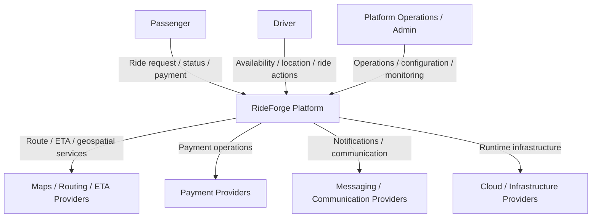
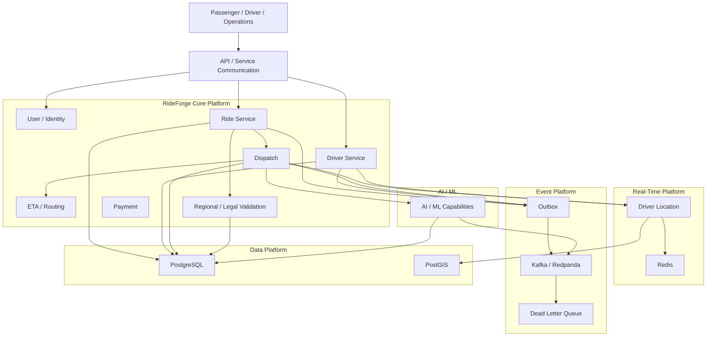
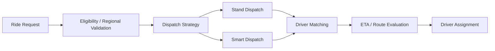
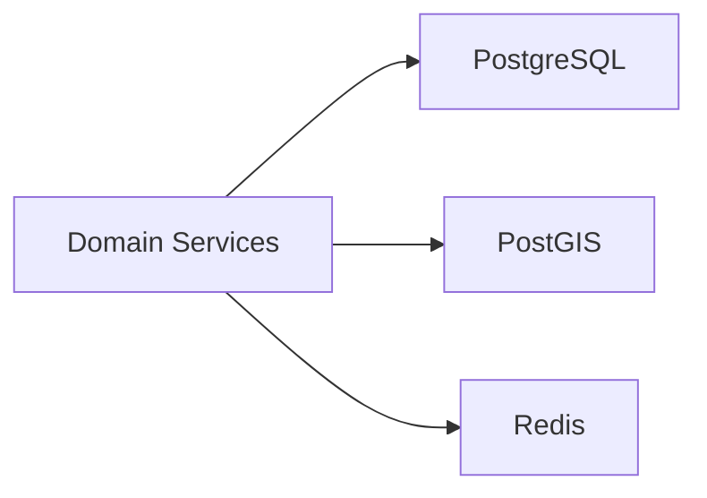
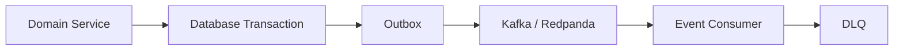
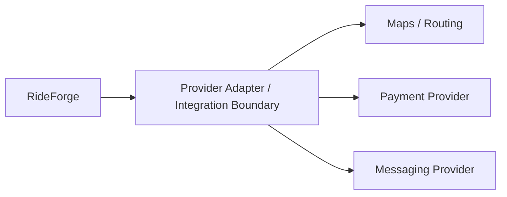
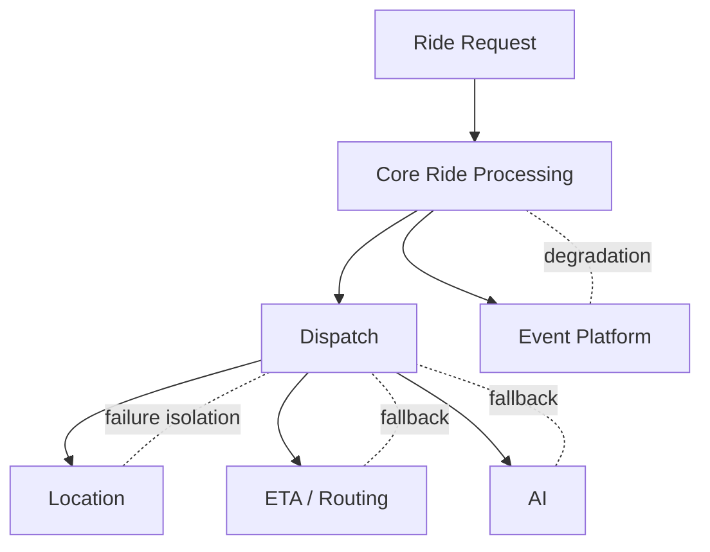
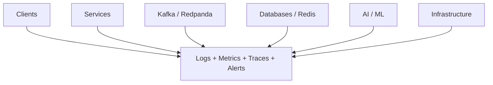
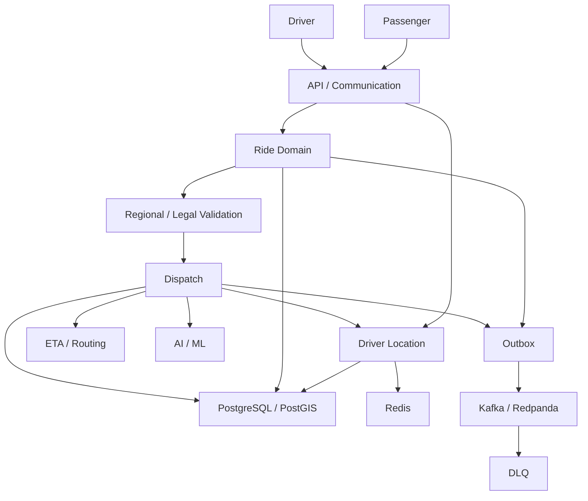
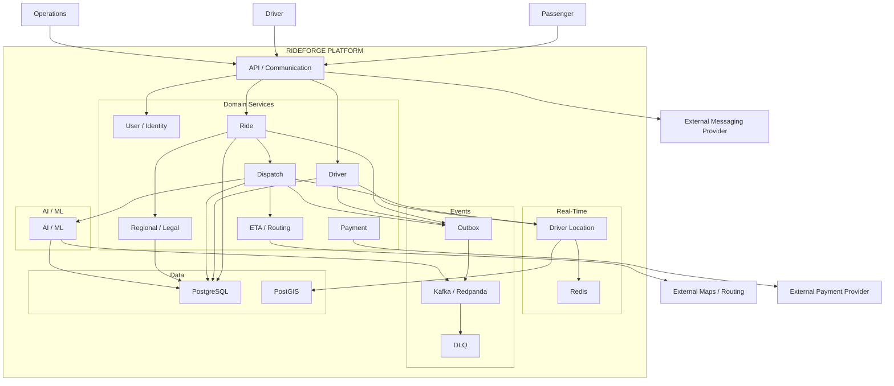

# 01 — System Context and High-Level Architecture

> **Document Type:** Architecture Diagram  
> **Format:** Markdown + Mermaid  
> **Scope:** RideForge system context and high-level platform architecture  
> **Purpose:** Provide a compact visual representation of the complete RideForge platform and its major external actors, services, infrastructure, data stores, and event flows.

---

## 1. Purpose

This document provides the highest-level architectural view of RideForge.

It answers:

- Who interacts with RideForge?
- What are the major platform boundaries?
- What are the major backend capabilities?
- Where do synchronous and asynchronous interactions occur?
- Where are PostgreSQL, PostGIS, Redis, and Kafka/Redpanda used?
- Where do external providers connect?
- Where do AI and dispatch fit into the platform?

This diagram is intentionally high-level.

Detailed behaviour belongs in:

```text
02-SERVICE_AND_DOMAIN_ARCHITECTURE.md
03-RIDE_AND_DRIVER_LIFECYCLE.md
04-DISPATCH_ARCHITECTURE.md
05-DRIVER_LOCATION_AND_GEOSPATIAL_FLOW.md
06-EVENT_DRIVEN_AND_DATA_FLOW.md
07-AI_AND_ML_ARCHITECTURE.md
08-SECURITY_FAILURE_AND_OBSERVABILITY.md
09-CLOUD_DEPLOYMENT_AND_INFRASTRUCTURE.md
```

---

# 2. System Context

RideForge is a ride-hailing platform connecting passengers, drivers, platform operations, external service providers, and the internal ride-hailing platform.



---

# 3. High-Level Platform

The RideForge backend is organized around domain-oriented services and shared platform capabilities.



---

# 4. Major Architectural Layers

RideForge can be understood as the following layers:

```text
Client Layer
      ↓
API / Communication Layer
      ↓
Domain Service Layer
      ↓
Dispatch / Real-Time / AI Capabilities
      ↓
Event Platform
      ↓
Data Platform
      ↓
Infrastructure
```

---

# 5. Client Layer

The client layer contains the primary platform actors:

```text
Passenger
Driver
Platform Operations
```

The clients interact with RideForge through platform APIs and real-time communication mechanisms.

---

# 6. API and Communication Layer

The communication layer provides the boundary between clients and backend capabilities.

Conceptually:

```text
Client
  ↓
API
  ↓
Application / Domain Services
```

Internal services may communicate through:

```text
Synchronous APIs
+
Asynchronous Events
```

The detailed communication strategy is defined by the relevant architecture and ADR documentation.

---

# 7. Domain Service Layer

The domain service layer contains capabilities responsible for core ride-hailing behaviour.

Major areas include:

```text
User / Identity
Ride
Driver
Dispatch
ETA / Routing
Regional / Legal Validation
Payment
```

These are conceptual capabilities at this level.

The detailed service boundaries are documented separately.

---

# 8. Ride Domain

The ride domain is responsible for the lifecycle and state of a ride.

Conceptually:

```text
Ride Request
     ↓
Ride Creation
     ↓
Validation
     ↓
Dispatch
     ↓
Driver Matching
     ↓
Driver Acceptance
     ↓
Trip
     ↓
Completion
```

The complete lifecycle is documented in:

```text
03-RIDE_AND_DRIVER_LIFECYCLE.md
```

---

# 9. Driver Domain

The driver domain manages driver-related platform state.

Important concepts include:

```text
Driver Identity
Availability
Operational Status
Location
Ride Assignment
Ride Participation
```

Driver location is treated as a real-time capability and is represented separately from ordinary transactional driver data.

---

# 10. Dispatch

Dispatch is a core RideForge capability.

RideForge supports:

```text
Stand Dispatch
Smart Dispatch
```

The system may select the appropriate strategy based on the operating context.

At the highest level:



Detailed dispatch architecture is documented in:

```text
04-DISPATCH_ARCHITECTURE.md
```

---

# 11. AI

AI is an assisting capability within the platform.

AI may support areas such as:

```text
Smart Dispatch
Matching
Ranking
ETA / Prediction
Demand / Supply Prediction
```

AI does not replace mandatory hard constraints such as:

```text
Eligibility
Regional Rules
Legal Restrictions
Ride State
Safety Constraints
```

The detailed AI architecture is documented in:

```text
07-AI_AND_ML_ARCHITECTURE.md
```

---

# 12. Real-Time Driver Location

Driver location is a separate real-time concern.

Conceptually:

```text
Driver Device
      ↓
Location Ingestion
      ↓
Real-Time Location State
      ↓
Candidate Discovery / Dispatch
      ↓
Geospatial Processing
```

RideForge uses:

```text
Redis
PostGIS
```

according to their respective architectural responsibilities.

Detailed location architecture is documented in:

```text
05-DRIVER_LOCATION_AND_GEOSPATIAL_FLOW.md
```

---

# 13. Data Platform

The primary transactional database is:

```text
PostgreSQL
```

Geospatial operations use:

```text
PostGIS
```

Real-time state and caching use:

```text
Redis
```

At a high level:



These technologies have distinct responsibilities and should not be treated as interchangeable stores.

---

# 14. Event Platform

RideForge uses event-driven architecture for asynchronous communication.

The high-level flow is:



The event platform provides:

```text
Asynchronous Communication
Decoupling
Reliable Event Publication
Retry / Failure Handling
Event Processing
```

Detailed event architecture is documented in:

```text
06-EVENT_DRIVEN_AND_DATA_FLOW.md
```

---

# 15. Outbox

The Outbox pattern connects transactional state changes with event publication.

Conceptually:

```text
Database Transaction
        │
        ├── Domain State
        │
        └── Outbox Event
                 │
                 ▼
          Event Publisher
                 │
                 ▼
          Kafka / Redpanda
```

This prevents domain state and event publication from becoming unrelated operations.

---

# 16. Dead Letter Queue

Failed event processing is isolated through a DLQ strategy.

Conceptually:

```text
Kafka / Redpanda
       ↓
Consumer
       ↓
Processing
   ┌───┴────┐
   │        │
Success   Failure
   │        │
   ▼        ▼
Continue   Retry
             │
             ▼
            DLQ
```

---

# 17. External Providers

RideForge may interact with external providers for capabilities such as:

```text
Maps
Routing
ETA
Payments
Messaging
Cloud Infrastructure
```

External provider dependencies should remain isolated from core domain logic where appropriate.

---

# 18. External Provider Boundary

The conceptual relationship is:



Provider-specific architecture is documented in the relevant subsystem documentation.

---

# 19. Security Boundary

Security is a cross-cutting concern.

Conceptually:

```text
Client
  ↓
Authentication / Authorization
  ↓
API
  ↓
Services
  ↓
Data / Events / Infrastructure
```

Security applies across:

```text
APIs
Services
Databases
Events
Secrets
Infrastructure
Observability
```

Detailed security architecture is documented in:

```text
08-SECURITY_FAILURE_AND_OBSERVABILITY.md
```

---

# 20. Failure Boundary

RideForge is designed to avoid allowing a failure in one subsystem to unnecessarily bring down unrelated capabilities.

Conceptually:



The exact fallback behaviour is defined by the relevant reliability documentation and ADRs.

---

# 21. Observability Boundary

Observability spans the entire platform.



Observability is not a separate isolated subsystem; it observes the platform as a whole.

---

# 22. Deployment Boundary

At the highest level:

```text
Source Code
     ↓
Build / Test
     ↓
Container / Artifact
     ↓
Deployment Infrastructure
     ↓
RideForge Runtime
```

The exact deployment topology is documented in:

```text
09-CLOUD_DEPLOYMENT_AND_INFRASTRUCTURE.md
```

---

# 23. High-Level End-to-End Relationship

The platform can be summarized as:



---

# 24. Architecture Summary

At the highest level, RideForge is:

```text
A domain-oriented ride-hailing platform
using event-driven communication,
PostgreSQL/PostGIS for transactional and geospatial data,
Redis for real-time state and caching,
Kafka/Redpanda for event streaming,
hybrid Stand + Smart Dispatch,
AI-assisted decision making,
explicit regional/legal validation,
and controlled failure and observability mechanisms.
```

---

# 25. Related Architecture Documents

Use these diagrams for deeper visual context:

```text
02-SERVICE_AND_DOMAIN_ARCHITECTURE.md
    ↓
Services + bounded contexts

03-RIDE_AND_DRIVER_LIFECYCLE.md
    ↓
Ride + driver state transitions

04-DISPATCH_ARCHITECTURE.md
    ↓
Dispatch strategies and matching

05-DRIVER_LOCATION_AND_GEOSPATIAL_FLOW.md
    ↓
Location + geospatial processing

06-EVENT_DRIVEN_AND_DATA_FLOW.md
    ↓
Events + data movement

07-AI_AND_ML_ARCHITECTURE.md
    ↓
AI / ML architecture

08-SECURITY_FAILURE_AND_OBSERVABILITY.md
    ↓
Operational cross-cutting concerns

09-CLOUD_DEPLOYMENT_AND_INFRASTRUCTURE.md
    ↓
Runtime infrastructure
```

---

# 26. Related ADRs

The primary architectural decisions represented by this diagram include:

```text
ADR-0002 — Architecture Style
ADR-0003 — Microservice Boundaries
ADR-0004 — Domain-Driven Design
ADR-0005 — Event-Driven Architecture
ADR-0006 — Kafka / Redpanda for Event Streaming
ADR-0007 — PostgreSQL as Primary Database
ADR-0008 — PostGIS for Geospatial Operations
ADR-0009 — Redis for Real-Time State and Caching
ADR-0010 — Driver Location Storage Strategy
ADR-0012 — Outbox Pattern
ADR-0013 — Dead Letter Queue Strategy
ADR-0014 — API and Service Communication
ADR-0015 — Smart Dispatch and Stand Dispatch
ADR-0016 — AI-Assisted Dispatch Strategy
ADR-0017 — ETA and Route Provider Strategy
ADR-0018 — Regional and Legal Ride Validation
ADR-0021 — Failure and Degradation Strategy
ADR-0022 — Observability Strategy
ADR-0023 — Security and Secret Management
ADR-0027 — Cloud and Deployment Strategy
```

---

# 27. Diagram Scope Rule

This document intentionally does not define:

```text
Exact API contracts
Exact database schemas
Exact Kafka topic schemas
Exact service implementation
Exact model architecture
Exact deployment manifests
Exact cloud resources
```

Those belong to the corresponding architecture, development, AI, and ADR documentation.

The purpose of this document is to establish the **top-level system map**.

---

# 28. AI Agent Usage

For an AI agent trying to understand RideForge quickly:

```text
Read this document first
        ↓
Read ADR-0030
        ↓
Load the ADRs relevant to the task
        ↓
Load the relevant detailed diagram
        ↓
Load the relevant development / AI documentation
        ↓
Inspect implementation
```

This document should therefore be treated as a **high-level visual context entry point**, not as a replacement for detailed project documentation.

---

# 29. Diagram Maintenance

Update this diagram when a change affects:

```text
Major Service Boundary
Primary Data Technology
Event Architecture
Dispatch Architecture
AI Architectural Role
External Provider Boundary
Major Infrastructure Boundary
```

Do not update it for every implementation detail.

---

# 30. Consistency Rule

The diagram must remain consistent with:

```text
Accepted ADRs
Architecture Documentation
Current Major System Boundaries
```

If the architecture changes materially:

```text
Update the relevant ADR
Update detailed architecture documentation
Update affected diagrams
```

---

# 31. Final Diagram



---

# 32. Completion Criteria

This diagram is complete when:

```text
□ System Context Is Represented
□ Major Actors Are Represented
□ Major Domain Capabilities Are Represented
□ Dispatch Is Represented
□ Driver Location Is Represented
□ PostgreSQL Is Represented
□ PostGIS Is Represented
□ Redis Is Represented
□ Kafka / Redpanda Is Represented
□ Outbox Is Represented
□ DLQ Is Represented
□ AI Boundary Is Represented
□ External Provider Boundary Is Represented
□ Security / Reliability / Observability Boundaries Are Identified
□ Deployment Boundary Is Identified
□ Related Documentation Is Referenced
□ Related ADRs Are Referenced
```

---

# 33. Status

```text
Status: Complete

Document:
01-SYSTEM_CONTEXT_AND_HIGH_LEVEL_ARCHITECTURE.md

Diagram Type:
System Context + High-Level Architecture

Primary Audience:
AI Agents
Architects
Backend Engineers
Platform Engineers
Developers

Primary Purpose:
Fast Architectural Context Loading

Next Diagram:
02-SERVICE_AND_DOMAIN_ARCHITECTURE.md
```
