# 02 — Service and Domain Architecture

> **Document Type:** Architecture Diagram  
> **Format:** Markdown + Mermaid  
> **Scope:** RideForge service boundaries, domain capabilities, bounded contexts, and major service relationships  
> **Purpose:** Provide a compact visual model of how RideForge's domain capabilities are separated and how they interact without duplicating detailed implementation documentation.

---

# 1. Purpose

This document visualizes the relationship between:

```text
Business Domains
Bounded Contexts
Application / Domain Services
Data Ownership
Synchronous Communication
Asynchronous Communication
Cross-Cutting Platform Capabilities
```

It answers:

- What are the major RideForge domains?
- Which capabilities belong together?
- Which services interact directly?
- Which interactions should use events?
- Where are transactional and real-time responsibilities separated?
- Where do dispatch, AI, ETA, and regional rules fit?

This is a **service and domain map**, not a deployment diagram.

---

# 2. Architecture Principle

RideForge follows a domain-oriented architecture.

The high-level relationship is:

```text
Business Capability
        ↓
Domain Boundary
        ↓
Application / Domain Service
        ↓
Owned State
        ↓
API / Events
```

The exact deployment topology is intentionally excluded from this document.

See:

```text
09-CLOUD_DEPLOYMENT_AND_INFRASTRUCTURE.md
```

for infrastructure and deployment relationships.

---

# 3. Bounded Context Overview

The major logical capabilities are:

```text
Identity / Users
Drivers
Rides
Dispatch
Driver Location
ETA / Routing
Payments
Regional / Legal Rules
AI / ML
Notifications / External Integrations
```

These capabilities should have clear responsibilities even when multiple capabilities are temporarily deployed together.

---

# 4. High-Level Domain Map

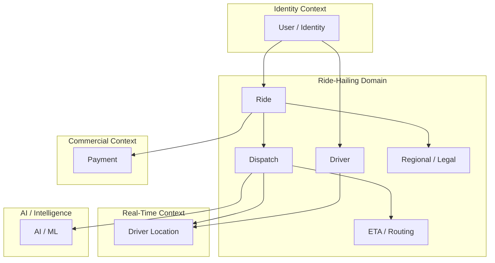

---

# 5. Domain Responsibility Summary

| Domain | Primary Responsibility |
|---|---|
| Identity | Users, identity, authentication-related domain state |
| Driver | Driver profile and operational driver state |
| Ride | Ride creation and ride lifecycle |
| Dispatch | Driver selection and assignment strategy |
| Driver Location | Real-time driver position and location state |
| Regional / Legal | Region-specific and legal ride eligibility |
| ETA / Routing | Route and ETA capability |
| Payment | Payment-related business operations |
| AI / ML | Prediction, ranking, optimization, and intelligent assistance |

These are logical responsibilities. Physical service boundaries may evolve according to the architecture decisions documented in the ADRs.

---

# 6. Service Boundary Model

The service architecture can be visualized as:

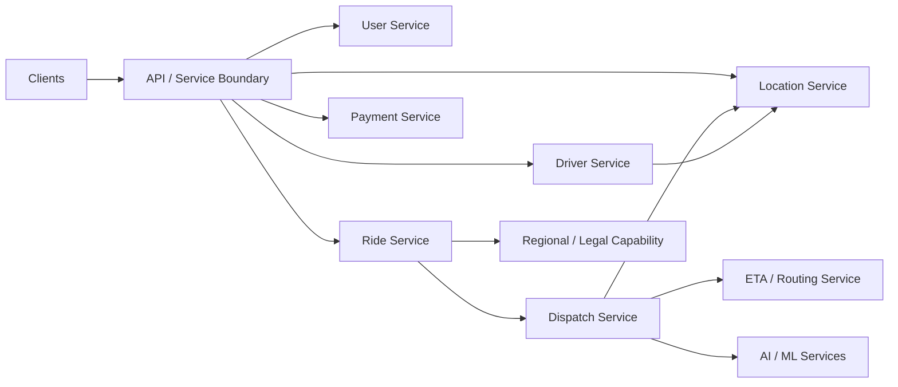

---

# 7. Important Boundary Rule

A logical domain does not automatically require an independently deployed microservice.

The architecture should distinguish:

```text
Domain Boundary
```

from:

```text
Deployment Boundary
```

A domain may initially be implemented inside a service boundary and extracted later if there is sufficient operational or architectural value.

This is consistent with the architecture evolution strategy.

---

# 8. Identity / User Domain

The Identity / User domain is responsible for user-related identity and account capabilities.

Conceptually:

```text
User
 ├── Identity
 ├── Account
 └── Access
```

It should not own:

```text
Ride Matching
Driver Location
Dispatch Ranking
ETA Calculation
```

Those belong to their respective capabilities.

---

# 9. Driver Domain

The Driver domain manages driver-related business state.

Conceptually:

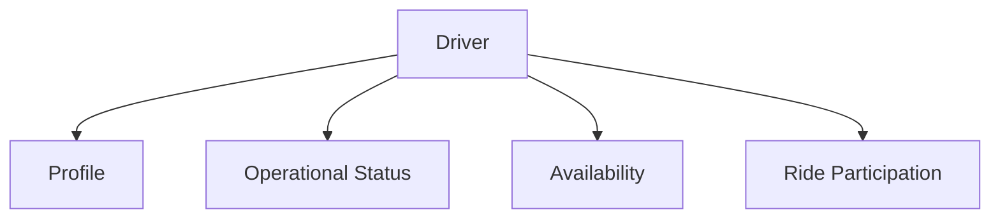

Driver location is related to the driver domain but is treated as a specialized real-time capability.

---

# 10. Driver Location Boundary

The distinction is:

```text
Driver Domain
    ↓
Who the driver is
How the driver operates

Driver Location
    ↓
Where the driver currently is
How recent the location is
How it is used for candidate discovery
```

This separation prevents high-frequency location updates from being treated like ordinary transactional profile updates.

Detailed location architecture:

```text
05-DRIVER_LOCATION_AND_GEOSPATIAL_FLOW.md
```

---

# 11. Ride Domain

The Ride domain owns the ride lifecycle.

Conceptually:

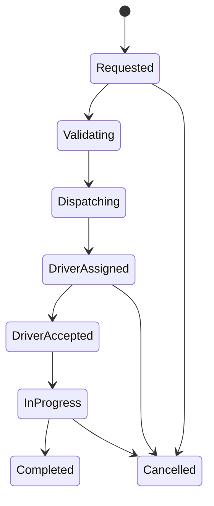

The complete lifecycle is documented separately in:

```text
03-RIDE_AND_DRIVER_LIFECYCLE.md
```

---

# 12. Ride Domain Responsibilities

The Ride domain is concerned with:

```text
Ride Creation
Ride Identity
Ride State
Ride Lifecycle
Ride Participants
Ride-Level Business Rules
Ride Events
```

It should not directly embed:

```text
Driver Candidate Ranking
Real-Time Location Storage
AI Model Internals
External Routing Provider Details
```

Those belong to other capabilities.

---

# 13. Regional / Legal Domain

Regional and legal validation is a domain constraint.

Conceptually:

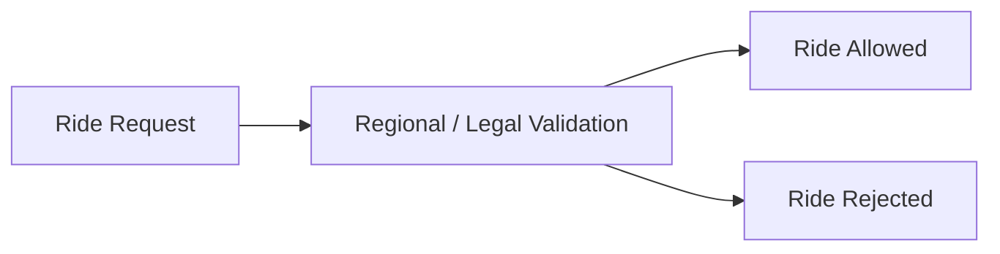

This validation occurs before the system performs actions that would violate applicable operating rules.

---

# 14. Regional Rules Are Not Dispatch Logic

A key separation is:

```text
Regional / Legal Validation
```

answers:

```text
"Is this ride permitted?"
```

while:

```text
Dispatch
```

answers:

```text
"Which eligible driver should receive this ride?"
```

These responsibilities must remain distinct.

---

# 15. Dispatch Domain

Dispatch determines how a valid ride is matched with an eligible driver.

RideForge supports:

```text
Stand Dispatch
Smart Dispatch
```

The strategy selection is represented in:

```text
04-DISPATCH_ARCHITECTURE.md
```

---

# 16. Dispatch Dependencies

Dispatch depends on several capabilities:

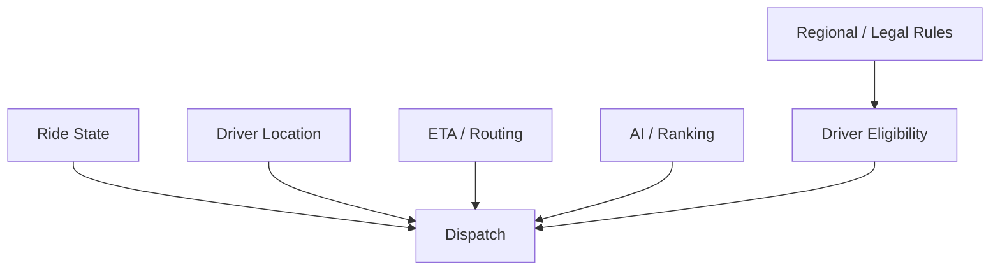

Dispatch consumes these capabilities but should not absorb their entire responsibilities.

---

# 17. Stand Dispatch

Stand Dispatch follows the operational rules associated with a designated stand or queue.

Conceptually:

```text
Ride Request
      ↓
Applicable Stand
      ↓
Eligible Drivers
      ↓
Stand / Queue Rules
      ↓
Driver Selection
      ↓
Assignment
```

The exact rules are defined in the dispatch documentation and ADRs.

---

# 18. Smart Dispatch

Smart Dispatch uses additional signals to make a more optimized driver selection.

Conceptually:

```text
Ride Request
      ↓
Candidate Discovery
      ↓
Eligibility
      ↓
Feature Collection
      ↓
Ranking / Scoring
      ↓
ETA / Cost / Quality Signals
      ↓
Driver Selection
```

AI may assist this process but cannot bypass hard constraints.

---

# 19. Hybrid Dispatch

RideForge supports selecting dispatch strategy according to operating context.

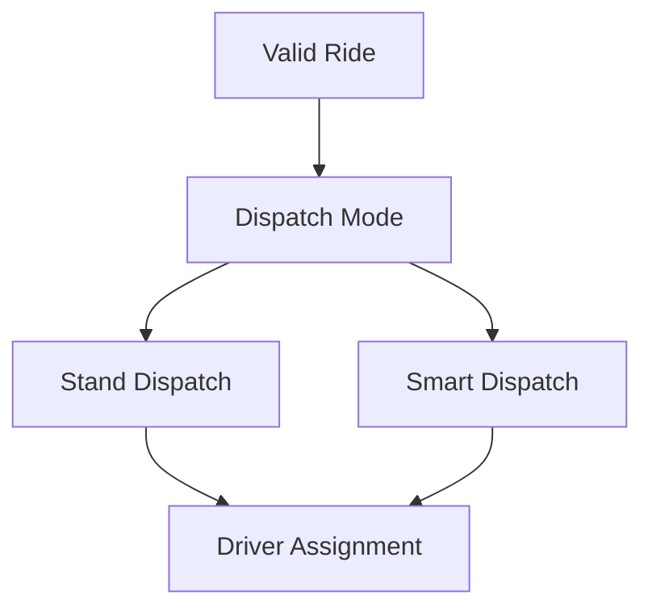

The mode decision may depend on:

```text
Operating Region
Business Rules
Operational Configuration
Availability of Smart Dispatch
```

---

# 20. ETA / Routing Boundary

ETA and routing are treated as a capability rather than something that should be deeply embedded into the Ride domain.

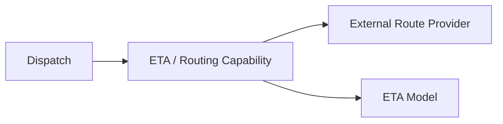

This allows routing providers or prediction implementations to evolve without rewriting dispatch domain logic.

---

# 21. Payment Boundary

Payment is a separate commercial capability.

Conceptually:

```text
Ride
  ↓
Payment Intent / Operation
  ↓
Payment Provider
  ↓
Payment Result
```

Payment implementation details are outside this service/domain diagram.

---

# 22. AI / ML Boundary

AI is treated as an intelligence capability supporting business domains.


AI should provide:

```text
Predictions
Scores
Rankings
Recommendations
```

while domain services retain authority over:

```text
Hard Constraints
State Transitions
Legal Rules
Safety Rules
```

---

# 23. AI Must Not Own Core Domain State

AI should not become the source of truth for:

```text
Ride State
Driver Eligibility
Legal Eligibility
Payment State
Assignment State
```

AI output is a decision-support signal.

---

# 24. Event-Based Service Communication

Services may communicate asynchronously through events.

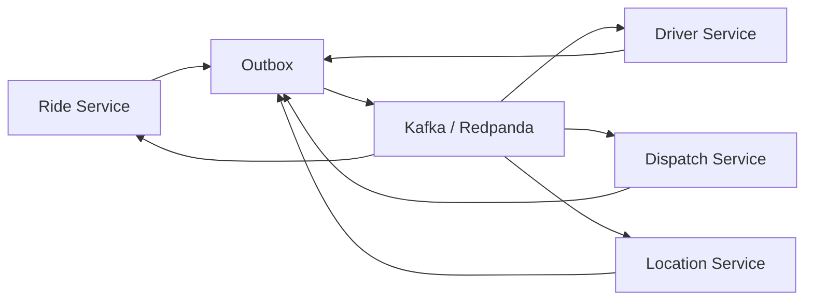

Actual event ownership and topic design belong in:

```text
06-EVENT_DRIVEN_AND_DATA_FLOW.md
```

---

# 25. Synchronous vs Asynchronous Communication

Use synchronous communication where an immediate response is required.

Examples:

```text
Create Ride
Get Ride
Get Driver
Validate Request
```

Use asynchronous communication where decoupling and eventual processing are appropriate.

Examples:

```text
Ride Events
Driver State Events
Notifications
Analytics
AI Feedback
Operational Events
```

The exact communication choice should follow the relevant ADRs.

---

# 26. Data Ownership

At the logical level:

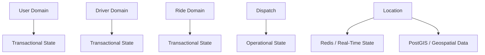

The primary transactional platform is PostgreSQL.

The actual physical schema and deployment may evolve without changing the domain responsibilities.

---

# 27. Shared Data Rule

Avoid uncontrolled direct access to another domain's internal state.

Prefer:

```text
API
+
Domain Contract
+
Event
```

over:

```text
Direct Access to Another Domain's Internal Implementation
```

where a meaningful service boundary exists.

---

# 28. Event Ownership Rule

The service responsible for a business concept should generally own the event representing a state change in that concept.

For example:

```text
Ride Service
    ↓
Ride Events

Driver Service
    ↓
Driver Events
```

This prevents multiple services from independently publishing conflicting versions of the same business state.

---

# 29. Transaction Boundary

A domain service should own the transaction boundary for the state it controls.

Conceptually:

```text
Application Service
      ↓
Domain Logic
      ↓
Transaction
 ┌────┴────────┐
 ▼             ▼
State        Outbox
```

This connects the service/domain boundary with the Outbox architecture.

---

# 30. Idempotency Boundary

Consumers processing events from other services must account for:

```text
Duplicate Delivery
Retry
Replay
Partial Failure
```

Therefore:

```text
Event Consumer
      ↓
Idempotency Check
      ↓
Business Processing
```

This is part of the distributed service boundary model.

---

# 31. Failure Isolation

A service boundary should also define a failure boundary.

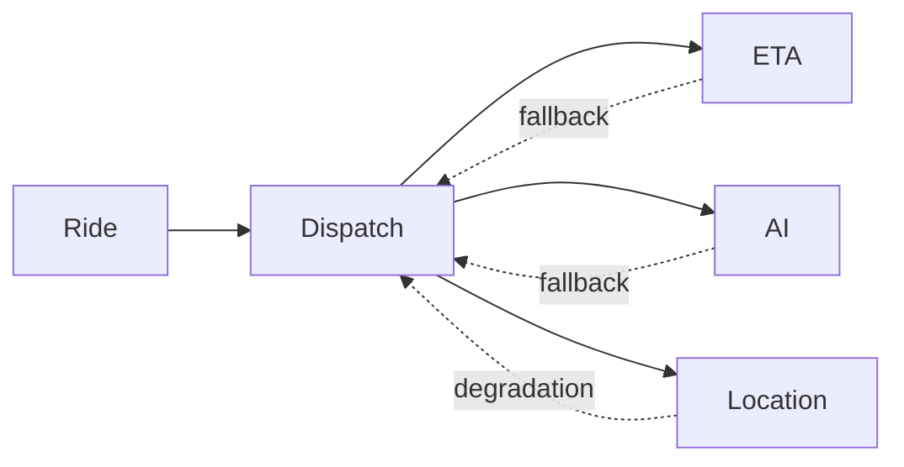

A dependent failure should trigger the documented fallback or degradation path rather than uncontrolled failure propagation.

---

# 32. Cross-Cutting Capabilities

The following concerns span multiple domains:

```text
Authentication
Authorization
Observability
Configuration
Security
Idempotency
Failure Handling
Event Infrastructure
```

They should not be duplicated independently inside every domain without a clear reason.

---

# 33. Service Boundary Heuristic

A capability is a good candidate for an independent service when it has meaningful:

```text
Domain Ownership
Independent Scaling Need
Independent Deployment Need
Failure Isolation Need
Security Boundary
Operational Ownership
```

It should not become a separate service merely because it has a different noun.

---

# 34. Service Extraction

If a domain initially exists inside another service, it may later be extracted.

Conceptually:

```text
Current Service
┌───────────────────────────┐
│ Ride                      │
│ Dispatch                  │
│ Location                  │
└───────────────────────────┘
              │
              │ Evolution
              ▼
┌────────┐ ┌──────────┐ ┌──────────┐
│ Ride   │ │ Dispatch │ │ Location │
└────────┘ └──────────┘ └──────────┘
```

The extraction must follow the migration strategy defined by the architecture evolution ADR.

---

# 35. Service Consolidation

The reverse is also permitted.

If multiple services no longer provide useful separation:

```text
Service A
Service B
```

may be consolidated when:

```text
Coupling Is High
Independent Scaling Is Unnecessary
Deployment Is Always Together
Operational Complexity Exceeds Value
```

Architecture should optimize for useful boundaries, not maximum service count.

---

# 36. Domain vs Infrastructure

The domain should remain insulated from infrastructure details where practical.

For example:

```text
Dispatch
```

should depend on:

```text
Driver Location Capability
ETA Capability
Ranking Capability
```

rather than deeply coupling itself to:

```text
Redis Commands
PostGIS Queries
Specific AI Framework
Specific Route Provider
```

Adapters and infrastructure boundaries should handle those details.

---

# 37. Service Communication Model

The overall relationship can be summarized as:

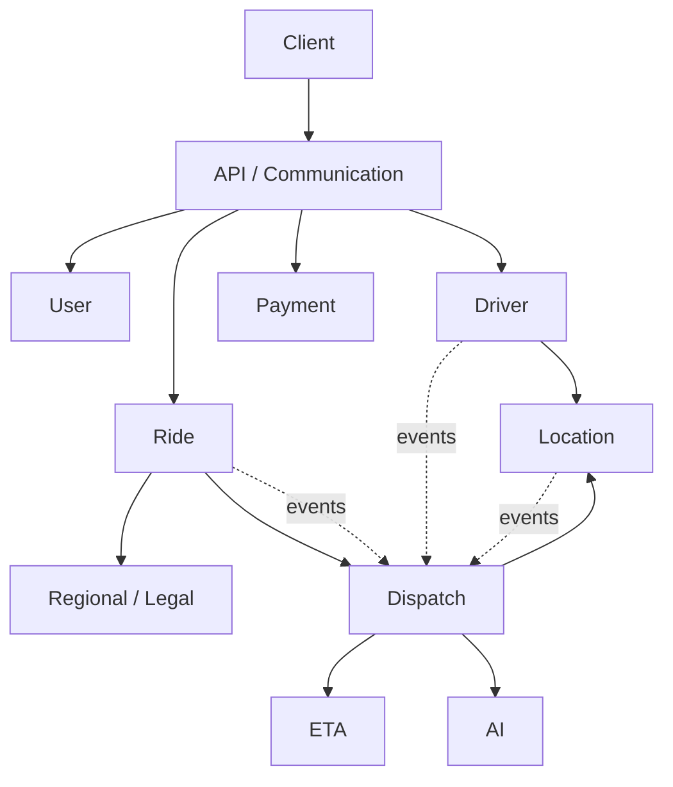

---

# 38. Domain Interaction Matrix

| Source | Target | Primary Interaction |
|---|---|---|
| User | Ride | Create / manage ride |
| Driver | Driver | Driver operations |
| Driver | Location | Location updates |
| Ride | Regional / Legal | Ride eligibility |
| Ride | Dispatch | Matching request |
| Dispatch | Location | Candidate discovery |
| Dispatch | ETA | ETA / route evaluation |
| Dispatch | AI | Ranking / prediction |
| Ride | Payment | Payment operations |
| Services | Event Platform | Asynchronous state propagation |

This is a conceptual matrix, not a complete API or event contract.

---

# 39. What Each Domain Owns

## User

```text
Identity
Account
Access
```

## Driver

```text
Driver Profile
Driver Operational State
Availability
Driver Ride Participation
```

## Ride

```text
Ride Identity
Ride State
Ride Lifecycle
Ride Participants
```

## Dispatch

```text
Dispatch Strategy
Candidate Selection
Matching
Assignment Decision
```

## Location

```text
Current Driver Position
Location Freshness
Real-Time Location State
Geospatial Candidate Support
```

## Regional / Legal

```text
Regional Eligibility
Legal Ride Constraints
Operating Rules
```

## ETA / Routing

```text
Route Evaluation
ETA
Provider / Model Integration
```

## Payment

```text
Payment Operations
Payment State
Provider Integration
```

## AI / ML

```text
Prediction
Ranking
Optimization Signals
Model Inference
```

---

# 40. What Domains Should Not Own

## Ride should not own

```text
AI Model Internals
Raw Driver Location Infrastructure
External Routing Provider Implementation
```

## Dispatch should not own

```text
Driver Profile Management
Payment Processing
Legal Rule Definition
```

## AI should not own

```text
Ride State
Driver Eligibility
Legal State
Payment State
```

## Location should not own

```text
Ride Lifecycle
Payment
Dispatch Policy
```

---

# 41. Service Boundary and Events

The intended architecture is:

```text
Service
  │
  ├── Owns Domain State
  │
  ├── Exposes APIs
  │
  ├── Publishes Domain Events
  │
  └── Consumes Relevant Events
```

This supports:

```text
Loose Coupling
Independent Evolution
Asynchronous Processing
Failure Isolation
```

---

# 42. Domain Event Relationship

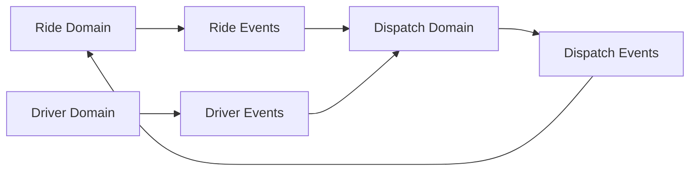

Actual event semantics are governed by the event architecture documentation and ADRs.

---

# 43. Real-Time and Transactional Separation

RideForge intentionally separates:

```text
Transactional State
```

from:

```text
High-Frequency Real-Time State
```

Conceptually:

```text
Transactional
    ↓
PostgreSQL

Geospatial
    ↓
PostGIS

Real-Time
    ↓
Redis
```

The detailed strategy is documented in the driver location and data architecture documentation.

---

# 44. AI and Domain Separation

The AI subsystem should be treated as:

```text
Decision Support
```

rather than:

```text
Domain Authority
```

Conceptually:

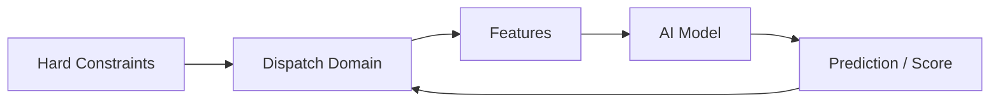

The final domain decision remains constrained by business and legal rules.

---

# 45. Architecture Evolution

Service boundaries are not immutable.

They may evolve according to:

```text
ADR-0029 — Architecture Evolution and Migration
```

Possible evolution includes:

```text
Service Extraction
Service Consolidation
Database Boundary Changes
Communication Changes
Infrastructure Changes
```

The domain model should remain stable where the underlying business concept remains stable.

---

# 46. Diagram Boundaries

This document intentionally does not prescribe:

```text
Exact Number of Deployments
Exact Number of Repositories
Exact Kubernetes Objects
Exact Database Tables
Exact Kafka Topics
Exact API Paths
Exact Programming Language Per Service
```

Those are implementation or deployment details.

---

# 47. AI Agent Usage

For an AI agent:

```text
Use this document to understand:
    ↓
Which capabilities exist
    ↓
Which responsibilities belong to each capability
    ↓
How services interact
    ↓
Where boundaries exist
```

Then load the detailed documentation for the subsystem being modified.

Recommended flow:

```text
01-System Context
        ↓
02-Service and Domain Architecture
        ↓
Relevant ADRs
        ↓
Relevant Development Docs
        ↓
Relevant AI Docs
        ↓
Source Code
```

---

# 48. Related Documents

```text
01-SYSTEM_CONTEXT_AND_HIGH_LEVEL_ARCHITECTURE.md
03-RIDE_AND_DRIVER_LIFECYCLE.md
04-DISPATCH_ARCHITECTURE.md
05-DRIVER_LOCATION_AND_GEOSPATIAL_FLOW.md
06-EVENT_DRIVEN_AND_DATA_FLOW.md
07-AI_AND_ML_ARCHITECTURE.md
08-SECURITY_FAILURE_AND_OBSERVABILITY.md
09-CLOUD_DEPLOYMENT_AND_INFRASTRUCTURE.md
10-DIAGRAM_INDEX.md
```

---

# 49. Related ADRs

```text
ADR-0002 — Architecture Style
ADR-0003 — Microservice Boundaries
ADR-0004 — Domain-Driven Design
ADR-0005 — Event-Driven Architecture
ADR-0006 — Kafka / Redpanda for Event Streaming
ADR-0007 — PostgreSQL as Primary Database
ADR-0008 — PostGIS for Geospatial Operations
ADR-0009 — Redis for Real-Time State and Caching
ADR-0010 — Driver Location Storage Strategy
ADR-0012 — Outbox Pattern
ADR-0013 — Dead Letter Queue Strategy
ADR-0014 — API and Service Communication
ADR-0015 — Smart Dispatch and Stand Dispatch
ADR-0016 — AI-Assisted Dispatch Strategy
ADR-0017 — ETA and Route Provider Strategy
ADR-0018 — Regional and Legal Ride Validation
ADR-0019 — Data Consistency and Transaction Boundaries
ADR-0020 — Idempotency Strategy
ADR-0021 — Failure and Degradation Strategy
ADR-0022 — Observability Strategy
ADR-0029 — Architecture Evolution and Migration
```

---

# 50. Maintenance Rules

Update this diagram when:

```text
A major domain boundary changes
A service is extracted
A service is consolidated
A major communication boundary changes
A new core domain is introduced
A core domain is removed
Ownership changes materially
```

Do not update it for:

```text
Minor refactoring
Variable changes
Small endpoint changes
Internal implementation details
Routine bug fixes
```

---

# 51. Completion Criteria

```text
□ Major domains identified
□ Major service capabilities identified
□ Domain responsibilities defined
□ Service relationships visualized
□ Ride domain represented
□ Driver domain represented
□ Dispatch represented
□ Location represented
□ Regional / legal boundary represented
□ ETA boundary represented
□ Payment boundary represented
□ AI boundary represented
□ Event communication represented
□ Data ownership represented
□ Failure boundaries identified
□ Service extraction principle documented
□ Service consolidation principle documented
□ Related diagrams referenced
□ Related ADRs referenced
```

---

# 52. Status

```text
Status: Complete

Document:
02-SERVICE_AND_DOMAIN_ARCHITECTURE.md

Diagram Type:
Service + Domain Architecture

Primary Audience:
AI Agents
Architects
Backend Engineers
Platform Engineers

Primary Purpose:
Understand RideForge domain boundaries and service relationships without loading implementation details.

Previous Diagram:
01-SYSTEM_CONTEXT_AND_HIGH_LEVEL_ARCHITECTURE.md

Next Diagram:
03-RIDE_AND_DRIVER_LIFECYCLE.md
```

---

# 24. Dispatch Strategy and Domain Boundary Clarifications

The service and domain architecture must reflect the canonical RideForge dispatch model.

## 24.1 Two Primary Dispatch Strategies

RideForge has two primary dispatch strategies:

```text
Smart Stand Dispatch
Smart Dispatch
```

AI-assisted dispatch is an optimization capability and is **not a third primary dispatch strategy**.

The domain model should therefore represent the primary strategy independently from AI assistance.

Conceptually:

```text
Effective Dispatch Strategy
        +
AI Assistance Context
```

rather than:

```text
SMART
SMART_STAND
AI_ASSISTED
```

as three mutually exclusive primary strategies.

---

## 24.2 Hierarchical Dispatch Configuration Domain

Dispatch strategy configuration belongs to the configuration/domain-policy boundary and must be resolved before dispatch execution.

Possible configuration levels include:

```text
State
District
City / Town
Rural Area
Auto Stand
Specific Ride Level
Other Intermediate Levels
```

Not every level requires explicit configuration.

The resolution rule is:

```text
Most Specific Applicable Configuration
        ↓
Explicit Strategy?
   ├── YES → Effective Strategy
   └── NO
        ↓
Parent Configuration
        ↓
Continue Upward
        ↓
System Default
```

The canonical rule is:

> **Specific configuration overrides inherited configuration.**

The domain model must support parent/child configuration relationships without hard-coding the hierarchy to a fixed set of geographic levels.

---

## 24.3 Smart Stand Dispatch Domain Semantics

Smart Stand Dispatch is **stand-preferred, not stand-exclusive**.

When the rider is within the radius of a configured auto stand:

```text
Ride Pickup
    ↓
Applicable Stand
    ↓
Eligible Stand Drivers
    ↓
Stand Queue / Ordering
```

The stand is the preferred dispatch source.

If suitable stand supply is unavailable, the candidate search may expand to:

```text
Drivers outside the preferred stand
Drivers at nearby stands
Drivers from nearby locations
```

Therefore, domain models must distinguish:

```text
Stand Preference
```

from:

```text
Driver Eligibility
```

A driver being outside the preferred stand must not automatically make that driver ineligible.

If the rider is outside all configured stand radii, Smart Stand Dispatch does not create a stand-only candidate pool.

---

## 24.4 Smart Dispatch Domain Semantics

Smart Dispatch is stand-agnostic.

The domain must allow eligible candidates regardless of stand membership:

```text
Driver at an auto stand
Driver outside an auto stand
Driver associated with another nearby location
```

Stand membership must not automatically create a preference under Smart Dispatch.

---

## 24.5 Cross-Location Dispatch Domain

A location is not automatically a hard dispatch boundary.

When local supply is insufficient, candidate discovery may expand to nearby locations.

Example:

```text
Location A → Smart Dispatch
Location B → Smart Stand Dispatch

Ride from A
    ↓
Local supply insufficient
    ↓
Consider eligible candidates from B
```

A candidate from Location B is not automatically rejected because Location B uses a different dispatch strategy.

The candidate context should preserve:

```text
Candidate Location
Candidate Location Strategy
Stand Membership
Relevant Stand
Queue Position
Discovery Source
Expansion Level
```

This allows downstream dispatch/ranking components to apply the correct strategy-specific prioritization.

---

## 24.6 Domain Separation of Strategy, Discovery, and Ranking

The domain/service boundaries must preserve the following separation:

```text
Configuration Resolution
        ↓
Dispatch Strategy Resolution
        ↓
Candidate Discovery
        ↓
Candidate Pipeline
        ↓
Strategy-Specific Prioritization
        ↓
Ranking / Selection
        ↓
Assignment
```

The following concepts must not be conflated:

```text
Dispatch Strategy
Candidate Discovery Scope
Candidate Eligibility
Strategy-Specific Preference
Ranking
Assignment
```

In particular:

```text
Dispatch Strategy ≠ Candidate Pool Boundary
```

---

## 24.7 Candidate Preference vs Eligibility

The domain model must distinguish between:

```text
Eligible but not preferred
```

and:

```text
Ineligible
```

Examples:

```text
Non-stand driver during Smart Stand Dispatch
    → potentially eligible, but not initially preferred

Driver from nearby location
    → potentially eligible, subject to constraints

Driver at preferred stand
    → preferred source when rider is inside stand radius
```

Therefore:

```text
Not Preferred ≠ Ineligible
```

---

## 24.8 Legal and Regional Constraints

Cross-location candidate discovery must not bypass regional or legal ride validation.

The domain flow must remain:

```text
Candidate Discovery
        ↓
Hard Eligibility / Regional Validation
        ↓
Strategy-Specific Prioritization
        ↓
Assignment
```

Geographic proximity does not imply legal permission.

```text
Geographic Proximity ≠ Legal Permission
```

The legal/regional domain remains authoritative regardless of the resolved dispatch strategy.

---

## 24.9 AI Assistance as a Domain Capability

AI-assisted dispatch should be represented as an optional optimization capability attached to the resolved strategy.

It may assist with:

```text
Candidate Ranking
ETA Prediction
Acceptance Prediction
Demand / Supply Signals
Other Approved Prediction Signals
```

AI must not override:

```text
Legal / Regional Restrictions
Driver Eligibility
Safety Constraints
Availability
Vehicle / Service Compatibility
Configured Stand Queue Semantics
Other Hard Business Rules
```

AI failure must preserve the resolved primary strategy.

For example:

```text
Smart Stand Dispatch + AI
        ↓
AI unavailable
        ↓
Deterministic Smart Stand Dispatch
```

and:

```text
Smart Dispatch + AI
        ↓
AI unavailable
        ↓
Deterministic Smart Dispatch
```

---

## 24.10 Strategy Context in Domain Events and Commands

Dispatch-related commands and events should preserve enough context for downstream services to make consistent decisions.

Where applicable, the dispatch context may include:

```text
Effective Dispatch Strategy
Configuration Level
Configuration Source
Applicable Stand
Candidate Location
Candidate Location Strategy
Stand Membership
Queue Position
Discovery Source
Expansion Level
AI Assisted
Model Version
```

The exact event schema remains governed by the relevant event contracts, but strategy context must not be lost between services.

---

## 24.11 Domain Evolution Guardrails

Future service/domain changes must not:

```text
Model Smart Stand Dispatch as stand-only.

Model Smart Dispatch as stand-aware without an explicit business decision.

Treat a location's strategy as a hard geographic boundary.

Hard-code State → District → Town → Stand as the only configuration hierarchy.

Allow parent configuration to override an explicit child configuration.

Treat candidate expansion as strategy switching.

Model AI-assisted dispatch as a third primary dispatch strategy.

Allow AI failure to silently change the resolved strategy.

Allow cross-location discovery to bypass regional/legal validation.

Discard candidate source location or strategy context required downstream.

Replace configured stand queue semantics with an arbitrary AI score.
```

Any intentional change to these business semantics must be documented through a new or superseding ADR.

