# 03 — Ride and Driver Lifecycle

> **Format:** Markdown + Mermaid  
> **Scope:** Ride lifecycle, driver lifecycle, assignment relationship, recovery paths  
> **Purpose:** Compact lifecycle context for AI agents and engineers.

---

## 1. Purpose

This document visualizes the two core operational lifecycles in RideForge:

```text
Ride Lifecycle
Driver Lifecycle
```

It also shows how they connect through:

```text
Validation
Dispatch
Assignment
Acceptance
Pickup
Trip
Completion
Cancellation
Re-dispatch
```

Detailed business rules remain in the domain, development, AI, and ADR documentation.

---

## 2. High-Level Relationship

```text
Passenger
    ↓
Ride Request
    ↓
Validation
    ↓
Dispatch
    ↓
Driver Assignment
    ↓
Driver Acceptance
    ↓
Pickup
    ↓
Trip
    ↓
Ride Completion
    ↓
Driver Available Again
```

---

## 3. Ride Lifecycle

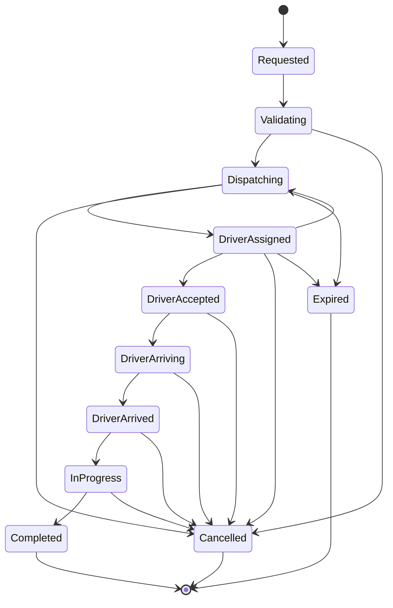

---

## 4. Ride State Meaning

| State | Meaning |
|---|---|
| `Requested` | Passenger requested a ride |
| `Validating` | Required ride and operating constraints are checked |
| `Dispatching` | System is finding an eligible driver |
| `DriverAssigned` | Driver has been selected |
| `DriverAccepted` | Selected driver accepted |
| `DriverArriving` | Driver is travelling to pickup |
| `DriverArrived` | Driver reached pickup |
| `InProgress` | Trip is active |
| `Completed` | Trip completed successfully |
| `Cancelled` | Ride was cancelled |
| `Expired` | Ride could not proceed within its applicable lifecycle window |

The exact production state model may contain additional implementation states.

---

## 5. Driver Lifecycle

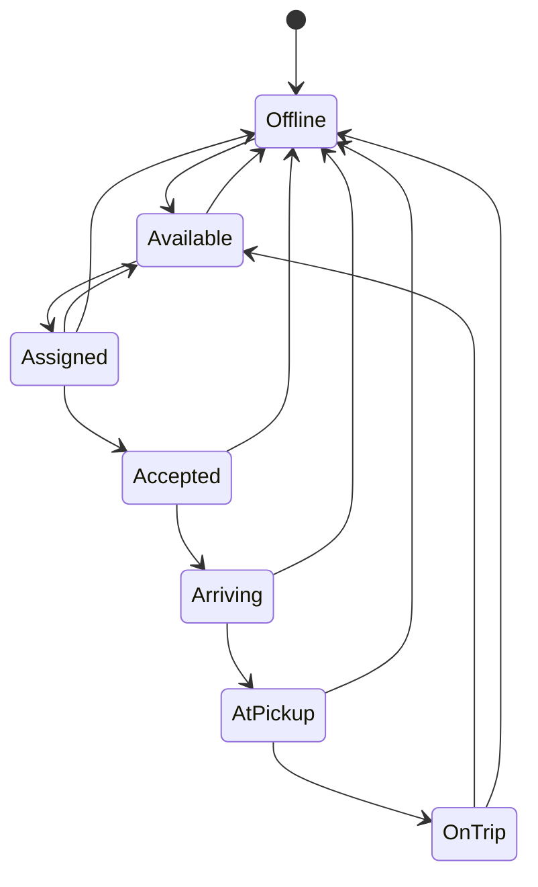

---

## 6. Driver State Meaning

| State | Meaning |
|---|---|
| `Offline` | Driver is not participating in active dispatch |
| `Available` | Driver can potentially receive a ride |
| `Assigned` | Ride has been assigned |
| `Accepted` | Driver accepted the ride |
| `Arriving` | Driver is travelling toward pickup |
| `AtPickup` | Driver reached pickup |
| `OnTrip` | Driver is serving the active trip |

Actual implementation may contain additional operational states.

---

## 7. Combined Lifecycle

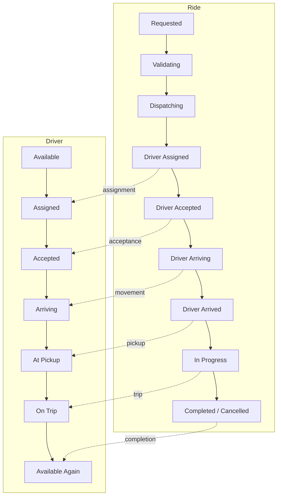

The two domains remain separate. The assignment relationship connects them.

---

## 8. Validation Before Dispatch

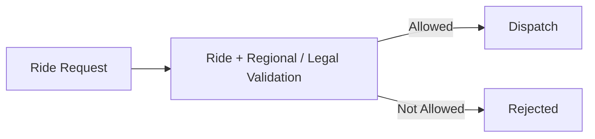

The distinction is:

```text
Regional / Legal Validation
    = Can this ride proceed?

Dispatch
    = Which eligible driver should receive it?
```

---

## 9. Driver Candidate Flow

```text
All Drivers
    ↓
Location Candidates
    ↓
Eligibility Filtering
    ↓
Dispatch Candidates
    ↓
Ranking / Selection
    ↓
Driver Assignment
```

A nearby driver is not automatically an eligible driver.

Eligibility may depend on:

```text
Availability
Location Freshness
Vehicle / Service Requirements
Regional Rules
Operational Rules
Existing Assignment
Other Hard Constraints
```

---

## 10. Assignment Flow

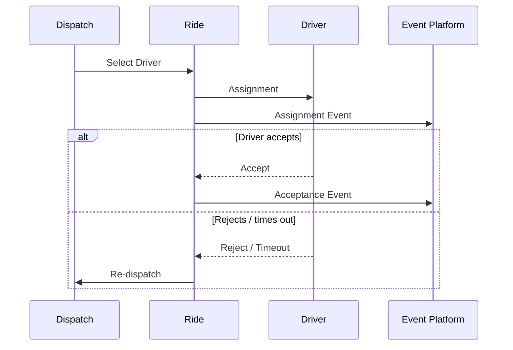

---

## 11. Re-Dispatch

A ride may return to dispatch when:

```text
Driver Rejects
Driver Times Out
Driver Becomes Unavailable
Assignment Becomes Invalid
Operational Failure Occurs
```

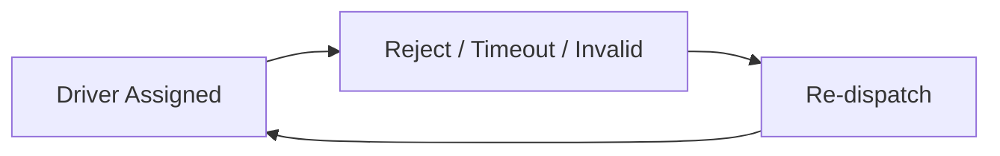

The retry/reassignment rules are governed by the dispatch and failure strategies.

---

## 12. Stand and Smart Dispatch

Both strategies converge on the same ride/driver lifecycle:

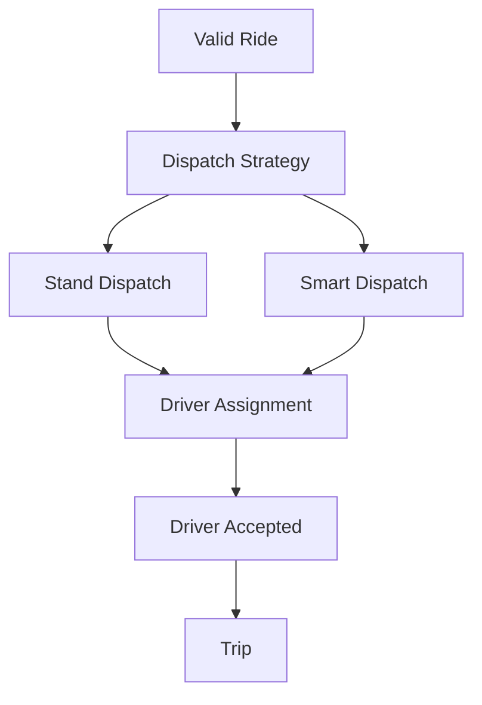

Therefore:

```text
Dispatch Strategy
```

can evolve independently from:

```text
Ride Lifecycle
Driver Lifecycle
```

---

## 13. AI Relationship

AI may assist:

```text
Candidate Ranking
Driver Selection
ETA Prediction
Demand / Supply Prediction
```

but does not own:

```text
Ride State
Driver State
Legal Eligibility
Hard Safety Constraints
Payment State
```

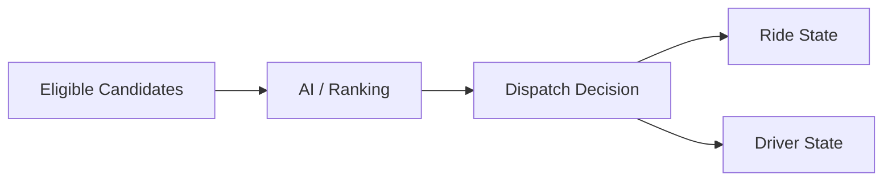

---

## 14. Location Relationship

Driver location supports several lifecycle stages:

```text
Before Assignment
    ↓
Candidate Discovery

After Assignment
    ↓
Driver Arrival

During Trip
    ↓
Trip Tracking
```

Conceptually:

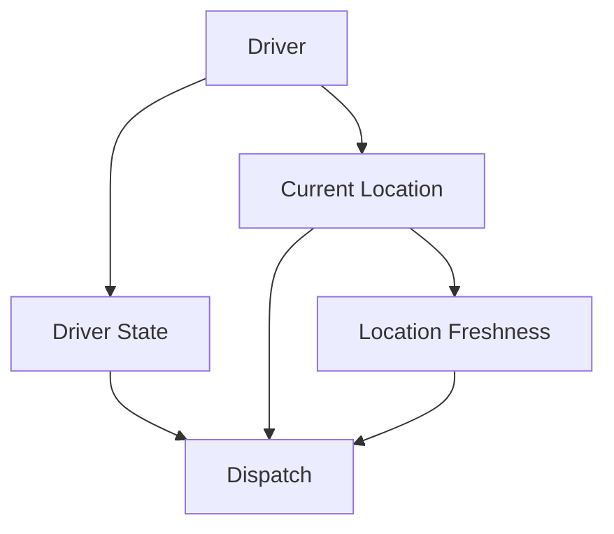

Location is a real-time capability rather than ordinary driver profile state.

---

## 15. Cancellation

Cancellation may occur at different stages:

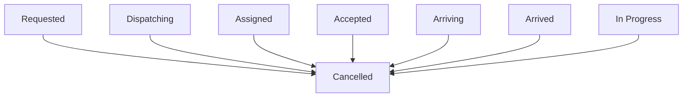

Whether cancellation is permitted at a particular stage and its consequences are business rules.

---

## 16. Normal Completion

```text
Driver Arrived
      ↓
Trip Started
      ↓
Trip In Progress
      ↓
Destination Reached
      ↓
Ride Completed
      ↓
Driver Released
      ↓
Driver Available Again
```

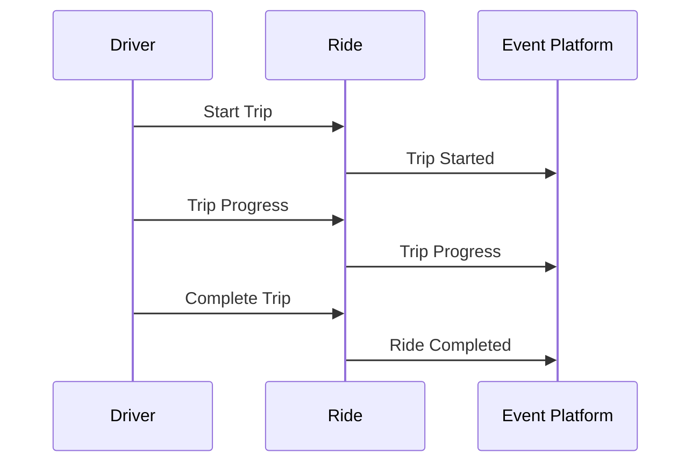

---

## 17. Lifecycle Events

Important transitions may produce domain events:

```text
Ride Created
Ride Dispatching
Driver Assigned
Driver Accepted
Trip Started
Ride Completed
Ride Cancelled

Driver Available
Driver Assigned
Driver Accepted
Driver Arriving
Driver At Pickup
Driver On Trip
Driver Available Again
```

Exact event names and schemas belong to the event architecture documentation and implementation.

---

## 18. Outbox Relationship

Lifecycle state changes and event publication follow the established event architecture:

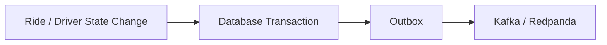

This preserves the relationship between transactional state and event publication.

---

## 19. Idempotency

Lifecycle operations may be retried or delivered more than once.

Important operations include:

```text
Assignment
Acceptance
Trip Start
Trip Completion
Cancellation
```

Conceptually:

```text
Event / Command
      ↓
Idempotency
      ↓
Valid State Transition
```

Consumers should not create duplicate business effects when processing the same operation more than once.

---

## 20. Invalid State Transitions

Lifecycle state must not move arbitrarily.

For example:

```text
Completed → Driver Assigned
Cancelled → In Progress
```

are not normal transitions.

The owning domain must reject invalid transitions unless an explicit recovery/business operation exists.

---

## 21. Concurrent Lifecycle Operations

Lifecycle transitions may race.

Example:

```text
Driver Accepts
```

while:

```text
Assignment Timeout
```

is being processed.

The implementation must protect the authoritative state from ending in an invalid condition.

The exact concurrency mechanism belongs to the data consistency and development documentation.

---

## 22. Authoritative State

Events are facts about state changes.

They are not themselves the authoritative state.

```text
Domain State
    ↓
State Transition
    ↓
Domain Event
    ↓
Consumers / Derived State
```

The owning domain remains authoritative.

---

## 23. Failure and Recovery

A lifecycle failure should produce an explicit outcome:

```text
Retry
Reconciliation
Re-dispatch
Fallback
Cancellation
Expiration
Recovery
```

The system should not silently leave a ride permanently stuck between lifecycle states.

---

## 24. Lifecycle Observability

Important transitions should be observable through:

```text
Logs
Metrics
Traces
Events
Alerts
```

Useful lifecycle measurements include:

```text
Time to Assignment
Assignment Acceptance Rate
Assignment Timeout Rate
Re-Dispatch Rate
Time to Pickup
Cancellation Rate
Completion Rate
Ride Expiration Rate
Trip Duration
```

These are representative metrics, not a complete mandatory metric list.

---

## 25. Core Lifecycle Rules

```text
1. Ride and Driver are separate lifecycle domains.

2. Dispatch connects the two lifecycles.

3. Validation occurs before dispatch.

4. Regional and legal rules remain authoritative.

5. Driver eligibility is checked before assignment.

6. Driver location supports candidate discovery and trip operations.

7. Stand Dispatch and Smart Dispatch converge on the same lifecycle.

8. AI may assist decisions but does not own lifecycle state.

9. ETA supports lifecycle decisions but does not own ride state.

10. Assignment is a critical state transition.

11. Assignment must safely handle retries and concurrency.

12. Retryable lifecycle operations require appropriate idempotency.

13. Events represent state changes; they do not replace authoritative state.

14. Derived consumers may temporarily lag authoritative state.

15. Invalid state transitions must be rejected.

16. Terminal ride states should not normally return to active states.

17. Failures must have explicit recovery or terminal outcomes.

18. Important lifecycle transitions must remain observable.

19. The lifecycle should remain stable when dispatch implementations evolve.
```

---

## 26. AI Agent Context

For lifecycle-related work, load this document with:

```text
02-SERVICE_AND_DOMAIN_ARCHITECTURE.md
04-DISPATCH_ARCHITECTURE.md
06-EVENT_DRIVEN_AND_DATA_FLOW.md
08-SECURITY_FAILURE_AND_OBSERVABILITY.md
```

Relevant ADRs include:

```text
ADR-0015 — Smart Dispatch and Stand Dispatch
ADR-0018 — Regional and Legal Ride Validation
ADR-0019 — Data Consistency and Transaction Boundaries
ADR-0020 — Idempotency Strategy
ADR-0021 — Failure and Degradation Strategy
ADR-0022 — Observability Strategy
```

For AI-assisted lifecycle decisions also load:

```text
ADR-0016 — AI-Assisted Dispatch Strategy
ADR-0026 — Model and AI Governance
07-AI_AND_ML_ARCHITECTURE.md
```

---

## 27. Related Diagrams

```text
01-SYSTEM_CONTEXT_AND_HIGH_LEVEL_ARCHITECTURE.md
02-SERVICE_AND_DOMAIN_ARCHITECTURE.md
04-DISPATCH_ARCHITECTURE.md
05-DRIVER_LOCATION_AND_GEOSPATIAL_FLOW.md
06-EVENT_DRIVEN_AND_DATA_FLOW.md
07-AI_AND_ML_ARCHITECTURE.md
08-SECURITY_FAILURE_AND_OBSERVABILITY.md
09-CLOUD_DEPLOYMENT_AND_INFRASTRUCTURE.md
10-DIAGRAM_INDEX.md
```

---

## 28. Maintenance Rules

Update this document when:

```text
Ride lifecycle states materially change
Driver lifecycle states materially change
Assignment semantics change
Cancellation semantics change
Dispatch-to-lifecycle integration changes
Lifecycle event architecture changes
```

Do not update it for ordinary implementation details.

---

## 29. Completion Criteria

```text
□ Ride Lifecycle Represented
□ Driver Lifecycle Represented
□ Ride / Driver Relationship Represented
□ Validation Before Dispatch Represented
□ Assignment Represented
□ Re-Dispatch Represented
□ Cancellation Represented
□ Completion Represented
□ Location Relationship Represented
□ Event Relationship Represented
□ Outbox Relationship Represented
□ Idempotency Considered
□ Failure / Recovery Considered
□ Stand / Smart Dispatch Convergence Represented
□ AI Role Represented
□ Observability Represented
□ Related ADRs Referenced
□ Related Diagrams Referenced
```

---

## 30. Status

```text
Status: Complete

Document:
03-RIDE_AND_DRIVER_LIFECYCLE.md

Diagram Type:
Ride Lifecycle + Driver Lifecycle

Primary Audience:
AI Agents
Architects
Backend Engineers
Dispatch Engineers

Previous Diagram:
02-SERVICE_AND_DOMAIN_ARCHITECTURE.md

Next Diagram:
04-DISPATCH_ARCHITECTURE.md
```
