# 04 — Dispatch Architecture

> **Format:** Markdown + Mermaid  
> **Scope:** Stand Dispatch, Smart Dispatch, Hybrid Dispatch, candidate discovery, eligibility, ranking, ETA, assignment, and fallback  
> **Purpose:** Provide a compact visual model of RideForge dispatch without duplicating detailed AI, development, or ADR documentation.

---

## 1. Purpose

Dispatch is the decision-making capability that connects a valid ride request with an eligible driver.

RideForge supports two dispatch strategies:

```text
Stand Dispatch
Smart Dispatch
```

The platform can select the appropriate strategy according to the operating context.

The strategies ultimately converge on the same outcome:

```text
Valid Ride
    ↓
Eligible Driver
    ↓
Assignment
```

---

## 2. Dispatch Architecture

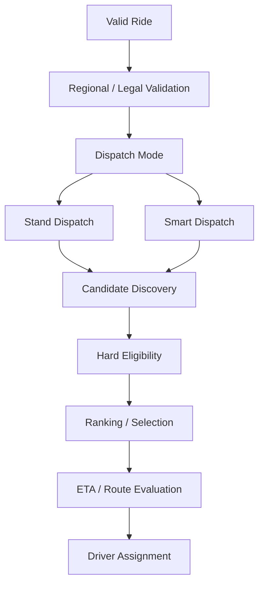

---

## 3. Dispatch Principle

Dispatch should be understood as a pipeline:

```text
Ride
 ↓
Validate
 ↓
Select Dispatch Strategy
 ↓
Discover Candidates
 ↓
Apply Hard Constraints
 ↓
Rank Candidates
 ↓
Evaluate ETA / Operational Signals
 ↓
Assign Driver
 ↓
Observe Result
```

The exact order of individual ranking and ETA operations may vary by implementation, but hard eligibility must remain authoritative.

---

## 4. Hard Constraints vs Optimization

A critical architectural distinction is:

```text
Hard Constraints
```

versus:

```text
Optimization Signals
```

### Hard constraints

Examples:

```text
Regional / Legal Eligibility
Driver Availability
Driver State
Location Freshness
Vehicle / Service Compatibility
Existing Assignment
Operational Restrictions
```

### Optimization signals

Examples:

```text
ETA
Distance
Expected Pickup Time
Driver Quality Signals
Demand / Supply Signals
AI Ranking
Operational Cost
```

Optimization must never override a hard constraint.

---

## 5. Dispatch Strategy Selection

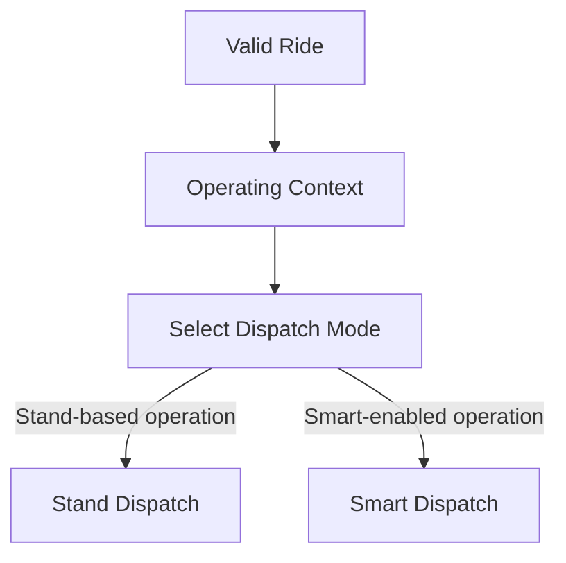

The decision may depend on:

```text
Operating Region
Business Rules
Operational Configuration
Availability of Smart Dispatch
Platform Readiness
```

The dispatch mode itself should not change the core ride lifecycle.

---

## 6. Stand Dispatch

Stand Dispatch is intended for operating environments where drivers are organized around a stand or queue.

```text
Ride Request
      ↓
Applicable Stand
      ↓
Eligible Stand Drivers
      ↓
Stand / Queue Rules
      ↓
Driver Selection
      ↓
Assignment
```

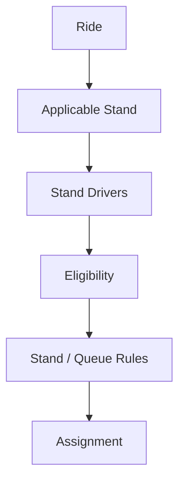

---

## 7. Stand Dispatch Principle

Stand Dispatch should preserve the operating model of the configured stand.

It should not unnecessarily introduce AI ranking when the operating rules require deterministic queue-based selection.

Conceptually:

```text
Stand Rules
    >
Optimization
```

when the operating mode explicitly requires stand-based dispatch.

---

## 8. Smart Dispatch

Smart Dispatch uses a broader set of signals to optimize driver selection.

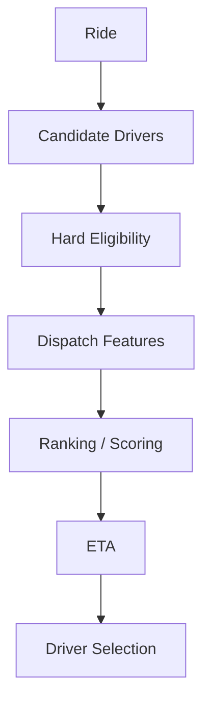

Potential signals include:

```text
Driver Location
ETA
Distance
Demand / Supply
Driver Availability
Historical Signals
Ride Characteristics
Operational Context
AI Prediction
```

The actual feature set is defined by the AI and development documentation.

---

## 9. Smart Dispatch Is Not AI-Only Dispatch

Smart Dispatch is a dispatch architecture.

AI is one capability that may assist it.

```text
Smart Dispatch
├── Candidate Discovery
├── Hard Eligibility
├── Feature Collection
├── Ranking
├── ETA
├── Business Rules
├── AI Signals
└── Assignment
```

Therefore:

```text
Smart Dispatch ≠ AI-only Dispatch
```

---

## 10. Hybrid Dispatch

The system can operate both strategies without creating two separate ride lifecycles.

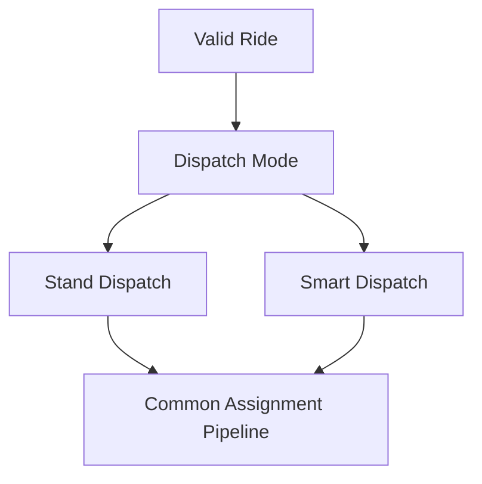

The common downstream outcome is:

```text
Driver Assignment
```

---

## 11. Candidate Discovery

Candidate discovery determines which drivers are worth evaluating.

```text
All Drivers
    ↓
Geospatial / Location Search
    ↓
Operational Candidates
    ↓
Eligibility
```

Candidate discovery should be efficient enough for real-time dispatch.

It should avoid sending the entire driver population into ranking.

---

## 12. Location as Candidate Input

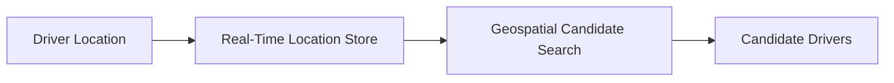

The detailed location architecture is documented in:

```text
05-DRIVER_LOCATION_AND_GEOSPATIAL_FLOW.md
```

---

## 13. Eligibility Filtering

After candidate discovery:

```text
Candidate
    ↓
Hard Eligibility
    ↓
Eligible Candidate
```

Eligibility should remove drivers who cannot legally or operationally receive the ride.

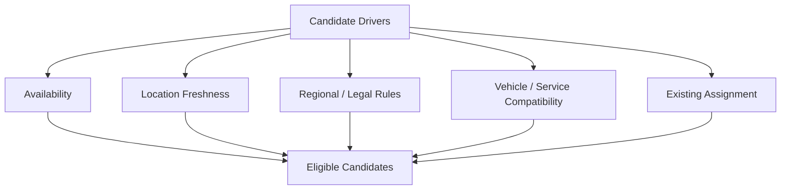

---

## 14. Legal Eligibility

Regional and legal validation is authoritative.

```text
Ride
 ↓
Regional / Legal Rules
 ↓
Allowed?
 ├── No → Reject / Do Not Dispatch
 └── Yes → Continue Dispatch
```

Dispatch must not bypass regional restrictions to obtain a better optimization result.

---

## 15. Candidate Ranking

Once hard constraints have been applied:

```text
Eligible Candidates
       ↓
Feature Collection
       ↓
Ranking
       ↓
Best Candidate
```

Ranking may use:

```text
ETA
Distance
Availability
Demand / Supply
Driver Signals
Ride Characteristics
AI Prediction
Business Rules
```

---

## 16. AI Ranking Boundary

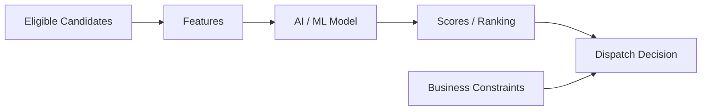

AI produces a signal.

The dispatch system remains responsible for applying the final domain constraints.

---

## 17. ETA Integration

ETA can be used as a dispatch signal.

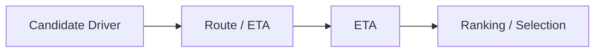

ETA may be obtained through:

```text
External Route Provider
ETA Model
Hybrid Provider + Model
```

The ETA capability remains replaceable.

---

## 18. Assignment

After selection:

```text
Selected Driver
      ↓
Assignment
      ↓
Driver Accepts?
```

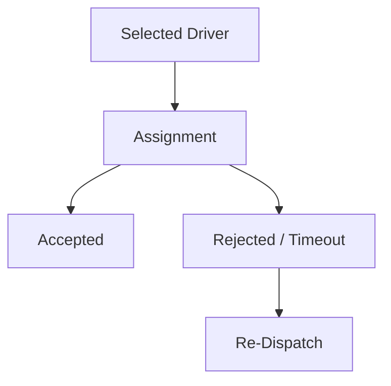

---

## 19. Assignment Is a Critical Boundary

Assignment connects:

```text
Ride
Driver
Dispatch
Location
Events
```

Therefore it must be:

```text
Consistent
Idempotent
Observable
Recoverable
Concurrency-Safe
```

---

## 20. Re-Dispatch

A dispatch attempt may fail.

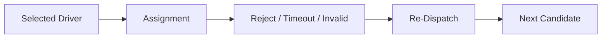

The system should avoid repeatedly selecting the same invalid candidate without state correction or exclusion.

---

## 21. Dispatch Attempt Lifecycle

```text
Dispatch Request
      ↓
Candidate Discovery
      ↓
Eligibility
      ↓
Ranking
      ↓
Candidate Selected
      ↓
Assignment Attempt
      ↓
Accepted?
   ┌──┴───┐
  Yes     No
   │       │
   ▼       ▼
Ride     Re-dispatch
```

---

## 22. No Candidate Available

If no eligible candidate exists:

```text
Ride
 ↓
Candidate Discovery
 ↓
Eligibility
 ↓
No Eligible Driver
```

Possible outcomes include:

```text
Retry
Wait
Expand Search
Switch Strategy
Notify Passenger
Expire
Cancel
```

The exact behaviour should follow configured operational and failure policies.

---

## 23. Dispatch Failure vs Ride Failure

A dispatch failure does not automatically mean the ride must fail.

```text
Dispatch Attempt Failed
        ↓
Recovery / Re-dispatch
        ↓
Another Dispatch Attempt
```

Only when the configured recovery options are exhausted should the ride move toward a terminal outcome.

---

## 24. Stand Dispatch Failure

For Stand Dispatch:

```text
Stand Candidate
      ↓
Invalid / Reject / Timeout
      ↓
Next Applicable Stand Candidate
```

The queue/stand rules remain authoritative.

---

## 25. Smart Dispatch Failure

For Smart Dispatch:

```text
Top Candidate
      ↓
Invalid / Reject / Timeout
      ↓
Next Ranked Candidate
```

The ranking system should not be required to restart from zero unless the candidate set or relevant features have materially changed.

---

## 26. Strategy Fallback

A strategy fallback may exist when permitted by operating configuration.

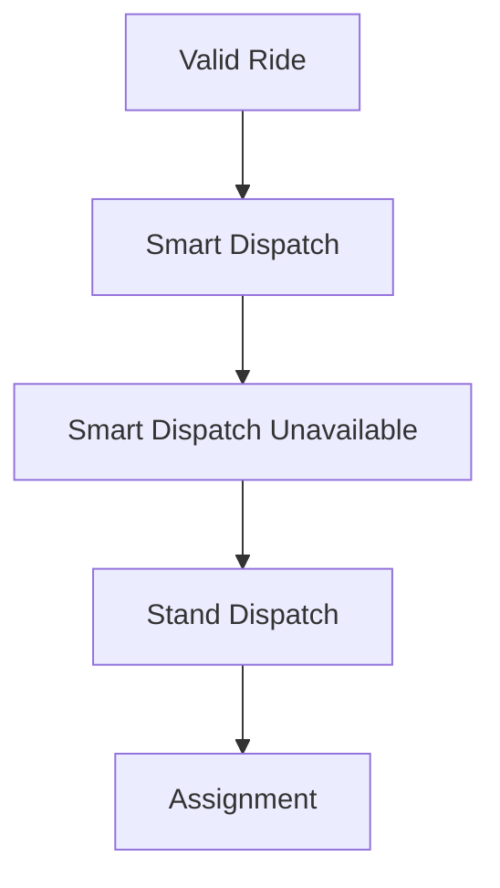

This is not an automatic rule for every environment.

Fallback behaviour must respect:

```text
Operating Region
Business Rules
Legal Constraints
Operational Configuration
```

---

## 27. Dispatch and Events

Dispatch produces and consumes relevant events.

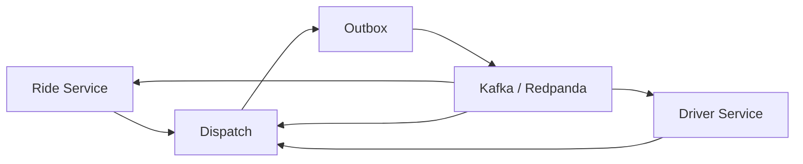

The event platform provides asynchronous propagation without requiring every dispatch interaction to be synchronous.

---

## 28. Dispatch State and Event State

Dispatch state and ride state should not be confused.

```text
Ride State
    ↓
Authoritative Ride Lifecycle

Dispatch State
    ↓
Current Matching / Assignment Process
```

A dispatch attempt can fail while the ride itself remains active.

---

## 29. Dispatch Idempotency

Retryable dispatch operations must be protected against duplicate effects.

Important operations include:

```text
Dispatch Request
Candidate Selection
Assignment
Assignment Confirmation
Re-Dispatch
```

Conceptually:

```text
Dispatch Operation
       ↓
Idempotency / State Validation
       ↓
Apply Valid Operation
```

---

## 30. Concurrent Dispatch

Distributed dispatch may encounter concurrent operations.

Example:

```text
Worker A → Assign Driver X
Worker B → Assign Driver X
```

The system must ensure that:

```text
Only one valid assignment wins
```

or that the conflict is safely resolved according to the domain rules.

---

## 31. Driver State During Dispatch

A candidate driver's state can change while dispatch is running.

```text
Candidate
   ↓
Driver Becomes Busy
   ↓
Assignment Attempt
   ↓
State Validation
   ↓
Reject / Re-select
```

Therefore candidate discovery should not be treated as permanent reservation unless the implementation explicitly establishes one.

---

## 32. Location Freshness

A geographically close driver may have stale location data.

```text
Nearby
  ≠
Currently Valid Candidate
```

Dispatch should consider location freshness as part of candidate eligibility.

---

## 33. ETA vs Distance

Distance alone is not necessarily the best dispatch signal.

```text
Straight-Line Distance
        ≠
Travel Time
```

ETA may account for:

```text
Road Network
Traffic
Route Restrictions
Provider Data
```

Therefore ETA can be a more useful operational signal than raw distance.

---

## 34. Dispatch Decision Layers

A useful conceptual model is:

```text
Layer 1 — Legal / Regional
        ↓
Layer 2 — Hard Eligibility
        ↓
Layer 3 — Candidate Discovery
        ↓
Layer 4 — Ranking / Optimization
        ↓
Layer 5 — Assignment
        ↓
Layer 6 — Recovery / Re-dispatch
```

The layers should not be collapsed into a single opaque AI decision.

---

## 35. Dispatch Architecture Summary

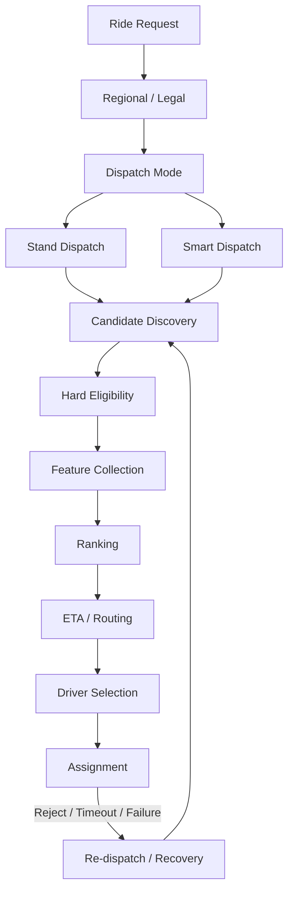

---

## 36. Hard Constraints Must Win

The following principle is mandatory:

```text
Optimization must never override hard constraints.
```

Examples:

```text
AI cannot select an ineligible driver.

ETA cannot override regional restrictions.

Distance cannot override driver availability.

A higher score cannot override an invalid vehicle/service type.

A fallback cannot bypass legal validation.
```

---

## 37. AI Is Replaceable

Dispatch should remain operational if the AI ranking component is unavailable.

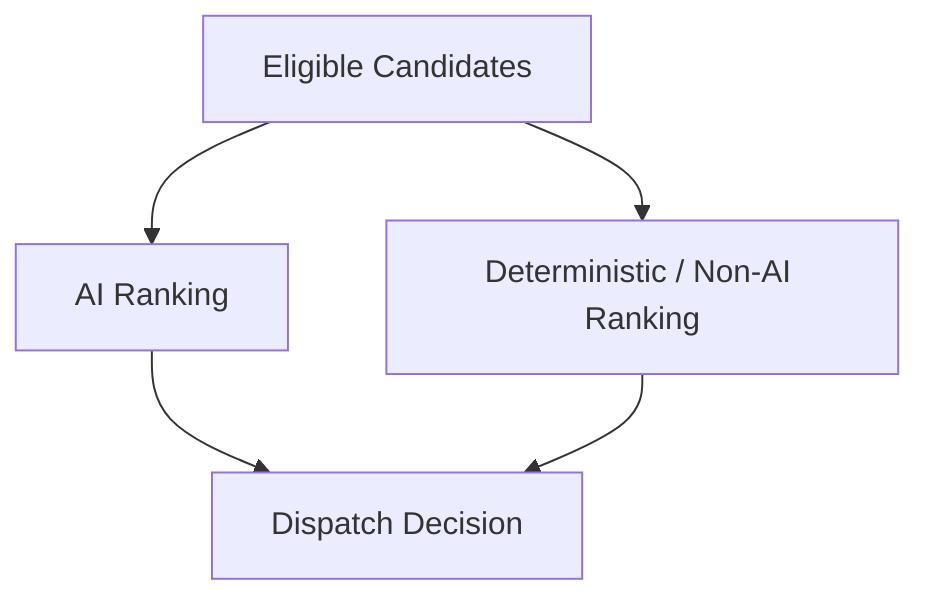

The actual fallback strategy depends on the configured operating mode.

---

## 38. ETA Is Replaceable

Similarly, dispatch should not become permanently unavailable because one ETA provider fails.

Conceptually:

```text
ETA Provider A
      ↓ failure
ETA Provider B / Alternative
      ↓
Fallback ETA / Signal
      ↓
Dispatch
```

The exact provider strategy belongs to the ETA architecture and ADR.

---

## 39. Observability

Important dispatch stages should be measurable:

```text
Candidate Search Latency
Candidate Count
Eligible Candidate Count
Ranking Latency
ETA Latency
Assignment Latency
Assignment Success Rate
Assignment Timeout Rate
Re-Dispatch Rate
Dispatch Failure Rate
```

AI-specific metrics belong to the AI observability documentation.

---

## 40. Dispatch Latency

The dispatch pipeline should be treated as latency-sensitive.

Conceptually:

```text
Request
 ↓
Validation
 ↓
Candidate Search
 ↓
Eligibility
 ↓
Ranking
 ↓
ETA
 ↓
Assignment
```

Slow dependencies should have appropriate:

```text
Timeouts
Fallbacks
Caching
Degradation
```

according to the relevant architecture.

---

## 41. Cost-Aware Dispatch

Optimization should consider operational cost where relevant.

Possible cost dimensions include:

```text
External Routing Calls
AI Inference
Infrastructure Load
Database Queries
Network Calls
```

Cost optimization must not violate:

```text
Correctness
Safety
Legal Rules
Required Reliability
```

---

## 42. Dispatch Boundary

This document intentionally does not define:

```text
Exact ranking formula
Exact ML model
Exact Kafka topic names
Exact API endpoints
Exact database schema
Exact Redis key format
Exact provider implementation
```

Those belong to their respective documentation and implementation.

---

## 43. AI Agent Usage

For dispatch-related work, load:

```text
01-SYSTEM_CONTEXT_AND_HIGH_LEVEL_ARCHITECTURE.md
02-SERVICE_AND_DOMAIN_ARCHITECTURE.md
03-RIDE_AND_DRIVER_LIFECYCLE.md
04-DISPATCH_ARCHITECTURE.md
05-DRIVER_LOCATION_AND_GEOSPATIAL_FLOW.md
06-EVENT_DRIVEN_AND_DATA_FLOW.md
07-AI_AND_ML_ARCHITECTURE.md
```

Then load the relevant ADRs:

```text
ADR-0010 — Driver Location Storage Strategy
ADR-0015 — Smart Dispatch and Stand Dispatch
ADR-0016 — AI-Assisted Dispatch Strategy
ADR-0017 — ETA and Route Provider Strategy
ADR-0018 — Regional and Legal Ride Validation
ADR-0019 — Data Consistency and Transaction Boundaries
ADR-0020 — Idempotency Strategy
ADR-0021 — Failure and Degradation Strategy
ADR-0022 — Observability Strategy
ADR-0026 — Model and AI Governance
ADR-0028 — Cost Optimization Strategy
```

---

## 44. Dispatch Design Rules

```text
1. Dispatch operates only on valid rides.

2. Regional and legal validation remains authoritative.

3. Stand Dispatch and Smart Dispatch are supported strategies.

4. Both strategies converge on the same assignment lifecycle.

5. Candidate discovery should precede expensive ranking operations.

6. Hard eligibility must be applied before optimization.

7. AI is a supporting capability, not the final authority.

8. ETA is a supporting capability, not the owner of ride state.

9. Assignment is a critical distributed transition.

10. Assignment must be safe under retries and concurrency.

11. Driver state and location can change during dispatch.

12. Location freshness matters.

13. Dispatch failure should normally lead to recovery or re-dispatch before ride failure.

14. Strategy fallback must respect regional and operational rules.

15. AI and external ETA dependencies should have safe degradation paths.

16. Dispatch must remain observable.

17. Dispatch must remain cost-aware.

18. Dispatch implementation can evolve without changing the fundamental ride lifecycle.
```

---

## 45. Related Documents

```text
01-SYSTEM_CONTEXT_AND_HIGH_LEVEL_ARCHITECTURE.md
02-SERVICE_AND_DOMAIN_ARCHITECTURE.md
03-RIDE_AND_DRIVER_LIFECYCLE.md
05-DRIVER_LOCATION_AND_GEOSPATIAL_FLOW.md
06-EVENT_DRIVEN_AND_DATA_FLOW.md
07-AI_AND_ML_ARCHITECTURE.md
08-SECURITY_FAILURE_AND_OBSERVABILITY.md
09-CLOUD_DEPLOYMENT_AND_INFRASTRUCTURE.md
10-DIAGRAM_INDEX.md
```

---

## 46. Related ADRs

```text
ADR-0004 — Domain-Driven Design
ADR-0005 — Event-Driven Architecture
ADR-0006 — Kafka / Redpanda for Event Streaming
ADR-0009 — Redis for Real-Time State and Caching
ADR-0010 — Driver Location Storage Strategy
ADR-0012 — Outbox Pattern
ADR-0013 — Dead Letter Queue Strategy
ADR-0015 — Smart Dispatch and Stand Dispatch
ADR-0016 — AI-Assisted Dispatch Strategy
ADR-0017 — ETA and Route Provider Strategy
ADR-0018 — Regional and Legal Ride Validation
ADR-0019 — Data Consistency and Transaction Boundaries
ADR-0020 — Idempotency Strategy
ADR-0021 — Failure and Degradation Strategy
ADR-0022 — Observability Strategy
ADR-0026 — Model and AI Governance
ADR-0028 — Cost Optimization Strategy
ADR-0029 — Architecture Evolution and Migration
```

---

## 47. Maintenance Rules

Update this document when:

```text
Dispatch strategy changes
Stand Dispatch semantics change
Smart Dispatch architecture changes
Candidate discovery changes materially
Eligibility boundaries change
Assignment semantics change
Major fallback behaviour changes
AI becomes a fundamentally different architectural component
```

Do not update it for:

```text
Minor ranking parameter changes
Internal refactoring
Small query optimizations
Variable changes
Routine bug fixes
```

---

## 48. Completion Criteria

```text
□ Stand Dispatch Represented
□ Smart Dispatch Represented
□ Hybrid Dispatch Represented
□ Strategy Selection Represented
□ Candidate Discovery Represented
□ Hard Eligibility Represented
□ Regional / Legal Boundary Represented
□ Ranking Represented
□ AI Boundary Represented
□ ETA Boundary Represented
□ Assignment Represented
□ Re-Dispatch Represented
□ Failure / Recovery Represented
□ Location Freshness Considered
□ Concurrency Considered
□ Idempotency Considered
□ Event Relationship Represented
□ Observability Represented
□ Cost Considerations Represented
□ Related ADRs Referenced
□ Related Diagrams Referenced
```

---

## 49. Status

```text
Status: Complete

Document:
04-DISPATCH_ARCHITECTURE.md

Diagram Type:
Stand + Smart + Hybrid Dispatch Architecture

Primary Audience:
AI Agents
Architects
Backend Engineers
Dispatch Engineers
AI / ML Engineers

Primary Purpose:
Fast understanding of the RideForge dispatch decision pipeline.

Previous Diagram:
03-RIDE_AND_DRIVER_LIFECYCLE.md

Next Diagram:
05-DRIVER_LOCATION_AND_GEOSPATIAL_FLOW.md
```

---

# 24. Clarification: Canonical Dispatch Strategy Model

The dispatch architecture must implement the following canonical model.

## 24.1 Two Primary Dispatch Strategies

RideForge has two primary dispatch strategies:

```text
Smart Stand Dispatch
Smart Dispatch
```

AI-assisted dispatch is an optimization capability and is **not a third primary dispatch strategy**.

The dispatch architecture therefore follows:

```text
Configuration Resolution
        ↓
Effective Dispatch Strategy
        ↓
Candidate Discovery
        ↓
Candidate Pipeline
        ↓
Strategy-Specific Prioritization / Ranking
        ↓
Assignment
```

AI may participate in optimization/ranking without replacing the resolved primary strategy.

---

## 24.2 Hierarchical Dispatch Strategy Configuration

The dispatch strategy may be configured at different levels of the applicable hierarchy.

Possible levels include:

```text
State
District
City / Town
Rural Area
Auto Stand
Specific Ride Level
Other Intermediate Levels
```

Not every level needs an explicit configuration.

The system must start from the most specific applicable level and move upward until it finds an explicitly configured dispatch strategy.

```text
Most Specific Applicable Configuration
        ↓
Explicit Strategy?
   ├── YES → Effective Strategy
   └── NO
        ↓
Parent Configuration
        ↓
Continue Upward
        ↓
System Default
```

The canonical precedence rule is:

> **Specific configuration overrides inherited configuration.**

Example:

```text
District → Smart Dispatch
Town A   → Smart Stand Dispatch
Town B   → No explicit configuration
```

Therefore:

```text
Town A ride → Smart Stand Dispatch
Town B ride → Smart Dispatch
```

The hierarchy must remain extensible and must not be hard-coded to a fixed sequence such as:

```text
State → District → Town → Stand
```

---

## 24.3 Smart Stand Dispatch

Smart Stand Dispatch is **stand-preferred, not stand-exclusive**.

When the rider is within the radius of a configured auto stand:

```text
Ride Pickup
    ↓
Applicable Auto Stand
    ↓
Eligible Drivers at Preferred Stand
    ↓
Stand Queue / Ordering
    ↓
Suitable driver available?
   ├── YES → preferred dispatch
   └── NO  → broader candidate discovery
```

The broader candidate search may include:

```text
Drivers outside the preferred stand
Drivers at nearby stands
Drivers from nearby locations
```

The stand therefore acts as a **preferred dispatch source**, not a hard candidate boundary.

If the rider is outside the radius of all configured stands, Smart Stand Dispatch must not restrict the search to stand drivers.

---

## 24.4 Smart Dispatch

Smart Dispatch is stand-agnostic.

It searches for the closest/best eligible available drivers without using auto-stand membership as an inherent dispatch preference.

Candidates may include:

```text
Drivers at auto stands
Drivers outside auto stands
Drivers from nearby locations
```

subject to:

```text
Eligibility
Availability
Distance
ETA
Legal / Regional Constraints
Service Constraints
Other Configured Matching Factors
```

---

## 24.5 Cross-Location Dispatch

A location's configured dispatch strategy must not automatically become a hard geographic boundary.

Example:

```text
Location A → Smart Dispatch
Location B → Smart Stand Dispatch
```

If a ride originates in Location A and suitable local supply is unavailable:

```text
Location A
    ↓
Local candidate search
    ↓
Insufficient suitable supply
    ↓
Nearby Location B
    ↓
Eligible candidate discovery
```

Drivers from Location B may be considered even though Location B uses Smart Stand Dispatch.

Location B's strategy determines the strategy-specific context for its drivers; it does not automatically make those drivers ineligible for the ride.

The architecture should preserve:

```text
Candidate Location
Candidate Location Strategy
Stand Membership
Relevant Stand
Queue Position
Discovery Source
Expansion Level
Distance
ETA where available
```

---

## 24.6 Candidate Preference Is Not Candidate Eligibility

The dispatch architecture must distinguish:

```text
Preferred Candidate
```

from:

```text
Eligible Candidate
```

For example:

```text
Driver at preferred stand
    → preferred under Smart Stand Dispatch when applicable

Driver outside preferred stand
    → potentially eligible, but not initially preferred

Driver from nearby location
    → potentially eligible, subject to hard constraints
```

Therefore:

```text
Not Preferred ≠ Ineligible
```

The system must not discard candidates merely because they are not currently preferred.

---

## 24.7 Dispatch Strategy Is Not Candidate Discovery Scope

The architecture must preserve the separation:

```text
Dispatch Strategy
        ≠
Candidate Discovery Scope
```

Smart Stand Dispatch can use stand preference while still expanding candidate discovery.

Smart Dispatch can search normally without stand preference.

Candidate discovery is responsible for finding candidates; strategy-specific prioritization determines how those candidates are preferred.

---

## 24.8 Strategy Preservation During Expansion

Candidate expansion must not silently change the effective dispatch strategy.

Example:

```text
Effective Strategy:
Smart Stand Dispatch

Preferred stand unavailable
        ↓
Expand candidate discovery
        ↓
Consider broader candidates
```

The effective strategy remains:

```text
Smart Stand Dispatch
```

unless an explicit business/configuration rule defines a strategy transition.

Therefore:

```text
Candidate Expansion ≠ Strategy Switching
```

---

## 24.9 AI-Assisted Dispatch

AI-assisted dispatch is an optimization capability applied within the resolved strategy.

It may assist with:

```text
Candidate Ranking
ETA Prediction
Acceptance Prediction
Demand / Supply Signals
Other Approved Prediction Signals
```

AI must not override:

```text
Driver Eligibility
Availability
Legal / Regional Restrictions
Safety Constraints
Vehicle / Service Compatibility
Configured Stand Queue Semantics
Other Hard Business Rules
```

AI failure must preserve the resolved primary strategy.

```text
Smart Stand Dispatch + AI
        ↓
AI unavailable
        ↓
Deterministic Smart Stand Dispatch
```

and:

```text
Smart Dispatch + AI
        ↓
AI unavailable
        ↓
Deterministic Smart Dispatch
```

---

## 24.10 Regional and Legal Validation

Cross-location discovery does not bypass regional or legal restrictions.

The architecture must maintain:

```text
Candidate Discovery
        ↓
Hard Eligibility / Regional Validation
        ↓
Strategy-Specific Prioritization
        ↓
Assignment
```

The following distinctions are mandatory:

```text
Geographic Proximity ≠ Legal Permission
Candidate Discovery ≠ Legal Authorization
Dispatch Strategy ≠ Legal Boundary
```

Every expanded candidate must independently satisfy applicable regional/legal rules.

---

## 24.11 Dispatch Context

The dispatch architecture should preserve sufficient context across service and component boundaries.

Where applicable:

```text
Effective Dispatch Strategy
Configuration Level
Configuration Source
Applicable Stand
Candidate Location
Candidate Location Strategy
Stand Membership
Queue Position
Discovery Source
Expansion Level
AI Assisted
Model Version
```

This prevents downstream components from reconstructing strategy semantics incorrectly.

---

## 24.12 Canonical End-to-End Flow

The canonical architecture is:

```text
Ride Request
    ↓
Resolve Hierarchical Dispatch Configuration
    ↓
Effective Dispatch Strategy
    ↓
Candidate Discovery
    ↓
Hard Eligibility / Regional / Legal Validation
    ↓
Candidate Pipeline
    ↓
Strategy-Specific Prioritization
    ↓
AI-Assisted Ranking where enabled
    ↓
Reservation / Offer
    ↓
Assignment
```

For Smart Stand Dispatch:

```text
Ride
 ↓
Inside Stand Radius?
 ├── YES
 │    ↓
 │  Prefer Relevant Stand
 │    ↓
 │  Stand Queue / Ordering
 │    ↓
 │  Suitable supply?
 │    ├── YES → continue
 │    └── NO → broaden discovery
 │
 └── NO
      ↓
   Normal eligible-driver discovery
```

For Smart Dispatch:

```text
Ride
 ↓
Normal eligible nearby-driver discovery
 ↓
Hard eligibility / legal validation
 ↓
Ranking
 ↓
Assignment
```

---

## 24.13 Implementation Guardrails

The dispatch architecture must not:

```text
Treat Smart Stand Dispatch as stand-only.

Reject every non-stand driver when a rider is inside a stand radius.

Treat Smart Dispatch as stand-aware without an explicit business rule.

Treat a location's strategy as a hard geographic boundary.

Reject nearby-location candidates solely because their source location uses another strategy.

Hard-code the hierarchy to State → District → Town → Stand.

Allow parent configuration to override explicit child configuration.

Treat candidate expansion as strategy switching.

Treat AI-assisted dispatch as a third primary strategy.

Allow AI failure to silently switch strategies.

Allow AI to override hard eligibility, legal, safety, or operational constraints.

Replace configured stand queue semantics with an arbitrary AI score.

Allow cross-location discovery to bypass regional/legal validation.

Discard source-location, stand, queue, or strategy context required downstream.

Resolve the dispatch strategy independently in multiple services with inconsistent precedence rules.
```

Any intentional change to these semantics must be documented through a new or superseding ADR.

