# 05 — Driver Location and Geospatial Flow

> **Format:** Markdown + Mermaid  
> **Scope:** Driver location ingestion, real-time state, Redis, PostGIS, geospatial candidate discovery, freshness, and dispatch integration  
> **Purpose:** Provide a compact visual model of how RideForge receives, stores, processes, and consumes driver location data.

---

## 1. Purpose

Driver location is a high-frequency real-time capability that supports:

```text
Driver Availability
+
Geospatial Candidate Discovery
+
Dispatch
+
ETA
+
Trip Tracking
```

This document explains the logical flow without prescribing every database key, schema, query, or infrastructure detail.

The detailed storage decision is governed by:

```text
ADR-0010 — Driver Location Storage Strategy
```

---

## 2. High-Level Flow

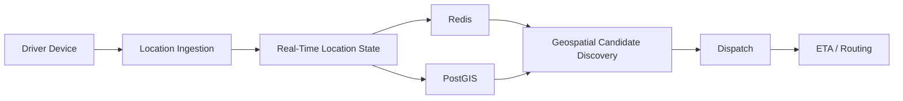

The exact division between Redis and PostGIS follows the established location storage strategy.

---

## 3. Why Driver Location Is a Separate Capability

Driver location differs from ordinary driver profile data because it is:

```text
High Frequency
Time Sensitive
Geospatial
Read Frequently
Updated Frequently
Useful for Real-Time Decisions
```

Therefore:

```text
Driver Profile
    ≠
Current Driver Location
```

---

## 4. Driver Location Lifecycle

```text
Driver Goes Online
      ↓
Location Updates Begin
      ↓
Location Ingestion
      ↓
Real-Time State Update
      ↓
Geospatial Availability
      ↓
Dispatch Candidate Discovery
      ↓
Location Continues Updating
      ↓
Driver Goes Offline / Becomes Unavailable
```

---

## 5. Location Ingestion

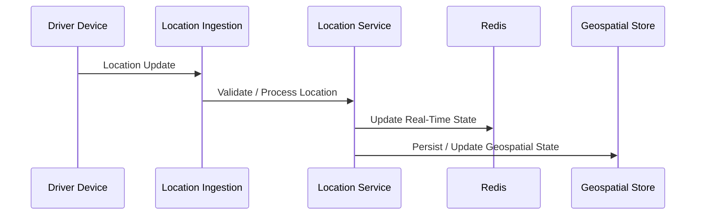

A location update should be treated as time-sensitive data.

---

## 6. Location Payload

Conceptually, a location update contains:

```text
Driver Identifier
Latitude
Longitude
Timestamp
```

It may also contain operational metadata such as:

```text
Accuracy
Heading
Speed
Device Information
```

The exact production contract belongs to the implementation and API documentation.

---

## 7. Location Freshness

A location is useful only while it remains sufficiently fresh.

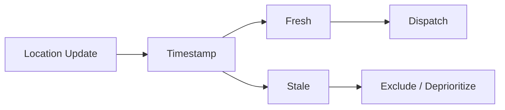

Therefore:

```text
Nearby
    ≠
Currently Valid
```

A driver with stale location data should not automatically be treated as a valid dispatch candidate.

---

## 8. Real-Time State

Redis is used for real-time state and caching according to the established architecture.

Conceptually:

```text
Driver Location Update
        ↓
Redis
        ↓
Fast Current-State Access
        ↓
Candidate Discovery / Dispatch
```

Redis should not automatically be treated as the authoritative transactional source for every piece of driver data.

---

## 9. Geospatial State

PostGIS provides geospatial capabilities associated with the PostgreSQL data platform.

Conceptually:

```text
Location
    ↓
PostGIS
    ↓
Geospatial Operations
    ↓
Candidate Discovery / Spatial Queries
```

The exact persistence strategy is defined by:

```text
ADR-0008 — PostGIS for Geospatial Operations
ADR-0010 — Driver Location Storage Strategy
```

---

## 10. Redis and PostGIS Responsibilities

At a high level:

| Capability | Redis | PostGIS |
|---|---|---|
| Fast current-state access | Primary role | Supporting role |
| Real-time location state | Primary role | Supporting / persistent role |
| Caching | Yes | No |
| Geospatial queries | Possible / supporting | Primary geospatial capability |
| Transactional relational data | No | Yes through PostgreSQL |
| High-frequency state access | Yes | Not the primary role |

The exact implementation may evolve without changing the conceptual responsibilities.

---

## 11. Candidate Discovery

Candidate discovery converts a ride location into a manageable set of nearby drivers.

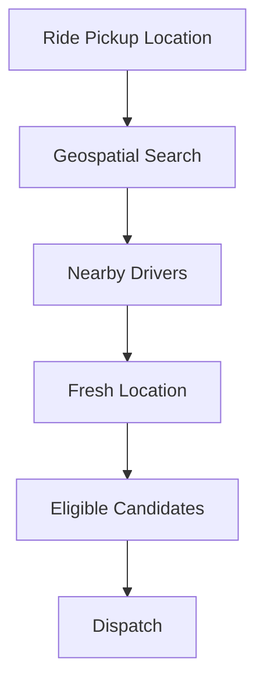

The purpose is to avoid evaluating every driver in the platform.

---

## 12. Search Radius

Candidate discovery may use a geographic search area.

Conceptually:

```text
Pickup Point
     ↓
Search Radius
     ↓
Candidate Drivers
```

The radius may be:

```text
Fixed
Dynamic
Configuration-Driven
Strategy-Dependent
```

The exact production algorithm belongs to the dispatch implementation.

---

## 13. Progressive Candidate Expansion

If the initial search does not provide enough candidates:

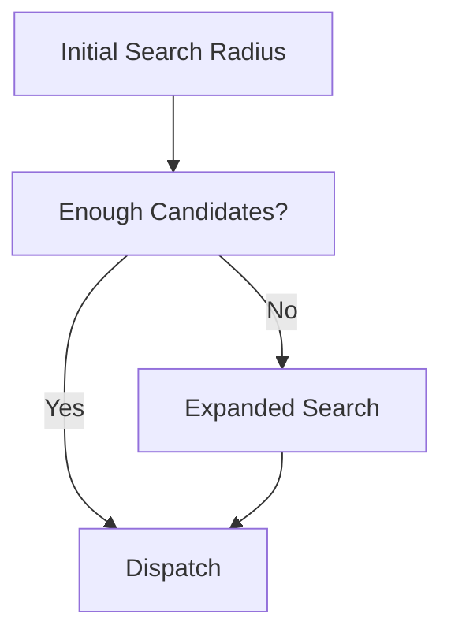

This is a possible operational strategy and should be enabled only where it matches the configured dispatch policy.

---

## 14. Candidate Discovery vs Ranking

These are different operations.

```text
Candidate Discovery
    =
Who is geographically / operationally relevant?

Ranking
    =
Which eligible candidate is preferable?
```

Therefore:

```text
Location / Geospatial Layer
        ↓
Candidate Discovery

Dispatch / Ranking Layer
        ↓
Candidate Selection
```

---

## 15. Candidate Pipeline

```mermaid
flowchart LR
    All["All Drivers"]
    Location["Location Search"]
    Fresh["Fresh Location"]
    Available["Available"]
    Legal["Regional / Legal"]
    Service["Service Compatibility"]
    Ranked["Ranked Candidates"]
    Assignment["Assignment"]

    All --> Location
    Location --> Fresh
    Fresh --> Available
    Available --> Legal
    Legal --> Service
    Service --> Ranked
    Ranked --> Assignment
```

The actual order of individual filters may vary, but hard constraints must remain authoritative.

---

## 16. Driver Availability

Location alone does not make a driver dispatchable.

A useful conceptual condition is:

```text
Dispatchable Driver
=
Available
+
Location Fresh
+
Eligible
+
Operationally Valid
+
Not Already Committed
```

---

## 17. Driver Location and Driver State

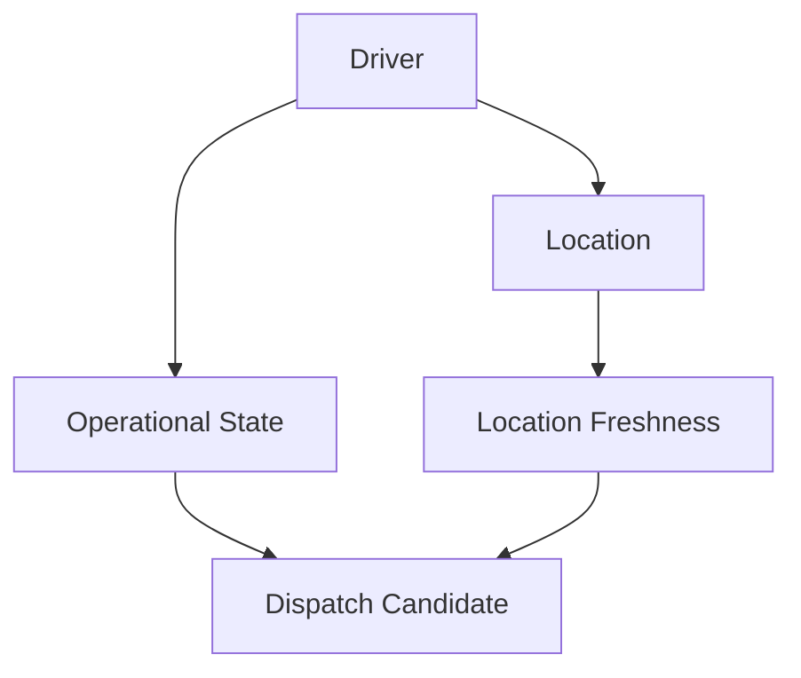

Both state and location must be considered.

---

## 18. Location Update Frequency

Location updates can occur much more frequently than ordinary domain state changes.

Therefore the location path should avoid unnecessary work such as:

```text
Large Transactional Writes
Expensive Cross-Service Calls
Unnecessary Event Fan-Out
Repeated Heavy Queries
```

The real-time path should remain optimized for the expected location update rate.

---

## 19. Location Update Flow

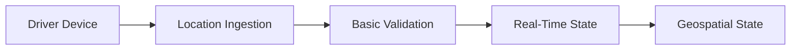

Validation may include:

```text
Payload Validity
Timestamp Validity
Coordinate Validity
Driver Identity
Basic Operational Checks
```

The exact validation rules belong to implementation documentation.

---

## 20. Invalid Location Data

Invalid location updates should not overwrite valid state.

Examples:

```text
Invalid Coordinates
Impossible Timestamp
Malformed Payload
Unknown Driver
```

Conceptually:

```text
Location Update
      ↓
Validation
   ┌──┴───┐
 Valid   Invalid
   │        │
   ▼        ▼
Update    Reject
```

---

## 21. Out-of-Order Location Updates

Distributed networks can deliver updates out of order.

Example:

```text
Update A — t=10:00:10
Update B — t=10:00:08
```

The older update should not blindly replace newer state.

Conceptually:

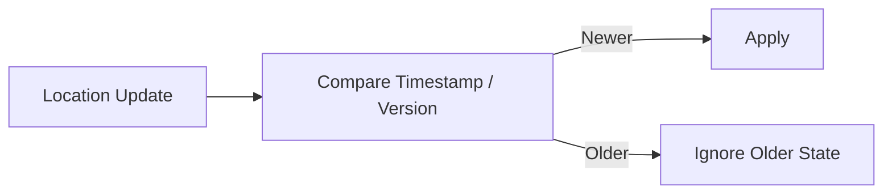

The exact implementation mechanism is part of the development/data consistency design.

---

## 22. Location Freshness Window

Conceptually:

```text
Current Time
     -
Last Location Timestamp
     =
Location Age
```

Then:

```text
Location Age <= Freshness Threshold
        ↓
Fresh

Location Age > Freshness Threshold
        ↓
Stale
```

The threshold should be configurable rather than hard-coded into unrelated dispatch logic.

---

## 23. Stale Driver Handling

A stale driver may be:

```text
Excluded
Deprioritized
Marked Unavailable
Revalidated
```

The exact behaviour depends on the operational strategy.

The important architectural rule is:

```text
Stale location must not silently appear equivalent to fresh location.
```

---

## 24. Driver Going Offline


When a driver becomes unavailable, the real-time candidate state should reflect that change promptly enough for dispatch correctness.

---

## 25. Driver Becoming Busy

After assignment:

```text
Available
   ↓
Assigned
   ↓
Unavailable for New Ride
```

The location may continue updating, but the driver should not remain a normal candidate for unrelated rides.

---

## 26. Active Trip Location

During an active trip:

```text
Driver
  ↓
Location Updates
  ↓
Real-Time State
  ↓
Trip Tracking
```

Location can support:

```text
Passenger Tracking
ETA Updates
Trip Monitoring
Operational Visibility
```

These use cases should not unnecessarily modify the core ride lifecycle.

---

## 27. Location and ETA

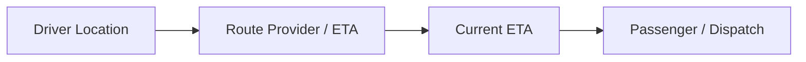

ETA is a separate capability and should remain replaceable.

---

## 28. Location and Dispatch

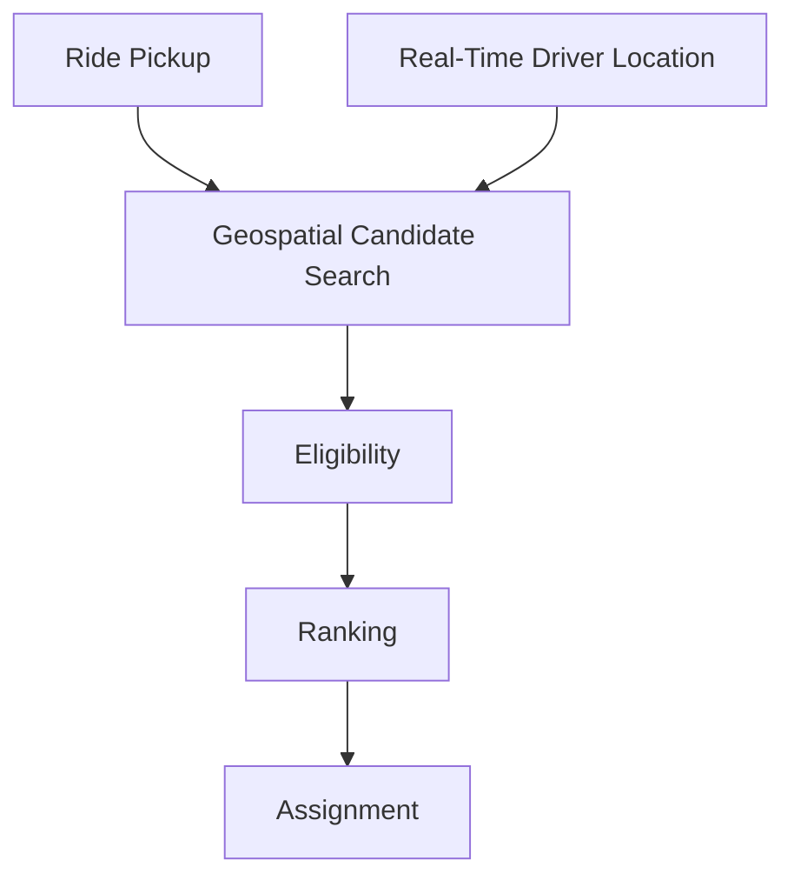

---

## 29. Location and Smart Dispatch

Smart Dispatch may use location-derived features such as:

```text
Distance
ETA
Driver Density
Driver Availability
Spatial Distribution
Pickup Proximity
```

Conceptually:

```text
Location
   ↓
Geospatial Features
   ↓
Smart Dispatch
   ↓
Ranking
```

The feature engineering and AI pipeline are documented separately.

---

## 30. Location and Stand Dispatch

Stand Dispatch may use location for:

```text
Driver Presence
Operational Availability
Stand Assignment Context
```

However, location optimization must not replace the configured stand/queue rules.

---

## 31. Geospatial Query Boundary

The geospatial layer should expose a capability such as:

```text
Find Nearby Drivers
```

rather than forcing dispatch to know the underlying database query implementation.

Conceptually:

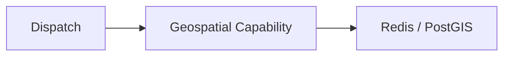

This keeps dispatch decoupled from storage details.

---

## 32. Storage Abstraction

The application should avoid spreading:

```text
Redis Commands
PostGIS SQL
Geospatial Index Details
```

throughout the dispatch domain.

Prefer:

```text
Dispatch
    ↓
Location / Geospatial Interface
    ↓
Storage Implementation
```

This allows the storage strategy to evolve.

---

## 33. Location Data Consistency

Location data is inherently time-sensitive.

Therefore it should be treated differently from strongly transactional state.

Conceptually:

```text
Ride State
    ↓
Strong Transactional Semantics

Driver Location
    ↓
Freshness + Temporal Validity
```

The system should explicitly define which location guarantees are required by each consumer.

---

## 34. Location Eventing

Not every raw location update needs to become a platform-wide event.

Because location can be high frequency:

```text
Raw Location Stream
    ≠
Domain Event Stream
```

Event publication should be selective and driven by actual consumers and requirements.

This avoids unnecessary event volume and infrastructure cost.

---

## 35. Location Observability

Important location metrics include:

```text
Location Update Rate
Location Ingestion Latency
Location Processing Latency
Stale Location Rate
Invalid Location Rate
Out-of-Order Update Rate
Candidate Search Latency
Candidate Search Result Count
```

These should be monitored without creating excessive observability overhead.

---

## 36. Location Failure

If the real-time location capability becomes degraded:

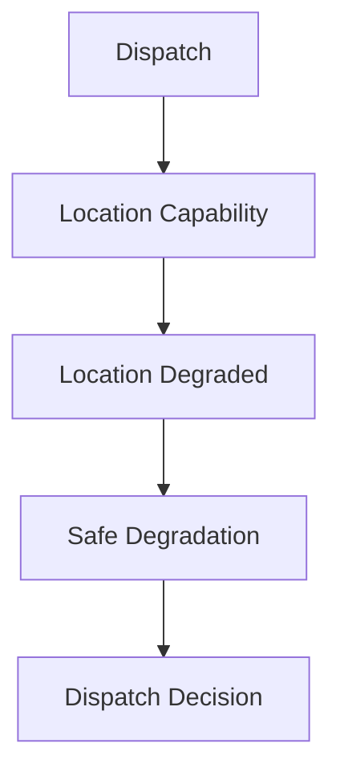

Possible outcomes depend on operational policy:

```text
Use Last Known Fresh State
Reduce Candidate Set
Retry
Use Alternative Capability
Delay Dispatch
Fail Safely
```

Stale data must not be silently treated as current data.

---

## 37. Redis Failure

Redis is a real-time capability.

A Redis failure should not automatically imply that all transactional RideForge functionality is lost.

The system should have an explicit degradation strategy for location-dependent operations.

The exact fallback belongs to:

```text
ADR-0021 — Failure and Degradation Strategy
```

---

## 38. PostGIS Failure

Geospatial operations may become degraded if the geospatial data path is unavailable.

The system should distinguish:

```text
Transactional Database Failure
```

from:

```text
Geospatial Capability Failure
```

and apply the documented recovery/degradation strategy.

---

## 39. Location Security

Location data is sensitive operational information.

The location subsystem should consider:

```text
Authentication
Authorization
Transport Security
Access Control
Retention
Logging Hygiene
```

Raw precise location should not be unnecessarily exposed through logs or unrelated services.

---

## 40. Location Privacy

Location data should follow the project's data governance and privacy requirements.

Avoid:

```text
Unnecessary Retention
Unnecessary Replication
Unrestricted Access
Raw Location in General-Purpose Logs
```

The detailed governance requirements belong to the security, privacy, and AI documentation.

---

## 41. High-Level Location Architecture

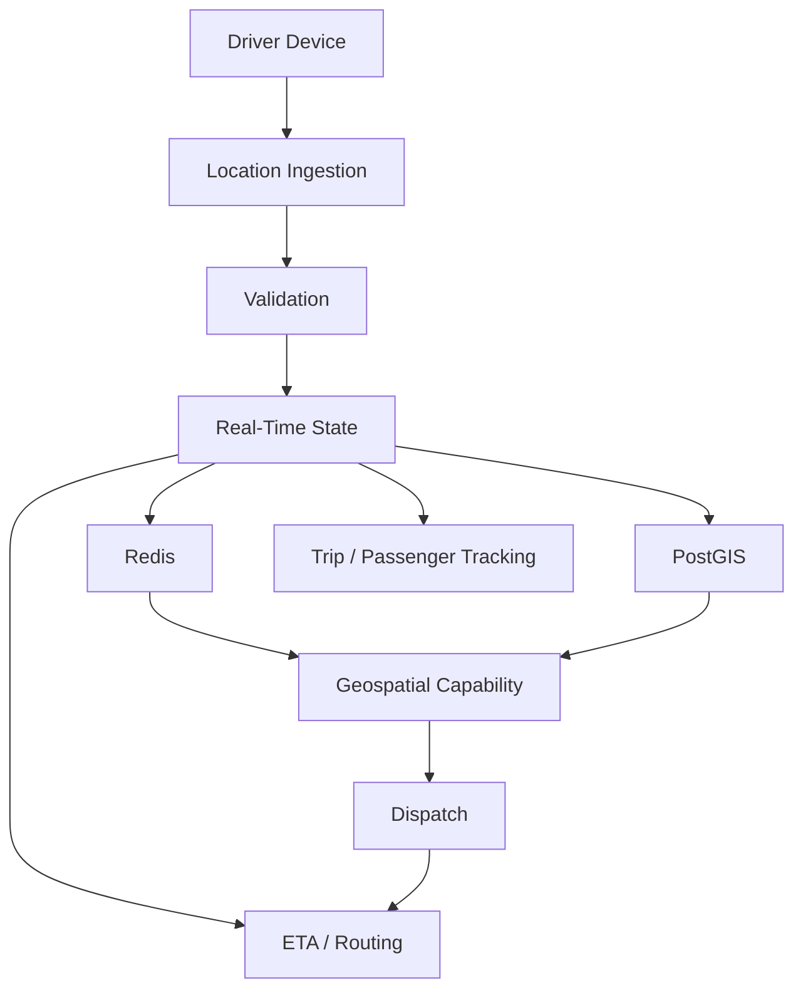

---

## 42. Complete Location-to-Dispatch Flow

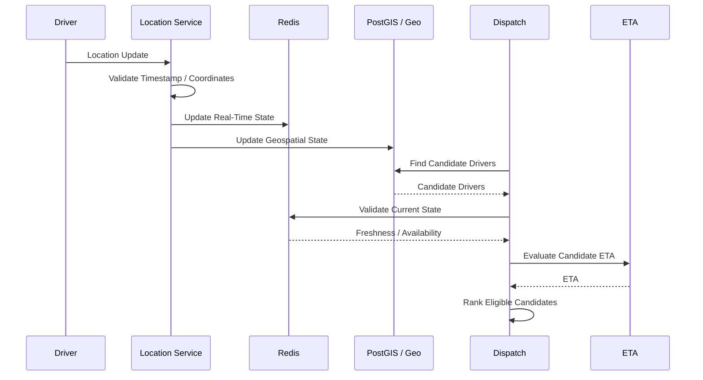

---

## 43. Architecture Rules

```text
1. Driver location is a real-time capability.

2. Driver profile state and current location are separate concerns.

3. Redis supports fast real-time state and caching.

4. PostGIS supports geospatial operations within the PostgreSQL platform.

5. Dispatch consumes location through a capability boundary.

6. Candidate discovery is separate from candidate ranking.

7. Location freshness is part of candidate validity.

8. Out-of-order updates must not blindly overwrite newer state.

9. Invalid location data must not corrupt valid state.

10. Driver availability and location must both be considered.

11. Raw high-frequency location updates should not automatically become platform-wide events.

12. Location-dependent failures require explicit degradation behaviour.

13. Location data requires appropriate security and privacy controls.

14. Storage implementation details should not leak throughout domain logic.

15. Location architecture must remain compatible with both Stand and Smart Dispatch.

16. Location should support ETA and tracking without owning ride lifecycle state.
```

---

## 44. AI Agent Usage

For driver-location or geospatial work, load:

```text
01-SYSTEM_CONTEXT_AND_HIGH_LEVEL_ARCHITECTURE.md
02-SERVICE_AND_DOMAIN_ARCHITECTURE.md
03-RIDE_AND_DRIVER_LIFECYCLE.md
04-DISPATCH_ARCHITECTURE.md
05-DRIVER_LOCATION_AND_GEOSPATIAL_FLOW.md
```

Relevant ADRs:

```text
ADR-0007 — PostgreSQL as Primary Database
ADR-0008 — PostGIS for Geospatial Operations
ADR-0009 — Redis for Real-Time State and Caching
ADR-0010 — Driver Location Storage Strategy
ADR-0011 — PgBouncer for Database Connection Pooling
ADR-0018 — Regional and Legal Ride Validation
ADR-0019 — Data Consistency and Transaction Boundaries
ADR-0021 — Failure and Degradation Strategy
ADR-0022 — Observability Strategy
ADR-0023 — Security and Secret Management
ADR-0028 — Cost Optimization Strategy
```

For Smart Dispatch or AI location features, additionally load:

```text
07-AI_AND_ML_ARCHITECTURE.md
```

and the relevant AI documentation.

---

## 45. Related Documents

```text
01-SYSTEM_CONTEXT_AND_HIGH_LEVEL_ARCHITECTURE.md
02-SERVICE_AND_DOMAIN_ARCHITECTURE.md
03-RIDE_AND_DRIVER_LIFECYCLE.md
04-DISPATCH_ARCHITECTURE.md
06-EVENT_DRIVEN_AND_DATA_FLOW.md
07-AI_AND_ML_ARCHITECTURE.md
08-SECURITY_FAILURE_AND_OBSERVABILITY.md
09-CLOUD_DEPLOYMENT_AND_INFRASTRUCTURE.md
10-DIAGRAM_INDEX.md
```

---

## 46. Related ADRs

```text
ADR-0007 — PostgreSQL as Primary Database
ADR-0008 — PostGIS for Geospatial Operations
ADR-0009 — Redis for Real-Time State and Caching
ADR-0010 — Driver Location Storage Strategy
ADR-0011 — PgBouncer for Database Connection Pooling
ADR-0015 — Smart Dispatch and Stand Dispatch
ADR-0017 — ETA and Route Provider Strategy
ADR-0018 — Regional and Legal Ride Validation
ADR-0019 — Data Consistency and Transaction Boundaries
ADR-0021 — Failure and Degradation Strategy
ADR-0022 — Observability Strategy
ADR-0023 — Security and Secret Management
ADR-0028 — Cost Optimization Strategy
```

---

## 47. Maintenance Rules

Update this document when:

```text
Driver location architecture changes
Real-time location storage strategy changes
Redis responsibilities change
PostGIS responsibilities change
Geospatial candidate discovery changes materially
Location freshness semantics change
Major location failure behaviour changes
```

Do not update it for:

```text
Minor query optimization
Internal variable changes
Small implementation refactors
Routine bug fixes
```

---

## 48. Completion Criteria

```text
□ Location Ingestion Represented
□ Real-Time State Represented
□ Redis Role Represented
□ PostGIS Role Represented
□ Location Freshness Represented
□ Candidate Discovery Represented
□ Eligibility Relationship Represented
□ Ranking Boundary Represented
□ Dispatch Relationship Represented
□ ETA Relationship Represented
□ Stand Dispatch Relationship Represented
□ Smart Dispatch Relationship Represented
□ Out-of-Order Handling Considered
□ Invalid Location Handling Considered
□ Location Failure Considered
□ Privacy / Security Considered
□ Event Volume Considered
□ Related ADRs Referenced
□ Related Diagrams Referenced
```

---

## 49. Status

```text
Status: Complete

Document:
05-DRIVER_LOCATION_AND_GEOSPATIAL_FLOW.md

Diagram Type:
Driver Location + Geospatial + Dispatch Flow

Primary Audience:
AI Agents
Architects
Backend Engineers
Dispatch Engineers
Geospatial Engineers

Primary Purpose:
Fast understanding of the driver location path and its relationship with Redis, PostGIS, and dispatch.

Previous Diagram:
04-DISPATCH_ARCHITECTURE.md

Next Diagram:
06-EVENT_DRIVEN_AND_DATA_FLOW.md
```

---

## 50. Dispatch Strategy and Geospatial Discovery Clarification

The geospatial flow must support the canonical RideForge dispatch model without turning dispatch strategy into a hard geographic candidate boundary.

### 50.1 Two Primary Dispatch Strategies

RideForge has two primary dispatch strategies:

```text
Smart Stand Dispatch
Smart Dispatch
```

AI-assisted dispatch is an optimization capability and is **not a third primary dispatch strategy**.

The geospatial layer must therefore provide geographic information and candidate discovery for the resolved strategy rather than inventing an additional AI strategy.

---

### 50.2 Hierarchical Dispatch Strategy Is Resolved Upstream

The geospatial layer must not independently resolve the dispatch configuration hierarchy.

The effective strategy is resolved before candidate discovery using the most specific applicable explicit configuration:

```text
Most Specific Applicable Configuration
        ↓
Explicit Strategy?
   ├── YES → Effective Strategy
   └── NO
        ↓
Parent Configuration
        ↓
Continue Upward
        ↓
System Default
```

Possible configuration levels include:

```text
State
District
City / Town
Rural Area
Auto Stand
Specific Ride Level
Other Intermediate Levels
```

The canonical rule is:

> **Specific configuration overrides inherited configuration.**

Geo components receive the resulting strategy/context; they do not determine the inheritance rules.

---

### 50.3 Smart Stand Dispatch and Stand Radius

Smart Stand Dispatch is **stand-preferred, not stand-exclusive**.

When the rider is within the radius of a configured auto stand, the geospatial flow should identify the applicable stand and make that context available to dispatch:

```text
Pickup Location
      ↓
Inside Configured Stand Radius?
   ├── YES → Preferred Stand Context
   └── NO  → No Preferred Stand
```

The stand radius identifies a **preferred dispatch source**.

It must not be interpreted as:

```text
Driver Search Boundary
```

Therefore:

```text
Pickup inside Stand Radius
        ≠
Only Drivers Inside Stand Radius
```

If suitable stand supply is unavailable, candidate discovery may expand to:

```text
Drivers outside the preferred stand
Drivers at nearby stands
Drivers from nearby locations
```

---

### 50.4 Smart Stand Dispatch Outside Stand Radius

If the rider is outside the radius of all configured stands, Smart Stand Dispatch must not create a stand-only candidate pool.

The geospatial layer may discover eligible nearby drivers regardless of stand membership.

```text
No Applicable Stand
        ↓
Normal Eligible Driver Discovery
```

Stand membership remains contextual information rather than a universal eligibility condition.

---

### 50.5 Smart Dispatch Geospatial Behavior

Smart Dispatch is stand-agnostic.

The geospatial search should focus on eligible nearby drivers without using auto-stand membership as an inherent preference.

Candidates may include:

```text
Drivers at auto stands
Drivers outside auto stands
Drivers from nearby locations
```

subject to the applicable:

```text
Availability
Location Freshness
Service Compatibility
Regional / Legal Constraints
Geographic Reachability
Other Hard Eligibility Rules
```

---

### 50.6 Cross-Location Geospatial Expansion

Geographic discovery may expand beyond the originating location when local supply is insufficient.

Example:

```text
Location A
Smart Dispatch
    ↓
Insufficient suitable local supply
    ↓
Nearby Location B
Smart Stand Dispatch
    ↓
Discover eligible candidates from B
```

The fact that Location B uses Smart Stand Dispatch does not automatically exclude its drivers.

The geospatial pipeline should preserve candidate context such as:

```text
Candidate Location
Candidate Location Strategy
Stand Membership
Relevant Stand
Queue Position
Discovery Source
Expansion Level
Distance
ETA where available
```

Downstream dispatch/ranking components use this context to apply strategy-specific prioritization.

---

### 50.7 Geospatial Discovery vs Dispatch Strategy

The following responsibilities must remain separate:

```text
Dispatch Strategy
        ≠
Geospatial Discovery
        ≠
Candidate Eligibility
        ≠
Ranking
```

The Geo Engine answers questions such as:

```text
Which drivers are geographically nearby?
Which stand is applicable to this pickup?
Which nearby locations can be searched?
What is the candidate's distance?
```

The dispatch/ranking layers determine:

```text
Which eligible candidate is preferred?
How should stand preference be applied?
How should queue ordering be respected?
How should Smart Dispatch ranking be performed?
```

Therefore:

```text
Dispatch Strategy ≠ Candidate Pool Boundary
```

---

### 50.8 Candidate Expansion Is Not Strategy Switching

Progressive geospatial expansion must not silently change the resolved strategy.

For example:

```text
Smart Stand Dispatch
        ↓
Preferred stand has no suitable driver
        ↓
Expand geographic discovery
        ↓
Non-stand / nearby-stand / nearby-location candidates
```

The effective strategy remains:

```text
Smart Stand Dispatch
```

unless an explicit business/configuration rule defines a strategy transition.

Therefore:

```text
Geographic Expansion ≠ Strategy Switching
```

---

### 50.9 Candidate Preference vs Eligibility

The geospatial layer must not treat lack of preference as hard ineligibility.

For example:

```text
Non-stand driver during Smart Stand Dispatch
    → potentially eligible, but not initially preferred

Driver from nearby location
    → potentially eligible, subject to constraints

Driver at preferred stand
    → preferred source when applicable
```

Therefore:

```text
Not Preferred ≠ Ineligible
```

Geospatial discovery should expose candidates and relevant context while hard eligibility remains authoritative.

---

### 50.10 Regional and Legal Validation

Cross-location geospatial discovery must not bypass regional or legal validation.

The conceptual flow is:

```text
Geospatial Discovery
        ↓
Hard Eligibility / Regional / Legal Validation
        ↓
Strategy-Specific Prioritization
        ↓
Ranking
        ↓
Assignment
```

The following distinctions are mandatory:

```text
Geographic Proximity ≠ Legal Permission
Candidate Discovery ≠ Legal Authorization
Location Strategy ≠ Legal Boundary
```

Every candidate discovered through local or expanded geographic search must independently satisfy the applicable regional and legal rules.

---

### 50.11 Location Freshness Remains a Hard Candidate Concern

The new dispatch model does not weaken location freshness requirements.

A candidate discovered through:

```text
Preferred Stand
Nearby Stand
Non-Stand Search
Cross-Location Search
```

must still satisfy the configured location freshness requirements.

Therefore:

```text
Geographically Nearby
        +
Stale Location
        =
Not Automatically Dispatchable
```

Candidate expansion must not bypass freshness validation.

---

### 50.12 AI-Assisted Geospatial Optimization

AI may consume geospatial signals such as:

```text
Distance
ETA
Driver Density
Spatial Supply
Spatial Demand
Historical Geographic Patterns
```

However, AI remains an optimization capability within the resolved primary strategy.

AI must not:

```text
Turn Smart Stand Dispatch into stand-only dispatch.

Override hard geographic eligibility.

Override regional/legal constraints.

Treat geographic proximity as legal authorization.

Silently switch Smart Stand Dispatch to Smart Dispatch.

Replace configured stand queue semantics with an arbitrary AI score.
```

If AI is unavailable, the same primary strategy continues using deterministic processing.

---

### 50.13 Geospatial Failure and Fallback

Location/geospatial degradation must preserve the dispatch strategy.

For example:

```text
Smart Stand Dispatch
        ↓
Geospatial Capability Degraded
        ↓
Configured safe fallback
        ↓
Still Smart Stand Dispatch
```

or:

```text
Smart Dispatch
        ↓
Geospatial Capability Degraded
        ↓
Configured safe fallback
        ↓
Still Smart Dispatch
```

Fallback may use an explicitly supported capability such as:

```text
Last Known Fresh State
Alternative Geospatial Capability
Reduced Candidate Search
Retry
Safe Dispatch Delay
```

but must not silently change the primary strategy.

All fallback candidates must continue to satisfy:

```text
Freshness
Availability
Eligibility
Regional / Legal Constraints
Service Compatibility
```

---

### 50.14 Required Dispatch Context from Geo

When candidate discovery completes, downstream components should have access to sufficient context to apply the resolved dispatch strategy correctly.

Where applicable:

```text
Effective Dispatch Strategy
Configuration Level
Configuration Source
Applicable Stand
Candidate Location
Candidate Location Strategy
Stand Membership
Queue Position
Discovery Source
Expansion Level
Distance
ETA
Location Timestamp / Freshness
```

The exact transport schema belongs to the relevant API/event/component contracts.

---

### 50.15 Geospatial Implementation Guardrails

Implementations must not:

```text
Treat Stand Radius as a universal driver search boundary.

Reject every non-stand driver when a pickup is inside a stand radius.

Restrict Smart Stand Dispatch to drivers physically inside the stand.

Treat Smart Dispatch as stand-aware without an explicit business rule.

Reject nearby-location candidates solely because their source location uses another strategy.

Resolve hierarchical dispatch configuration independently inside Geo.

Hard-code State → District → Town → Stand into the geospatial layer.

Treat candidate expansion as strategy switching.

Treat AI-assisted dispatch as a third primary strategy.

Allow AI to override hard eligibility or legal constraints.

Allow cross-location discovery to bypass regional/legal validation.

Ignore location freshness for expanded candidates.

Discard stand, location, strategy, queue, or discovery-source context needed downstream.
```

The Geo layer should remain a **geospatial capability**, not the owner of dispatch business strategy.

---

## 51. Updated Dispatch Relationship

The canonical relationship between driver location, geospatial discovery, and dispatch is:

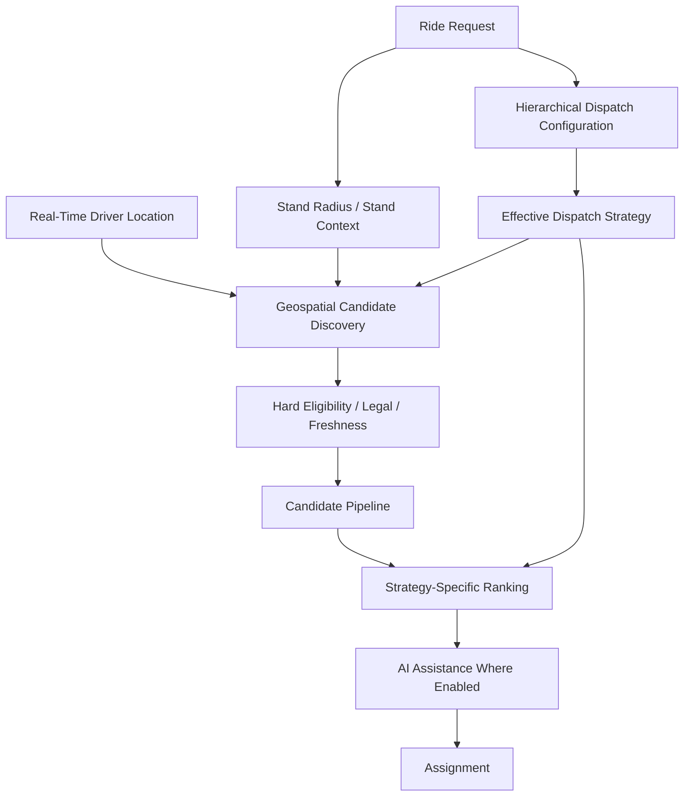

The important architectural rule is:

```text
Location enables discovery.
Configuration selects the strategy.
Strategy determines prioritization.
Hard constraints determine eligibility.
AI may optimize ranking.
```

No single layer should silently take ownership of all five responsibilities.

---

## 52. Updated Completion Criteria

The document is complete only when the implementation/design preserves:

```text
□ Smart Stand Dispatch is stand-preferred, not stand-exclusive
□ Smart Dispatch is stand-agnostic
□ Stand Radius is separate from Driver Search Radius
□ Stand Radius is not a universal candidate boundary
□ Hierarchical dispatch configuration is resolved upstream
□ Most-specific explicit configuration wins
□ Parent configuration is inherited only when needed
□ Intermediate configuration levels remain supported
□ Cross-location candidate discovery is supported
□ Different source-location strategies do not automatically reject candidates
□ Candidate source context is preserved
□ Candidate expansion does not switch dispatch strategy
□ Location freshness applies to expanded candidates
□ Regional/legal validation applies to every candidate
□ AI remains an optimization capability
□ AI failure preserves the primary dispatch strategy
□ Geospatial failure preserves the primary dispatch strategy
□ Stand queue semantics remain owned by dispatch/business logic
□ Geo remains independent of final ranking and assignment
```

