# 06 — Event-Driven and Data Flow

> **Format:** Markdown + Mermaid  
> **Scope:** Domain events, Outbox, Kafka/Redpanda, consumers, DLQ, synchronous/asynchronous flows, and major RideForge data movement  
> **Purpose:** Provide a compact visual model of how state changes become events and how data moves across RideForge.

---

## 1. Purpose

RideForge uses event-driven architecture for asynchronous communication between domain capabilities.

The core flow is:

```text
Domain State Change
        ↓
Database Transaction
        ↓
Outbox
        ↓
Kafka / Redpanda
        ↓
Consumers
        ↓
Derived Actions / State
```

This document explains the major event and data-flow relationships without defining every topic, schema, or consumer implementation.

---

## 2. High-Level Event Architecture

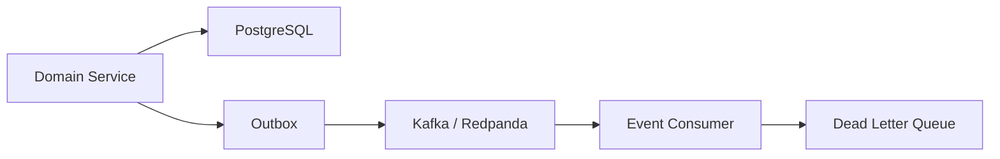

The Outbox connects transactional domain state with reliable event publication.

---

## 3. Why Event-Driven Communication

Events are useful for:

```text
Loose Coupling
Asynchronous Processing
Independent Consumers
Failure Isolation
Event Propagation
Operational Integration
AI / Analytics Pipelines
```

Not every interaction should be asynchronous.

Use synchronous communication where an immediate domain response is required.

---

## 4. Synchronous vs Asynchronous

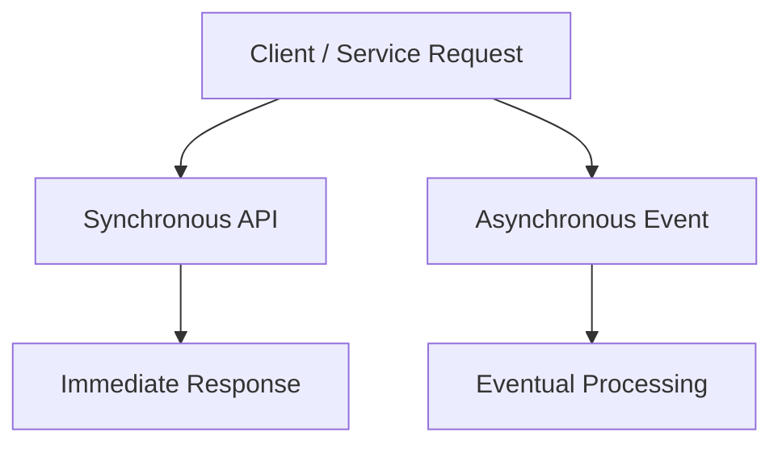

Conceptually:

### Synchronous

```text
Create Ride
Get Ride
Get Driver
Validate Request
```

### Asynchronous

```text
Ride Events
Driver Events
Notifications
Analytics
AI Feedback
Operational Processing
```

The exact communication choice follows the relevant ADRs and service contracts.

---

## 5. Domain Event Principle

A domain event represents a meaningful fact:

```text
Something happened.
```

Examples:

```text
Ride Created
Driver Assigned
Driver Accepted
Trip Started
Ride Completed
Ride Cancelled
Driver Became Available
```

Events should describe facts rather than hidden implementation details.

---

## 6. Event Ownership

The domain that owns a state change should normally publish the corresponding event.

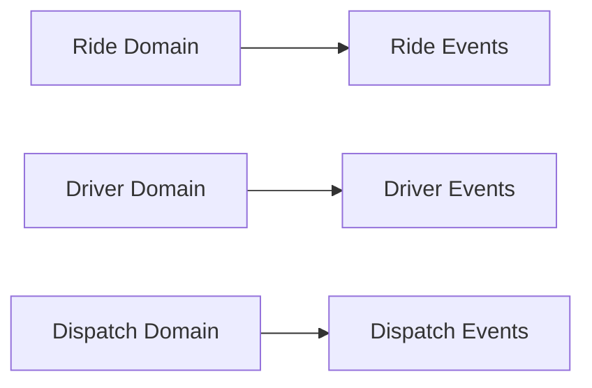

This avoids multiple services becoming competing authorities for the same business state.

---

## 7. Outbox Pattern

The transactional flow is:

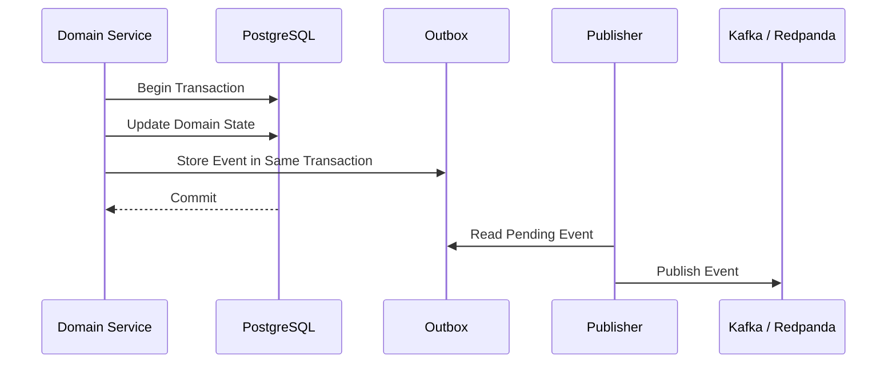

The important property is:

```text
Domain State
+
Outbox Event
```

are committed within the same database transaction.

---

## 8. Outbox Lifecycle

```text
Pending
   ↓
Publisher Reads
   ↓
Published
   ↓
Marked / Reconciled
```

If publication fails:

```text
Pending
   ↓
Retry
   ↓
Publish
```

The exact implementation state model belongs to the development documentation.

---

## 9. Kafka / Redpanda

Kafka / Redpanda provides the event streaming layer.

Conceptually:

```text
Producer
   ↓
Topic / Stream
   ↓
Consumer Group
   ↓
Consumer
```

It provides asynchronous transport and decouples producers from consumers.

---

## 10. Event Flow

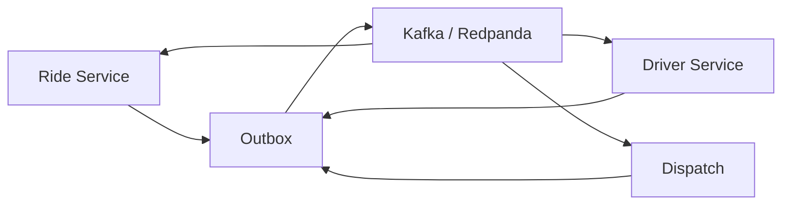

A service may both:

```text
Publish Events
```

and:

```text
Consume Events
```

depending on its responsibilities.

---

## 11. Event Consumer Model

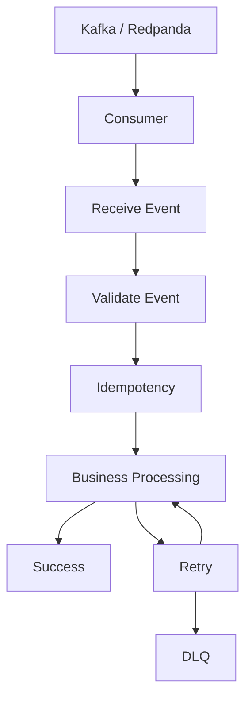

Consumers should assume that:

```text
Events can be retried.
Events can be duplicated.
Consumers can fail.
Dependencies can be temporarily unavailable.
```

---

## 12. Consumer Idempotency

A consumer should be safe against duplicate delivery.

```text
Event
  ↓
Identify Event / Operation
  ↓
Check Idempotency
  ↓
Already Processed?
 ┌──────┴──────┐
Yes           No
 │             │
Skip          Process
```

The exact mechanism is defined by the data consistency and idempotency architecture.

---

## 13. Dead Letter Queue

The DLQ handles events that cannot be successfully processed after the configured retry policy.

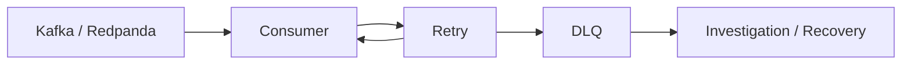

The DLQ is not a replacement for fixing the underlying failure.

---

## 14. Failure Classification

Event processing failures may be:

```text
Transient
Permanent
Invalid Message
Dependency Failure
Business Rejection
Infrastructure Failure
```

Retry behaviour should depend on the failure category.

---

## 15. Retry Principle

Transient failures may be retried.

Examples:

```text
Temporary Database Failure
Temporary Network Failure
Temporary Provider Failure
Temporary Service Unavailability
```

Permanent or invalid failures may require:

```text
DLQ
Manual Investigation
Correction
Replay
```

The exact retry policy is defined elsewhere.

---

## 16. Event Replay

A failed or corrected event may need to be replayed.

Conceptually:

```text
DLQ / Retained Event
       ↓
Investigation
       ↓
Correction
       ↓
Replay
       ↓
Consumer
```

Replay must respect:

```text
Idempotency
Ordering Requirements
Business State
Schema Compatibility
```

---

## 17. Ride Event Flow

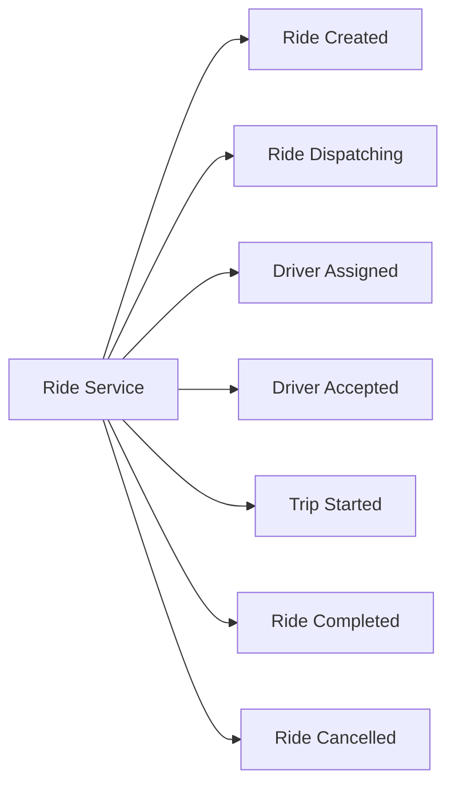

These are conceptual lifecycle facts.

---

## 18. Driver Event Flow

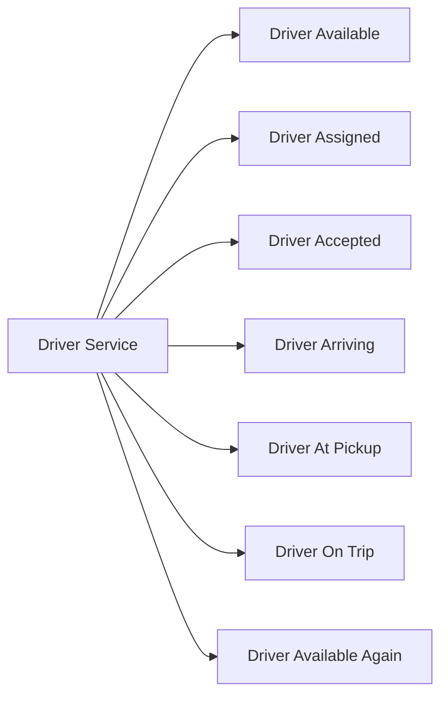

---

## 19. Dispatch Event Flow

Dispatch may consume events from:

```text
Ride
Driver
Location
Operational Configuration
```

and produce events related to:

```text
Matching
Assignment
Re-dispatch
```

Conceptually:

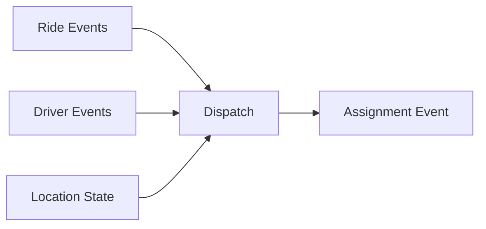

---

## 20. Ride-to-Dispatch Data Flow

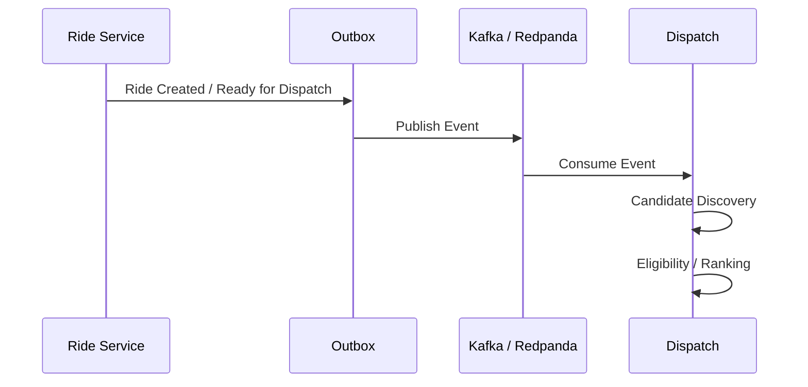

---

## 21. Dispatch-to-Ride Data Flow

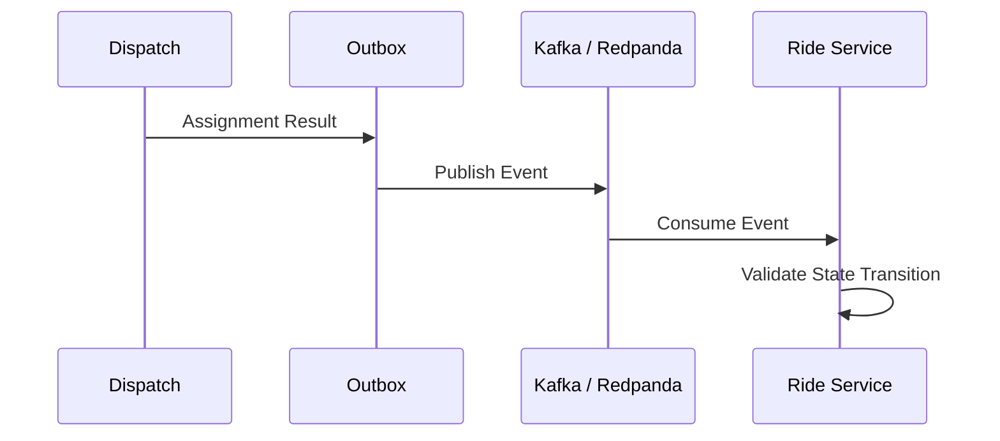

The Ride domain remains authoritative for its own lifecycle state.

---

## 22. Driver-to-Dispatch Data Flow

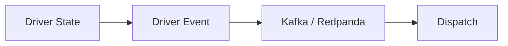

Location itself may use a specialized real-time path rather than publishing every raw location update through the general event platform.

---

## 23. Location Event Boundary

High-frequency location data should not automatically become a platform-wide event.

```text
Raw Location Updates
        ↓
Real-Time Location Path
        ↓
Redis / Geospatial State
```

Only meaningful derived events should enter the general event architecture when there is a concrete consumer requirement.

This limits:

```text
Event Volume
Network Traffic
Broker Load
Consumer Load
Cost
```

---

## 24. Event Envelope

Conceptually, events should carry enough metadata for safe processing.

Typical conceptual fields:

```text
Event ID
Event Type
Aggregate / Entity ID
Occurred At
Producer
Schema Version
Correlation ID
Payload
```

The exact event envelope belongs to the implementation and event contract documentation.

---

## 25. Event Identity

Each event should have a stable identifier suitable for:

```text
Deduplication
Tracing
Debugging
Replay
Audit
```

Consumers should not assume that receiving the same event twice means two business operations occurred.

---

## 26. Correlation

Related operations should be traceable.

Conceptually:

```text
Ride Request
    ↓
Ride ID
    ↓
Dispatch Attempt
    ↓
Assignment
    ↓
Trip
```

Correlation metadata can connect:

```text
Logs
Traces
Events
Service Calls
```

---

## 27. Event Ordering

Consumers should not assume global ordering across the entire platform.

Ordering requirements should be defined at the appropriate business scope.

For example:

```text
Ride A Events
```

may require ordering relative to:

```text
Ride A
```

without requiring:

```text
Ride A
```

to be globally ordered against every other ride.

---

## 28. Eventual Consistency

Event-driven communication may create temporary differences between services.

```text
Service A
    ↓
Event
    ↓
Broker
    ↓
Service B
```

There may be a short interval where:

```text
A = New State
B = Previous Derived State
```

Consumers and domain logic must account for this.

---

## 29. Authoritative vs Derived State

```text
Authoritative State
    ↓
Owned by Domain Service

Derived State
    ↓
Produced from Events / Queries
```

Events propagate facts.

They do not eliminate domain ownership.

---

## 30. Data Flow: Ride Request

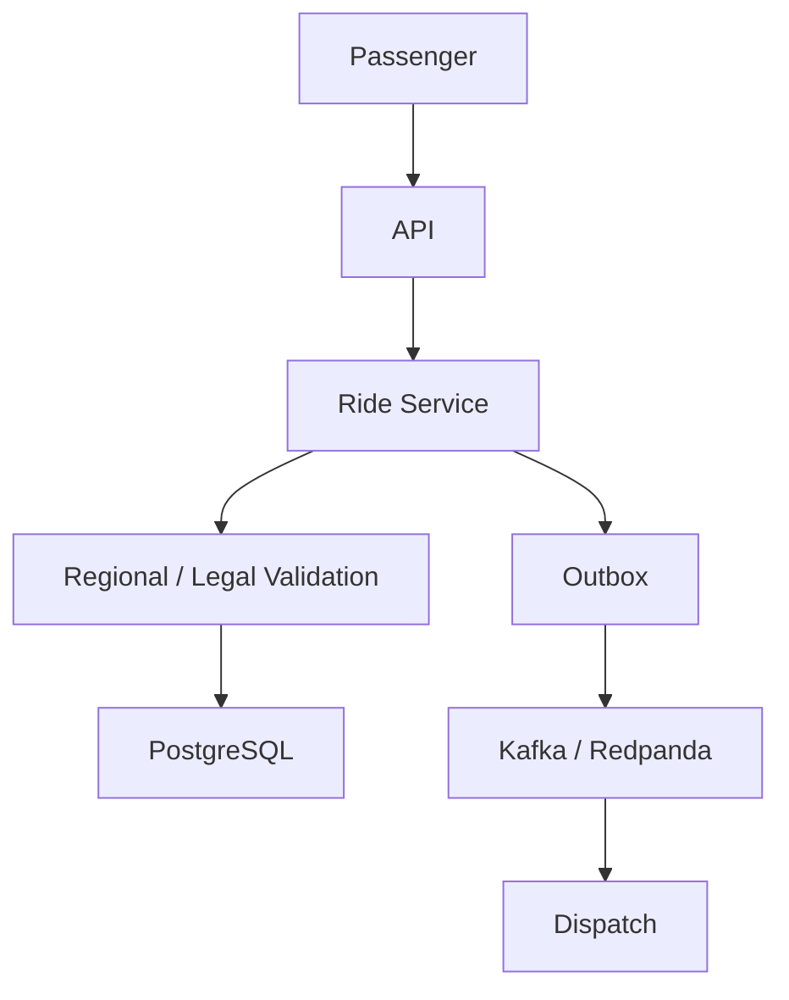

---

## 31. Data Flow: Driver Availability

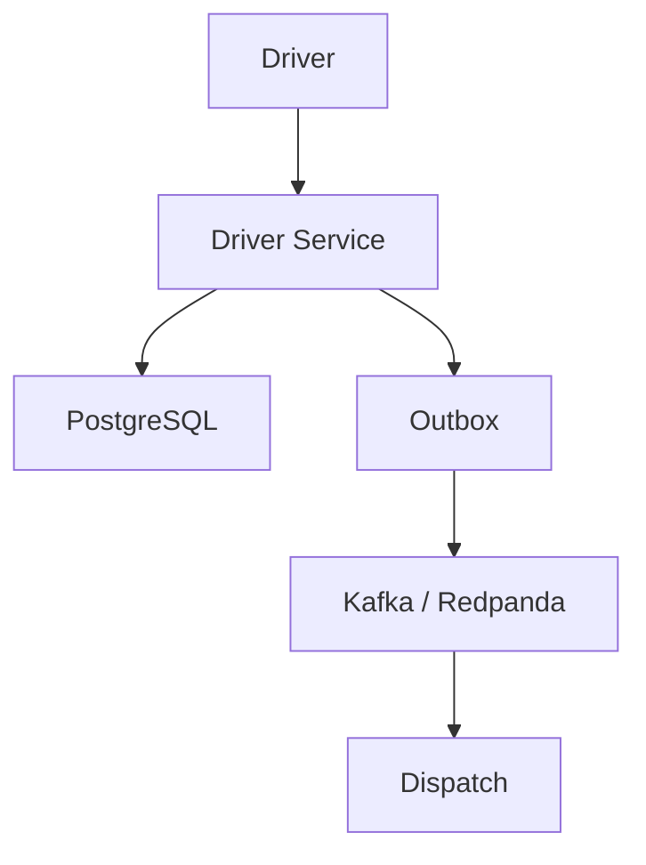

---

## 32. Data Flow: Driver Location

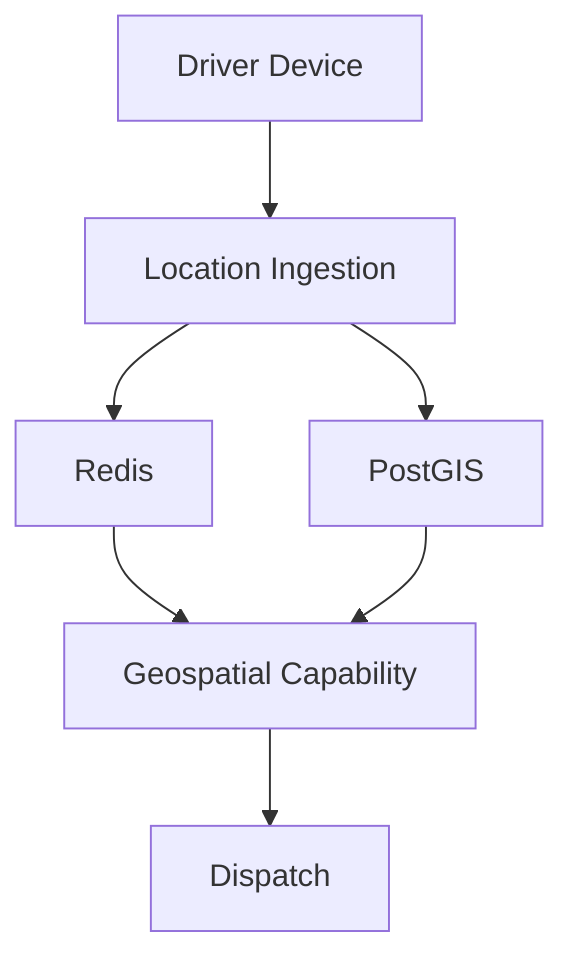

This is intentionally separate from the normal domain event path.

---

## 33. Data Flow: Dispatch

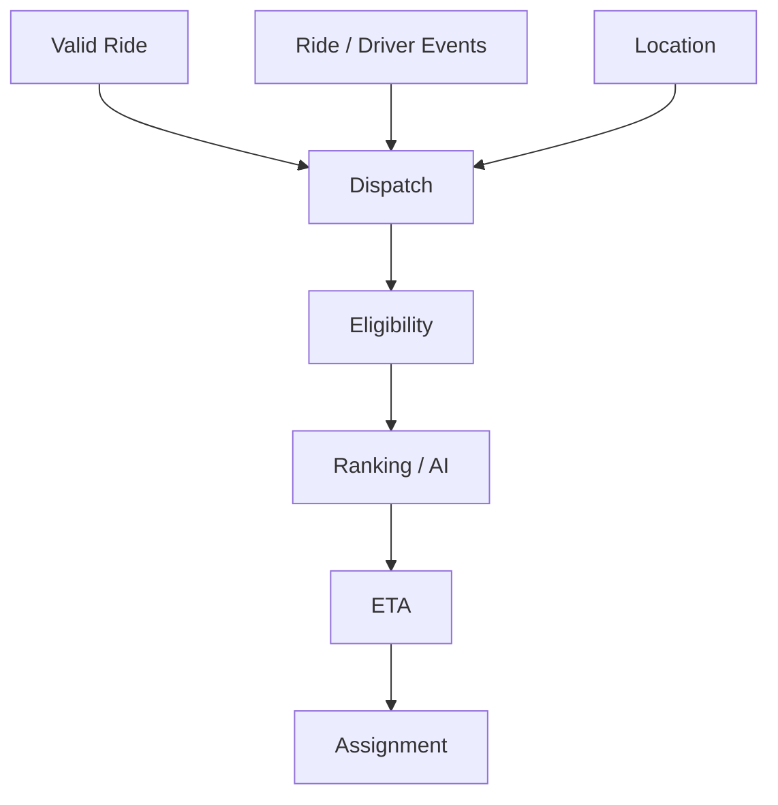

---

## 34. Data Flow: AI

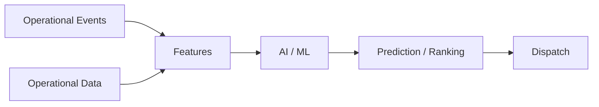

AI consumes appropriate derived data rather than becoming the owner of transactional domain state.

---

## 35. Data Flow: External Providers

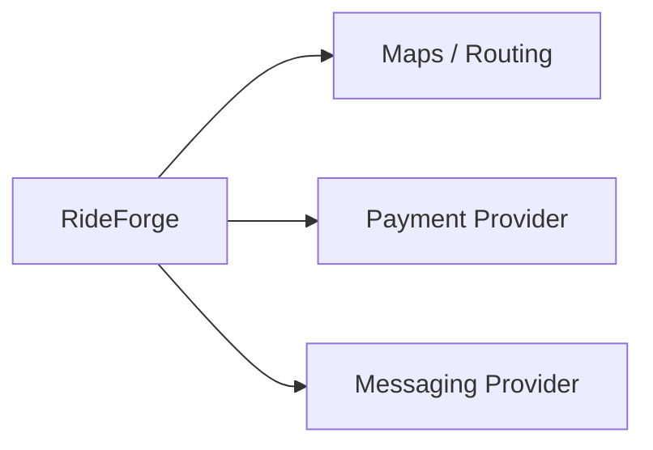

External integration boundaries should remain isolated from core domain logic where practical.

---

## 36. Event Data vs Transactional Data

These are different concerns:

```text
Transactional Data
    ↓
Current authoritative state

Event Data
    ↓
Facts about state changes
```

Do not use an event stream as an uncontrolled substitute for transactional domain storage.

---

## 37. Event Data vs Real-Time Location

Likewise:

```text
General Domain Events
    ↓
Business State Changes

Real-Time Location
    ↓
High-Frequency Operational State
```

The two paths should remain distinct unless there is a concrete reason to connect them.

---

## 38. Event Processing Failure

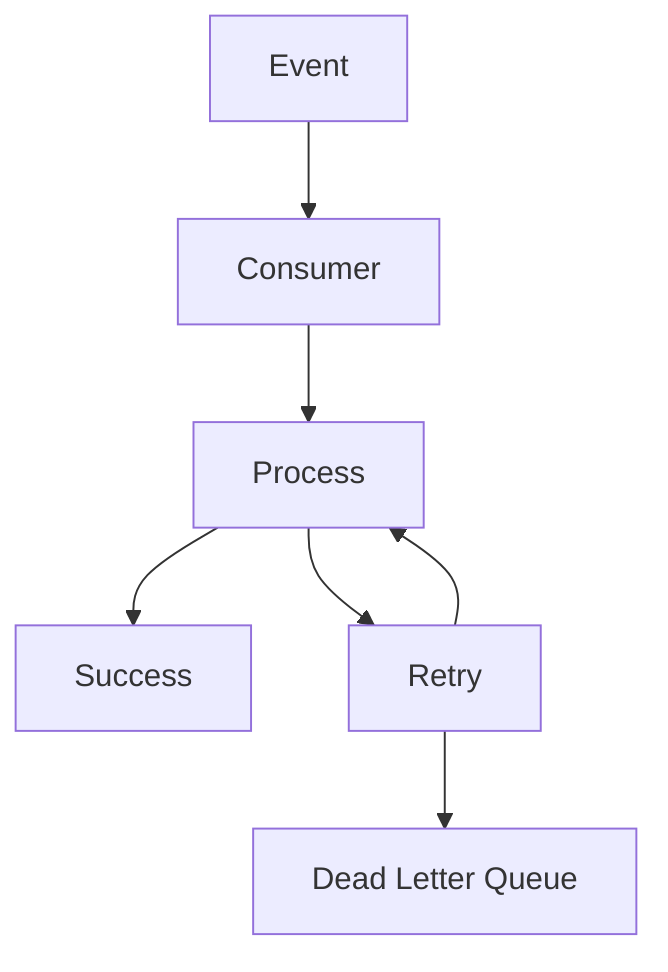

The retry policy should prevent infinite uncontrolled retries.

---

## 39. DLQ Recovery

```mermaid
flowchart LR
    DLQ["DLQ"]
    Investigate["Investigate"]
    Correct["Correct Root Cause"]
    Replay["Replay"]
    Consumer["Consumer"]

    DLQ --> Investigate
    Investigate --> Correct
    Correct --> Replay
    Replay --> Consumer
```

A replay must remain safe under idempotent processing.

---

## 40. Schema Evolution

Event schemas must evolve without unnecessarily breaking existing consumers.

Conceptually:

```text
Event Schema v1
      ↓
Schema v2
      ↓
Compatible Consumers
```

Schema changes should consider:

```text
Backward Compatibility
Consumer Compatibility
Versioning
Optional Fields
Migration
Replay
```

Exact schema governance belongs to the development and AI/data documentation.

---

## 41. Event Contract Boundary

A consumer should depend on:

```text
Event Contract
```

rather than:

```text
Producer Internal Database Schema
```

This preserves service independence.

---

## 42. Event Security

Events may contain sensitive operational or user data.

The event platform should therefore consider:

```text
Access Control
Authentication
Authorization
Encryption
Sensitive Payload Minimization
Retention
Auditability
```

Do not publish data merely because it is available internally.

---

## 43. Event Observability

Useful event metrics include:

```text
Event Publish Rate
Event Processing Rate
Consumer Lag
Processing Latency
Retry Rate
DLQ Rate
Duplicate Rate
Failed Consumer Operations
```

Tracing should connect important events to the originating business operation where practical.

---

## 44. Event Cost

Event architecture has operational cost.

Cost drivers include:

```text
Event Volume
Message Size
Retention
Partitions
Consumers
Replication
Network Traffic
Storage
```

High-frequency data such as raw location should therefore not be unnecessarily routed through the general event platform.

---

## 45. Event Failure Principles

```text
1. Domain state remains authoritative.

2. Outbox coordinates state changes with event publication.

3. Consumers must tolerate retries and duplicates.

4. Idempotency protects business effects.

5. Transient failures may be retried.

6. Poison / permanently failing messages move to the DLQ.

7. DLQ messages require investigation and controlled replay.

8. Global event ordering should not be assumed.

9. Eventual consistency is expected across asynchronous boundaries.

10. Event contracts should evolve compatibly.

11. Raw high-frequency location should not automatically become a general domain event.

12. Sensitive data should not be unnecessarily published.

13. Event processing must remain observable.

14. Event volume should remain cost-aware.
```

---

## 46. AI Agent Usage

For event-driven or data-flow work, load:

```text
01-SYSTEM_CONTEXT_AND_HIGH_LEVEL_ARCHITECTURE.md
02-SERVICE_AND_DOMAIN_ARCHITECTURE.md
03-RIDE_AND_DRIVER_LIFECYCLE.md
04-DISPATCH_ARCHITECTURE.md
05-DRIVER_LOCATION_AND_GEOSPATIAL_FLOW.md
06-EVENT_DRIVEN_AND_DATA_FLOW.md
```

Relevant ADRs:

```text
ADR-0005 — Event-Driven Architecture
ADR-0006 — Kafka / Redpanda for Event Streaming
ADR-0012 — Outbox Pattern
ADR-0013 — Dead Letter Queue Strategy
ADR-0014 — API and Service Communication
ADR-0019 — Data Consistency and Transaction Boundaries
ADR-0020 — Idempotency Strategy
ADR-0021 — Failure and Degradation Strategy
ADR-0022 — Observability Strategy
ADR-0023 — Security and Secret Management
ADR-0028 — Cost Optimization Strategy
```

For AI / ML event consumers additionally load:

```text
07-AI_AND_ML_ARCHITECTURE.md
```

---

## 47. Related Documents

```text
01-SYSTEM_CONTEXT_AND_HIGH_LEVEL_ARCHITECTURE.md
02-SERVICE_AND_DOMAIN_ARCHITECTURE.md
03-RIDE_AND_DRIVER_LIFECYCLE.md
04-DISPATCH_ARCHITECTURE.md
05-DRIVER_LOCATION_AND_GEOSPATIAL_FLOW.md
07-AI_AND_ML_ARCHITECTURE.md
08-SECURITY_FAILURE_AND_OBSERVABILITY.md
09-CLOUD_DEPLOYMENT_AND_INFRASTRUCTURE.md
10-DIAGRAM_INDEX.md
```

---

## 48. Related ADRs

```text
ADR-0005 — Event-Driven Architecture
ADR-0006 — Kafka / Redpanda for Event Streaming
ADR-0012 — Outbox Pattern
ADR-0013 — Dead Letter Queue Strategy
ADR-0014 — API and Service Communication
ADR-0019 — Data Consistency and Transaction Boundaries
ADR-0020 — Idempotency Strategy
ADR-0021 — Failure and Degradation Strategy
ADR-0022 — Observability Strategy
ADR-0023 — Security and Secret Management
ADR-0028 — Cost Optimization Strategy
ADR-0029 — Architecture Evolution and Migration
```

---

## 49. Maintenance Rules

Update this document when:

```text
Event architecture changes
Outbox strategy changes
Kafka / Redpanda architecture changes
DLQ strategy changes
Major producer / consumer relationships change
Important data-flow boundaries change
Event vs real-time state responsibilities change
```

Do not update it for:

```text
Minor event implementation changes
Internal consumer refactoring
Small query changes
Routine bug fixes
```

---

## 50. Completion Criteria

```text
□ Event-Driven Architecture Represented
□ Synchronous / Asynchronous Boundary Represented
□ Domain Event Ownership Represented
□ Outbox Represented
□ Kafka / Redpanda Represented
□ Consumer Flow Represented
□ Idempotency Represented
□ Retry Represented
□ DLQ Represented
□ Replay Represented
□ Event Ordering Considered
□ Eventual Consistency Considered
□ Schema Evolution Considered
□ Ride Data Flow Represented
□ Driver Data Flow Represented
□ Location Data Flow Represented
□ Dispatch Data Flow Represented
□ AI Data Flow Represented
□ External Provider Flow Represented
□ Security Considered
□ Observability Considered
□ Cost Considered
□ Related ADRs Referenced
□ Related Diagrams Referenced
```

---

## 51. Status

```text
Status: Complete

Document:
06-EVENT_DRIVEN_AND_DATA_FLOW.md

Diagram Type:
Event-Driven + Data Flow Architecture

Primary Audience:
AI Agents
Architects
Backend Engineers
Platform Engineers
Event / Streaming Engineers

Primary Purpose:
Fast understanding of RideForge event propagation, Outbox, Kafka / Redpanda, DLQ, and major data flows.

Previous Diagram:
05-DRIVER_LOCATION_AND_GEOSPATIAL_FLOW.md

Next Diagram:
07-AI_AND_ML_ARCHITECTURE.md
```
