# 07 — AI and ML Architecture

> **Format:** Markdown + Mermaid  
> **Scope:** AI/ML capabilities, feature flow, inference, Smart Dispatch integration, ETA/prediction, feedback, and model boundaries  
> **Purpose:** Provide a compact visual model of how AI/ML participates in RideForge without becoming the authority for core transactional or legal state.

---

## 1. Purpose

AI/ML in RideForge is an assisting capability for:

```text
Smart Dispatch
Driver Ranking
ETA / Prediction
Demand / Supply Prediction
Operational Optimization
```

The architecture separates:

```text
Domain Authority
```

from:

```text
AI Decision Support
```

AI may produce:

```text
Predictions
Scores
Rankings
Recommendations
```

but domain services remain responsible for:

```text
Ride State
Driver State
Legal Rules
Hard Eligibility
Safety Constraints
Payment State
Assignment State
```

---

## 2. High-Level AI Architecture

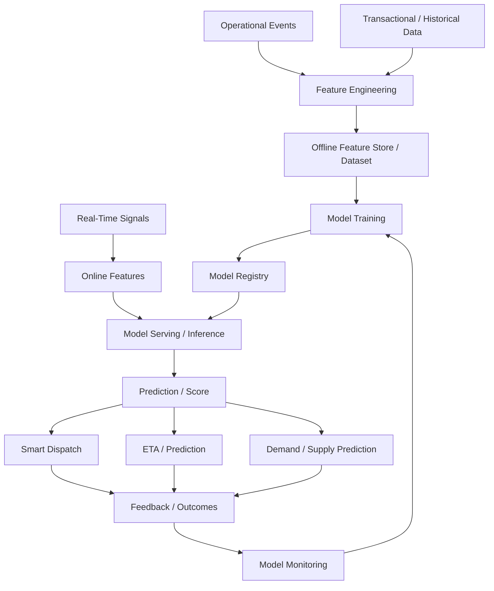

---

## 3. AI Architectural Position

AI sits beside the domain services rather than underneath their authority.

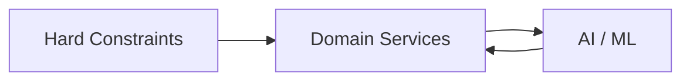

The relationship is:

```text
Domain
  ↓
Provides Context / Features
  ↓
AI
  ↓
Returns Prediction / Ranking
  ↓
Domain
  ↓
Applies Rules + Makes Final Decision
```

---

## 4. AI Is Not the Source of Truth

AI must not become the authoritative source for:

```text
Ride Lifecycle
Driver Lifecycle
Regional / Legal Eligibility
Payment State
Assignment State
Security Policy
```

Instead:

```text
AI Output
    =
Decision Signal
```

not:

```text
AI Output
    =
Authoritative Domain State
```

---

## 5. AI Capability Areas

The major AI/ML capabilities are:

```text
Smart Dispatch
Driver Matching / Ranking
ETA Prediction
Demand Prediction
Supply Prediction
Operational Forecasting
```

The detailed AI documentation defines their individual models, features, training, serving, and governance.

---

## 6. Smart Dispatch Integration

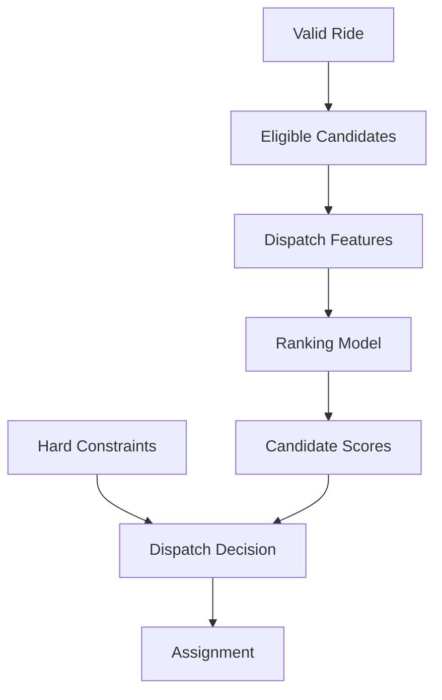

The ranking model assists selection after candidate eligibility has been established.

---

## 7. Hard Constraints vs AI

The most important architectural rule is:

```text
Hard Constraints
        >
AI Optimization
```

Examples:

```text
Legal Restriction
Driver Not Available
Invalid Service Type
Stale Location
Existing Assignment
Safety Restriction
```

cannot be overridden by:

```text
Higher AI Score
Lower ETA
Greater Predicted Acceptance
```

---

## 8. AI Dispatch Pipeline

```text
Ride
 ↓
Regional / Legal Validation
 ↓
Candidate Discovery
 ↓
Hard Eligibility
 ↓
Feature Collection
 ↓
AI Ranking
 ↓
ETA / Operational Signals
 ↓
Final Dispatch Decision
 ↓
Assignment
```

AI therefore operates inside the dispatch pipeline rather than replacing it.

---

## 9. Feature Flow

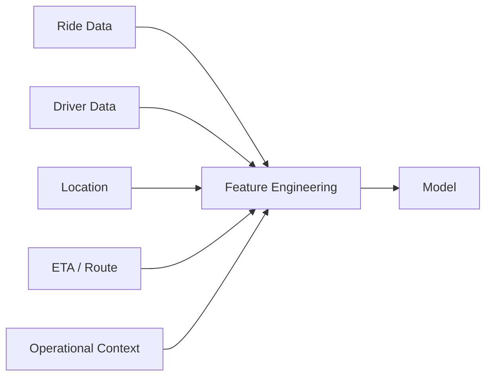

Potential feature categories include:

```text
Ride Characteristics
Driver Characteristics
Spatial Features
Temporal Features
ETA Features
Demand / Supply Features
Operational Context
Historical Signals
```

The exact feature catalog belongs to the feature-engineering documentation.

---

## 10. Online Features

Online features are values that must be available with low latency.

Examples:

```text
Current Driver Location
Driver Availability
Current Demand
Current Supply
Current ETA
Current Operational Context
```

Conceptually:


---

## 11. Offline Features

Offline features are useful for:

```text
Training
Historical Analysis
Model Evaluation
Long-Term Aggregations
```

Conceptually:


---

## 12. Online vs Offline

```text
Online
    ↓
Low-Latency Inference

Offline
    ↓
Training / Evaluation
```

The two paths should remain logically consistent.

Feature definitions should avoid situations where:

```text
Training Feature
    ≠
Production Feature
```

without an intentional reason.

---

## 13. Training Pipeline

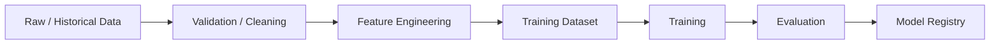

Only models that satisfy the required evaluation and governance criteria should progress toward production use.

---

## 14. Model Registry

The model registry tracks production model identity and lifecycle.

Conceptually:

```text
Model
 ↓
Version
 ↓
Evaluation
 ↓
Approved
 ↓
Registered
 ↓
Deployed
```

Important metadata may include:

```text
Model Version
Training Dataset Version
Feature Version
Evaluation Results
Approval Status
Deployment Status
```

---

## 15. Model Serving

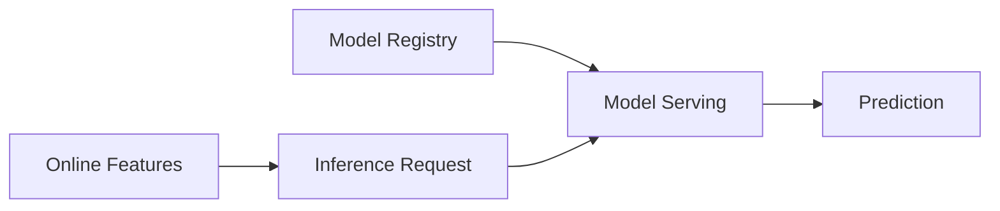

Inference should be designed around the latency requirements of its consumer.

---

## 16. Inference Path

For latency-sensitive dispatch:

```text
Dispatch Request
      ↓
Feature Retrieval
      ↓
Model Inference
      ↓
Prediction / Score
      ↓
Dispatch Decision
```

The inference path should avoid unnecessary synchronous dependencies.

---

## 17. AI Failure Boundary

AI should not become a single point of failure for core ride operations.

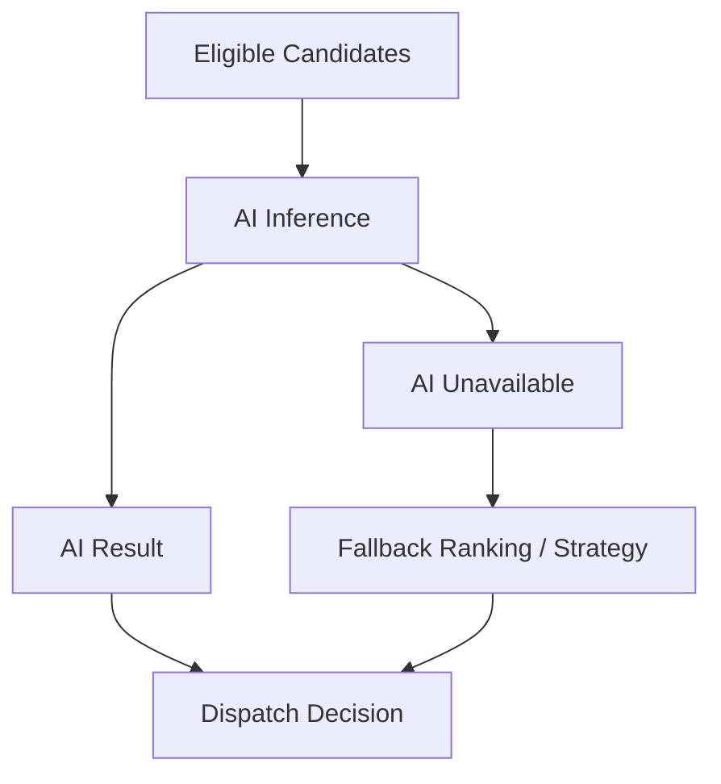

The fallback strategy depends on the operating mode and documented failure policy.

---

## 18. Deterministic Fallback

Possible non-AI signals include:

```text
ETA
Distance
Stand / Queue Position
Availability
Operational Rules
```

The fallback must still respect:

```text
Legal Constraints
Hard Eligibility
Safety Constraints
```

---

## 19. ETA Architecture

ETA can be produced by:

```text
External Route Provider
ETA Model
Hybrid Provider + Model
```

Conceptually:

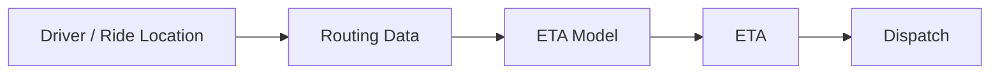

The ETA capability should remain replaceable.

---

## 20. Demand and Supply Prediction

AI may estimate:

```text
Future Ride Demand
Future Driver Supply
Demand / Supply Imbalance
```

Conceptually:

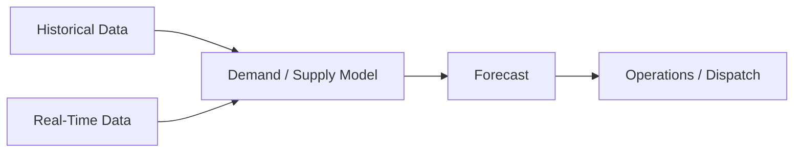

Predictions are advisory inputs rather than guaranteed future outcomes.

---

## 21. Feedback Loop

Production outcomes should feed learning systems.

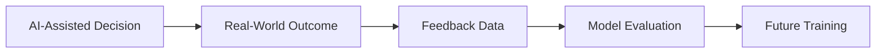

Potential outcomes include:

```text
Driver Accepted
Driver Rejected
Assignment Timeout
Pickup Time
Trip Completion
Cancellation
ETA Error
Dispatch Quality
```

---

## 22. Feedback Must Be Carefully Defined

A model should not learn from every outcome without considering:

```text
Data Quality
Selection Bias
Feedback Bias
Delayed Outcomes
Operational Changes
Policy Changes
```

The AI feedback loop should therefore be governed rather than blindly automated.

---

## 23. Training / Serving Separation

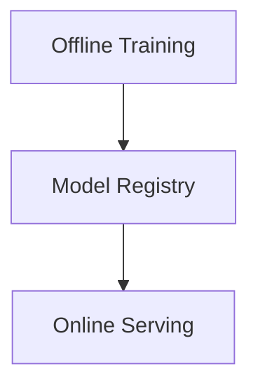

The production inference system should consume approved model versions rather than arbitrary training artifacts.

---

## 24. Model Versioning

A production prediction should be traceable to:

```text
Model Version
Feature Version
Relevant Configuration
```

This enables:

```text
Debugging
Comparison
Rollback
Experimentation
Audit
```

---

## 25. Experimentation

AI changes should be evaluated through controlled experimentation where appropriate.

```text
Current Model
      ↓
Experiment
   ↙      ↘
Control  Treatment
   ↓        ↓
Metrics / Outcomes
      ↓
Evaluation
```

AI experimentation must not violate:

```text
Legal Rules
Safety Constraints
Privacy Requirements
Core Reliability Requirements
```

---

## 26. Model Monitoring

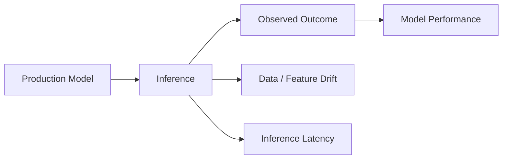

Monitoring should cover both:

```text
Model Quality
```

and:

```text
Operational Behaviour
```

---

## 27. Model Observability

Useful model metrics include:

```text
Prediction Accuracy
Ranking Quality
ETA Error
Acceptance Prediction Error
Inference Latency
Error Rate
Fallback Rate
Feature Missing Rate
Feature Drift
Model Drift
```

The exact production metric set belongs to the AI observability documentation.

---

## 28. Data Quality Boundary

AI quality depends on data quality.

```text
Source Data
    ↓
Validation
    ↓
Feature Engineering
    ↓
Training / Inference
```

Bad upstream data can produce:

```text
Bad Features
    ↓
Bad Predictions
    ↓
Bad Decisions
```

Data validation therefore belongs in the AI pipeline.

---

## 29. Training-Serving Consistency

A critical rule is:

```text
Training Features
        ≈
Serving Features
```

The system should minimize training-serving skew.

Where differences are intentional, they should be documented and tested.

---

## 30. AI Data Boundary

AI should consume only the data required for its use case.

```text
Operational Data
      ↓
Relevant Data Selection
      ↓
Feature Engineering
      ↓
Model
```

Avoid unnecessary replication of sensitive user or driver data into AI systems.

---

## 31. Privacy

AI data pipelines should consider:

```text
Data Minimization
Access Control
Retention
Purpose Limitation
Sensitive Data Handling
Training Data Governance
Inference Data Protection
```

The detailed privacy requirements belong to the AI governance and security documentation.

---

## 32. AI Safety

AI outputs should be constrained by deterministic safeguards.

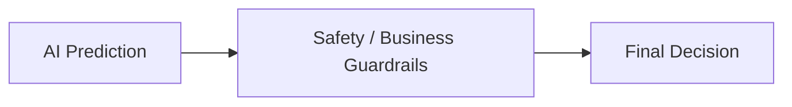

Guardrails may enforce:

```text
Legal Constraints
Safety Constraints
Operational Constraints
Confidence Thresholds
Fallback Conditions
```

---

## 33. Confidence and Fallback

If an AI model produces an unreliable or low-confidence result:

```text
Prediction
   ↓
Confidence Check
   ├── Acceptable → Use Signal
   └── Low / Invalid → Fallback
```

AI should fail safely rather than forcing an uncertain prediction into a critical decision.

---

## 34. AI and Event Architecture

Operational events can provide learning signals.

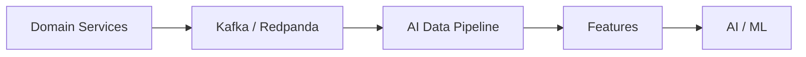

Raw event streams should be transformed into appropriate training/inference data rather than consumed blindly.

---

## 35. AI and Real-Time Location

Location can provide real-time features:

```text
Driver Position
Distance
Spatial Density
ETA
Availability
```

The flow is:

```text
Driver Location
      ↓
Real-Time Feature
      ↓
Inference
      ↓
Dispatch
```

The location subsystem remains responsible for location state.

AI does not become the location store.

---

## 36. AI and Dispatch Authority

The final relationship is:

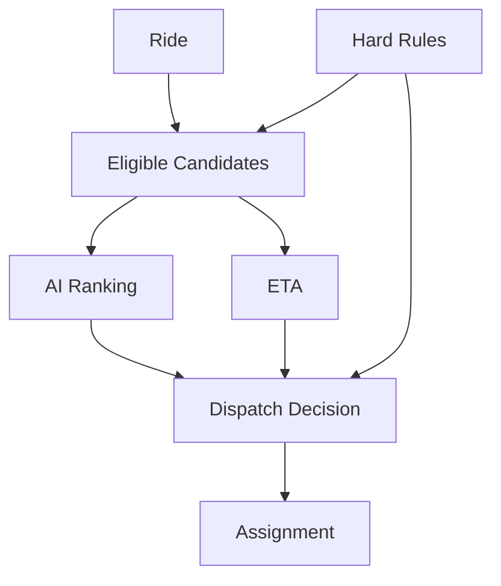

---

## 37. AI and Stand Dispatch

Stand Dispatch may operate without AI.

```text
Stand Rules
    ↓
Eligible Stand Drivers
    ↓
Queue / Operational Selection
    ↓
Assignment
```

AI may be introduced only where the operating model permits it.

---

## 38. AI and Smart Dispatch

Smart Dispatch can use:

```text
AI Ranking
+
ETA
+
Operational Signals
+
Hard Constraints
```

The architecture therefore supports:

```text
Smart Dispatch with AI
```

without making:

```text
AI
```

a mandatory dependency for every ride.

---

## 39. AI Service Boundary

AI services should expose capabilities such as:

```text
Predict
Rank
Score
Forecast
Estimate
```

rather than directly modifying:

```text
Ride State
Driver State
Payment State
```

---

## 40. AI Inference Boundary

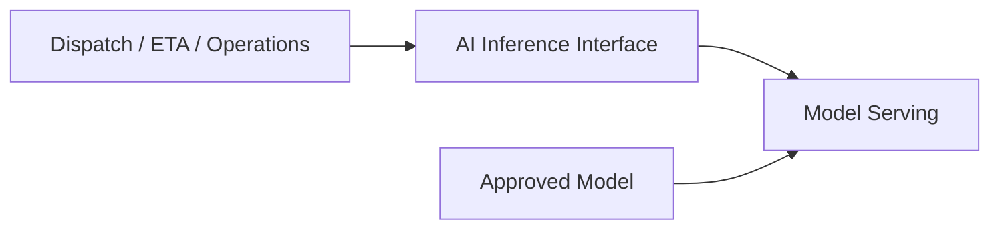

This provides a replaceable boundary between consumers and model implementation.

---

## 41. AI Failure and Degradation

If AI is unavailable:

```text
AI Failure
   ↓
Detect
   ↓
Fallback
   ↓
Continue Core Operation
```

For Smart Dispatch:

```text
AI Ranking Unavailable
        ↓
Deterministic Ranking / ETA / Configured Strategy
        ↓
Assignment
```

The system should avoid turning a model outage into a platform-wide ride outage.

---

## 42. AI Cost Boundary

AI cost may come from:

```text
Training
Inference
Feature Storage
Feature Computation
Data Processing
Model Serving
External AI Providers
```

Cost optimization should consider:

```text
Inference Frequency
Model Complexity
Feature Retrieval Cost
Batch vs Online Processing
Caching
Model Size
```

without violating required latency or quality.

---

## 43. AI Security

AI systems should follow the platform's security model:

```text
Authentication
Authorization
Secret Management
Network Security
Data Access Control
Auditability
```

Model artifacts and inference endpoints should not be treated as unrestricted internal resources.

---

## 44. AI Governance

Production AI should have:

```text
Model Ownership
Versioning
Evaluation
Approval
Deployment Status
Monitoring
Rollback
```

No model should become production-critical without an explicit governance path.

---

## 45. AI Architecture Summary

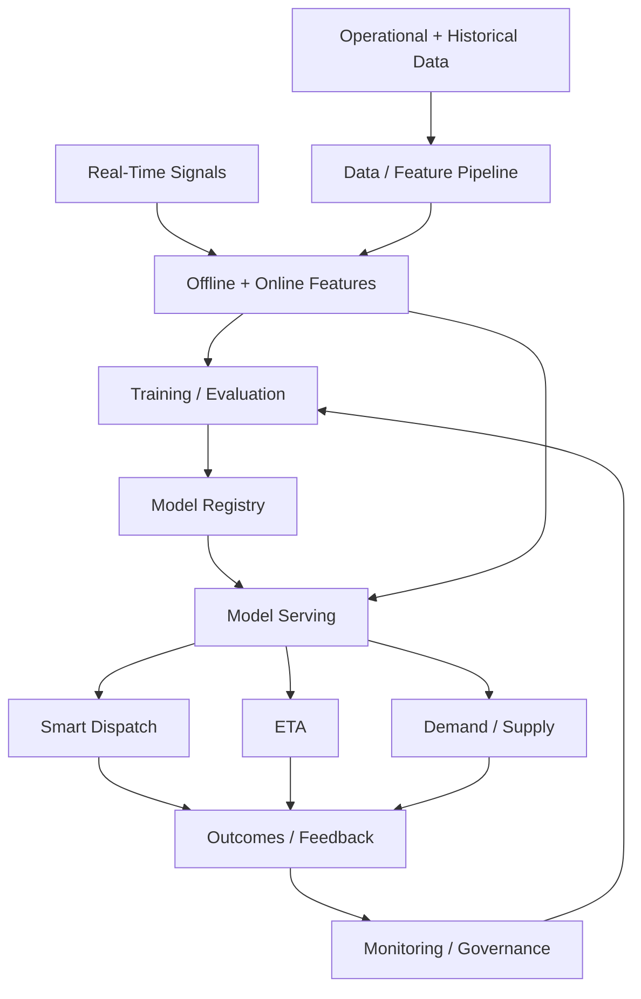

---

## 46. AI Architecture Rules

```text
1. AI is a supporting capability, not domain authority.

2. Hard constraints always override AI optimization.

3. AI must not own ride or driver lifecycle state.

4. AI should not bypass regional or legal validation.

5. Smart Dispatch may use AI but must remain operationally understandable.

6. Stand Dispatch can operate without AI.

7. AI inference should have a safe fallback.

8. Model versions must be traceable.

9. Training and serving features should remain consistent.

10. Data quality must be validated before model use.

11. Feedback loops must account for bias and data quality.

12. Production models require monitoring and governance.

13. AI data should follow privacy and minimization principles.

14. High-frequency real-time data should not be unnecessarily duplicated.

15. AI services should expose capabilities rather than own transactional state.

16. Model and provider implementations should remain replaceable.

17. AI must remain observable.

18. AI infrastructure must remain cost-aware.

19. AI failures must not unnecessarily become ride-platform failures.

20. Architecture should support gradual evolution from deterministic to AI-assisted behaviour.
```

---

## 47. AI Agent Usage

For AI-related work, load:

```text
01-SYSTEM_CONTEXT_AND_HIGH_LEVEL_ARCHITECTURE.md
02-SERVICE_AND_DOMAIN_ARCHITECTURE.md
03-RIDE_AND_DRIVER_LIFECYCLE.md
04-DISPATCH_ARCHITECTURE.md
05-DRIVER_LOCATION_AND_GEOSPATIAL_FLOW.md
06-EVENT_DRIVEN_AND_DATA_FLOW.md
07-AI_AND_ML_ARCHITECTURE.md
```

Then load the relevant AI documentation from:

```text
05-ai/
```

Especially for:

```text
Smart Dispatch
ETA
Demand / Supply Prediction
Matching / Ranking
Feature Engineering
Training
Serving
Model Governance
Feedback
AI Monitoring
```

Relevant ADRs include:

```text
ADR-0015 — Smart Dispatch and Stand Dispatch
ADR-0016 — AI-Assisted Dispatch Strategy
ADR-0017 — ETA and Route Provider Strategy
ADR-0021 — Failure and Degradation Strategy
ADR-0022 — Observability Strategy
ADR-0023 — Security and Secret Management
ADR-0026 — Model and AI Governance
ADR-0028 — Cost Optimization Strategy
```

---

## 48. Related Documents

```text
01-SYSTEM_CONTEXT_AND_HIGH_LEVEL_ARCHITECTURE.md
02-SERVICE_AND_DOMAIN_ARCHITECTURE.md
03-RIDE_AND_DRIVER_LIFECYCLE.md
04-DISPATCH_ARCHITECTURE.md
05-DRIVER_LOCATION_AND_GEOSPATIAL_FLOW.md
06-EVENT_DRIVEN_AND_DATA_FLOW.md
08-SECURITY_FAILURE_AND_OBSERVABILITY.md
09-CLOUD_DEPLOYMENT_AND_INFRASTRUCTURE.md
10-DIAGRAM_INDEX.md
```

AI documentation:

```text
05-ai/
```

---

## 49. Related ADRs

```text
ADR-0015 — Smart Dispatch and Stand Dispatch
ADR-0016 — AI-Assisted Dispatch Strategy
ADR-0017 — ETA and Route Provider Strategy
ADR-0019 — Data Consistency and Transaction Boundaries
ADR-0020 — Idempotency Strategy
ADR-0021 — Failure and Degradation Strategy
ADR-0022 — Observability Strategy
ADR-0023 — Security and Secret Management
ADR-0026 — Model and AI Governance
ADR-0028 — Cost Optimization Strategy
ADR-0029 — Architecture Evolution and Migration
```

---

## 50. Maintenance Rules

Update this document when:

```text
AI becomes a new major platform capability
AI boundaries change
Model serving architecture changes materially
Training / serving architecture changes materially
AI-to-dispatch integration changes
AI failure strategy changes
AI governance changes
```

Do not update it for:

```text
Individual model parameter changes
Minor feature additions
Routine model retraining
Small inference optimizations
Internal implementation refactoring
```

---

## 51. Completion Criteria

```text
□ AI Platform Boundary Represented
□ Smart Dispatch Integration Represented
□ Hard Constraints Represented
□ Feature Flow Represented
□ Online Features Represented
□ Offline Features Represented
□ Training Flow Represented
□ Model Registry Represented
□ Model Serving Represented
□ ETA Relationship Represented
□ Demand / Supply Prediction Represented
□ Feedback Loop Represented
□ Model Monitoring Represented
□ AI Failure / Fallback Represented
□ Stand Dispatch Relationship Represented
□ Event Integration Represented
□ Location Integration Represented
□ Privacy Considered
□ Security Considered
□ Governance Considered
□ Cost Considered
□ Related ADRs Referenced
□ Related Diagrams Referenced
```

---

## 52. Status

```text
Status: Complete

Document:
07-AI_AND_ML_ARCHITECTURE.md

Diagram Type:
AI / ML Architecture + Inference + Feedback Flow

Primary Audience:
AI Agents
Architects
Backend Engineers
AI / ML Engineers
Dispatch Engineers

Primary Purpose:
Fast understanding of the AI/ML platform and its relationship with dispatch, ETA, real-time data, events, and domain authority.

Previous Diagram:
06-EVENT_DRIVEN_AND_DATA_FLOW.md

Next Diagram:
08-SECURITY_FAILURE_AND_OBSERVABILITY.md
```

---

## 24. Canonical Dispatch Strategy and AI/ML Architecture Clarification

The AI/ML architecture must operate within the canonical RideForge dispatch strategy model.

### 24.1 Two Primary Dispatch Strategies

RideForge has two primary dispatch strategies:

```text
Smart Stand Dispatch
Smart Dispatch
```

**AI-Assisted Dispatch is not a third primary dispatch strategy.**

AI/ML capabilities are optimization capabilities that may operate within either resolved strategy.

```text
Hierarchical Configuration
        ↓
Effective Dispatch Strategy
        ↓
Candidate Discovery
        ↓
Hard Eligibility / Legal Validation
        ↓
Strategy-Specific Processing
        ↓
AI/ML Optimization where enabled
        ↓
Ranking / Selection
        ↓
Assignment
```

The AI/ML layer must not independently decide which primary dispatch strategy applies to a ride.

---

### 24.2 Hierarchical Dispatch Strategy Resolution

The effective dispatch strategy is resolved before AI/ML ranking or optimization.

Possible configuration levels include:

```text
State
District
City / Town
Rural Area
Auto Stand
Specific Ride Level
Other Intermediate Levels
```

Not every level requires an explicit configuration.

The resolution rule is:

```text
Most Specific Applicable Configuration
        ↓
Explicit Strategy?
   ├── YES → Effective Strategy
   └── NO
        ↓
Parent Configuration
        ↓
Continue Upward
        ↓
System Default
```

The canonical rule is:

> **Specific configuration overrides inherited configuration.**

Example:

```text
District → Smart Dispatch
Town A   → Smart Stand Dispatch
Town B   → No explicit configuration
```

Therefore:

```text
Town A ride → Smart Stand Dispatch
Town B ride → Smart Dispatch
```

The AI/ML layer consumes the resolved strategy and must not recreate this hierarchy independently.

---

### 24.3 Smart Stand Dispatch and AI/ML

Smart Stand Dispatch is **stand-preferred, not stand-exclusive**.

When the rider is inside the configured radius of an auto stand:

```text
Applicable Stand
      ↓
Eligible Stand Drivers
      ↓
Stand Queue / Ordering
      ↓
Suitable supply?
   ├── YES → continue
   └── NO  → broader candidate discovery
```

Broader candidates may include:

```text
Drivers outside the preferred stand
Drivers at nearby stands
Drivers from nearby locations
```

AI/ML may assist with prediction or ranking where permitted by the strategy.

However, AI must not reinterpret Smart Stand Dispatch as:

```text
Stand-only Dispatch
```

If the configured stand rule requires first-eligible-in-queue behavior, an AI score must not silently replace that business rule.

---

### 24.4 Smart Dispatch and AI/ML

Smart Dispatch is stand-agnostic.

AI/ML may rank eligible candidates using approved signals such as:

```text
Distance
ETA
Driver Availability
Acceptance Prediction
Demand / Supply Signals
Historical Performance
Other Approved Features
```

The model must not give a driver an implicit preference merely because the driver is currently at an auto stand.

The candidate pool may contain:

```text
Drivers at stands
Drivers outside stands
Drivers from nearby locations
```

subject to hard eligibility and operational constraints.

---

### 24.5 Cross-Location Dispatch and AI Context

AI/ML components may receive candidates from nearby locations when the dispatch flow expands beyond the originating location.

Example:

```text
Location A → Smart Dispatch
Location B → Smart Stand Dispatch

Ride from A
    ↓
Local supply insufficient
    ↓
Candidate discovery expands to B
    ↓
Eligible candidates from B
    ↓
AI/ML optimization where enabled
```

A candidate from Location B must not be rejected solely because Location B uses a different dispatch strategy.

AI/ML components should preserve or receive relevant context such as:

```text
Candidate Location
Candidate Location Strategy
Stand Membership
Relevant Stand
Queue Position
Discovery Source
Expansion Level
Distance
ETA
```

This context allows strategy-specific prioritization without conflating strategy with eligibility.

---

### 24.6 Candidate Eligibility vs AI Preference

The AI/ML layer must distinguish between:

```text
Eligible but not preferred
```

and:

```text
Ineligible
```

For example:

```text
Non-stand driver during Smart Stand Dispatch
    → potentially eligible, but not initially preferred

Driver from nearby location
    → potentially eligible, subject to constraints

Preferred stand driver
    → preferred source when the rider is within the stand radius
```

Therefore:

```text
Not Preferred ≠ Ineligible
```

AI ranking must only operate over the candidate set that has passed authoritative hard constraints.

---

### 24.7 AI Must Not Resolve Dispatch Configuration

AI/ML models must not infer the effective dispatch strategy from:

```text
Stand Membership
Location
Distance
Driver History
Other Model Features
```

The effective strategy must be explicitly supplied by the dispatch/configuration layer.

For example:

```text
effective_strategy = SMART_STAND
```

or:

```text
effective_strategy = SMART
```

AI may use the strategy as a model feature or select strategy-specific ranking behavior, but it must not invent or override configuration inheritance.

---

### 24.8 AI Hard Constraints

AI/ML output is subordinate to authoritative hard constraints.

AI must not override:

```text
Driver Eligibility
Driver Availability
Regional / Legal Restrictions
Safety Constraints
Vehicle / Service Compatibility
Ride Constraints
Location Freshness
Configured Stand Queue Semantics
Other Hard Business Rules
```

The conceptual order is:

```text
Candidate Discovery
        ↓
Hard Eligibility / Regional / Legal Validation
        ↓
Strategy-Specific Candidate Processing
        ↓
AI/ML Optimization
        ↓
Final Ranking / Selection
```

A model's higher score cannot make an otherwise invalid candidate dispatchable.

---

### 24.9 AI Failure and Deterministic Strategy-Preserving Fallback

AI failure must preserve the resolved primary dispatch strategy.

For Smart Stand Dispatch:

```text
Smart Stand Dispatch + AI
        ↓
AI unavailable
        ↓
Deterministic Smart Stand Dispatch
```

For Smart Dispatch:

```text
Smart Dispatch + AI
        ↓
AI unavailable
        ↓
Deterministic Smart Dispatch
```

AI failure must not silently cause:

```text
Smart Stand Dispatch
        ↓
Smart Dispatch
```

unless an explicit business/configuration rule defines that transition.

Similarly:

```text
Broader Candidate Discovery
        ≠
Strategy Switching
```

---

### 24.10 AI/ML Feature Context

AI/ML models used in dispatch may consume approved features including:

```text
Effective Dispatch Strategy
Configuration Level
Applicable Stand
Stand Membership
Queue Position
Candidate Location
Candidate Location Strategy
Discovery Source
Expansion Level
Distance
ETA
Driver Availability
Demand / Supply Signals
Other Approved Features
```

Feature availability must not be used to infer or override authoritative business configuration.

---

### 24.11 AI Observability and Strategy Attribution

AI-assisted decisions should record the primary dispatch strategy separately from AI assistance.

For example:

```text
strategy = SMART_STAND
ai_assisted = true
model_version = dispatch-ranker-vX
```

or:

```text
strategy = SMART
ai_assisted = true
model_version = dispatch-ranker-vX
```

This prevents operational analysis from incorrectly treating AI assistance as a third dispatch strategy.

---

### 24.12 AI/ML Architecture Guardrails

AI/ML implementations must not:

```text
Treat AI-Assisted Dispatch as a third primary dispatch strategy.

Infer dispatch strategy from stand membership alone.

Treat Smart Stand Dispatch as stand-only.

Reject non-stand candidates solely because the rider is inside a stand radius.

Reject nearby-location candidates solely because their source location uses another strategy.

Resolve hierarchical dispatch configuration inside an AI model.

Hard-code the State → District → Town → Stand hierarchy into the AI layer.

Allow AI ranking to override legal, safety, eligibility, or availability constraints.

Replace a configured stand queue rule with an arbitrary AI score.

Switch Smart Stand Dispatch to Smart Dispatch merely because AI is unavailable.

Treat candidate expansion as strategy switching.

Discard source location, strategy, stand, queue, or discovery context required for downstream ranking.
```

The AI/ML architecture must remain an optimization layer over the authoritative dispatch and domain rules rather than becoming the owner of dispatch strategy selection.

