# 08 — Security, Failure and Observability

> **Format:** Markdown + Mermaid  
> **Scope:** Security boundaries, authentication/authorization, secrets, failure/degradation, retries, recovery, observability, logs, metrics, traces, and operational visibility  
> **Purpose:** Provide one compact visual model for how RideForge protects, observes, and recovers its distributed runtime.

---

## 1. Purpose

RideForge operates as a distributed system containing:

```text
APIs
Services
Databases
Redis
Kafka / Redpanda
AI / ML
External Providers
Background Workers
```

The architecture therefore needs three connected operational capabilities:

```text
Security
Failure / Degradation
Observability
```

These capabilities support the platform without becoming business-domain owners.

---

## 2. High-Level Operational Architecture

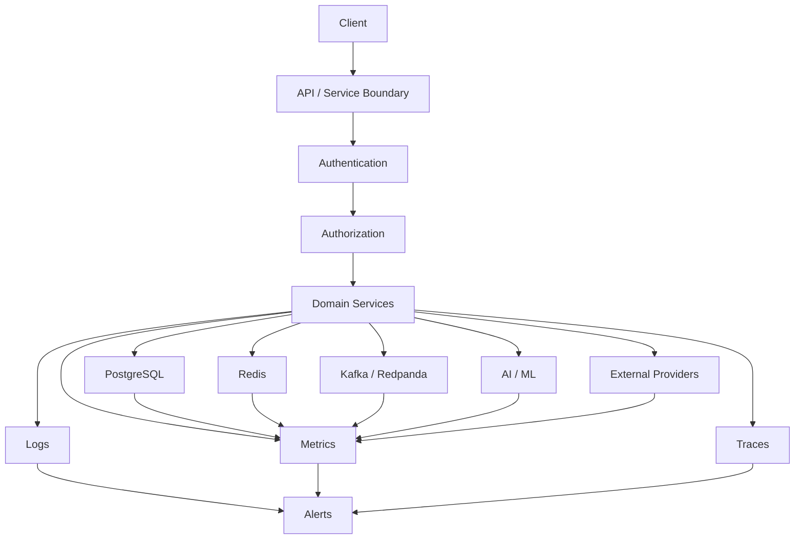

---

## 3. Security Boundary

The core security flow is:

```text
Request
  ↓
Authentication
  ↓
Authorization
  ↓
Validated Access
  ↓
Service Operation
```

Authentication answers:

```text
Who are you?
```

Authorization answers:

```text
What are you allowed to do?
```

These are separate concerns.

---

## 4. Request Security Flow

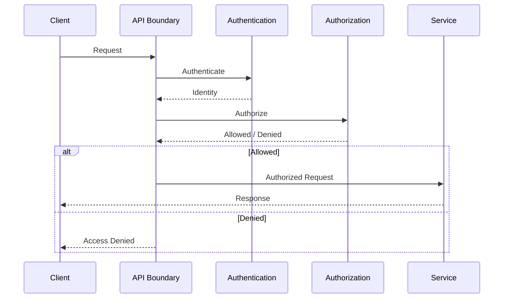

---

## 5. Service-to-Service Security

Internal communication must not automatically be trusted simply because it occurs inside the platform.

```text
Service A
   ↓
Authenticated Service Request
   ↓
Service B
   ↓
Authorization
```

The exact mechanism may evolve with the deployment environment.

---

## 6. Identity and Access

Access should follow:

```text
Identity
    ↓
Authentication
    ↓
Role / Permission
    ↓
Authorization
    ↓
Resource Access
```

Authorization should be evaluated at the appropriate boundary rather than relying only on client-side controls.

---

## 7. Least Privilege

Services should receive only the access they require.

Examples:

```text
Read-only Consumer
    ↓
Read-only Database Access

Event Consumer
    ↓
Required Topic Access

AI Service
    ↓
Required Feature / Model Access
```

Avoid broad credentials when narrower permissions are sufficient.

---

## 8. Secrets

Secrets include:

```text
Database Credentials
Kafka Credentials
Redis Credentials
API Keys
Signing Keys
Provider Credentials
AI Provider Credentials
```

Secrets should be supplied through an appropriate secret-management mechanism rather than committed to source control.

---

## 9. Secret Flow


Secrets should not normally flow through:

```text
Source Code
Git History
Logs
Client Payloads
Public Configuration
```

---

## 10. Data Protection

Security controls should protect:

```text
Data In Transit
Data At Rest
Credentials
Tokens
Location Data
User Data
Operational Data
Model Data
```

The exact encryption implementation is defined by deployment and security architecture.

---

## 11. Sensitive Data

Potentially sensitive data includes:

```text
User Identity
Driver Identity
Precise Location
Contact Information
Payment Information
Authentication Data
Operational Events
AI Training Data
```

The platform should apply data minimization and access control.

---

## 12. Logging Security

Logs should not unnecessarily contain:

```text
Passwords
API Keys
Tokens
Secrets
Payment Credentials
Unnecessary Precise Location
Sensitive Personal Data
```

Prefer:

```text
Identifiers
Correlation IDs
Redacted Metadata
Operational Context
```

---

# Failure and Degradation

## 13. Failure Principle

Failures are expected in distributed systems.

RideForge should distinguish:

```text
Transient Failure
Permanent Failure
Dependency Failure
Data Failure
Infrastructure Failure
Business Rejection
```

Each category may require different handling.

---

## 14. Failure Flow

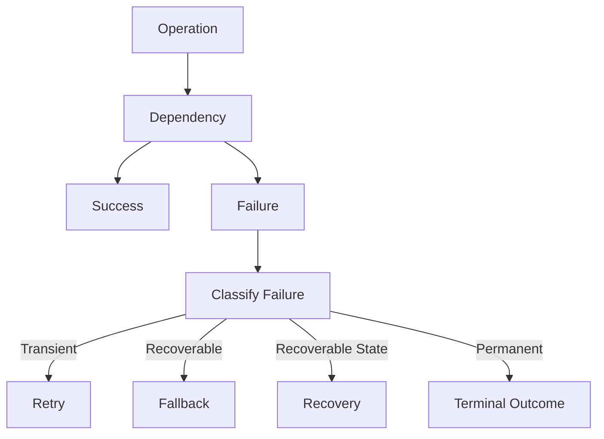

---

## 15. Retry

Retries are appropriate for failures that may succeed later.

Examples:

```text
Temporary Network Failure
Temporary Database Unavailability
Temporary Provider Failure
Temporary Broker Failure
```

Retries should be bounded.

Avoid:

```text
Infinite Immediate Retries
```

---

## 16. Retry with Backoff

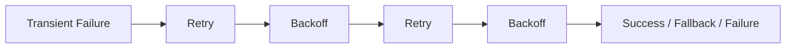

The exact backoff policy depends on the operation.

---

## 17. Idempotency and Retry

Retryable operations must consider duplicate effects.

```text
Operation
   ↓
Retry
   ↓
Possible Duplicate
   ↓
Idempotency
   ↓
Safe Business Effect
```

Critical examples include:

```text
Ride Creation
Assignment
Payment Operation
Ride Completion
Event Consumption
```

---

## 18. Timeout

Every remote dependency should have an appropriate timeout.

Conceptually:

```text
Request
  ↓
Dependency
  ↓
Response?
 ├── Yes → Continue
 └── No → Timeout → Recovery
```

A timeout prevents one unhealthy dependency from consuming resources indefinitely.

---

## 19. Circuit Breaking

Where appropriate:

```text
Repeated Dependency Failure
        ↓
Circuit Opens
        ↓
Stop Repeated Calls
        ↓
Fallback / Degradation
        ↓
Recovery Check
        ↓
Circuit Closes
```

Circuit breaking should be applied where it provides meaningful protection.

---

## 20. Graceful Degradation

A degraded dependency should not automatically cause the entire platform to fail.

Examples:

```text
AI unavailable
    ↓
Deterministic Dispatch Fallback

ETA Provider unavailable
    ↓
Alternative ETA / Reduced Capability

Notification Provider unavailable
    ↓
Retry / Deferred Notification

Non-critical Consumer unavailable
    ↓
Core Ride Flow Continues
```

---

## 21. Critical vs Non-Critical Dependencies

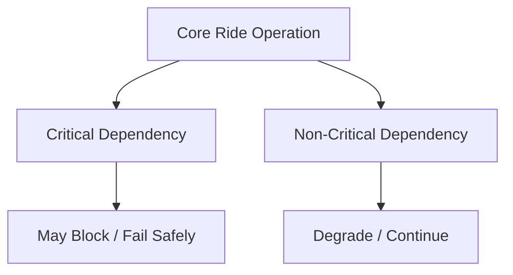

Dependency criticality should be explicitly understood by the owning service.

---

## 22. Dispatch Failure

Dispatch failure should normally trigger recovery before ride failure.

```text
Dispatch Attempt
      ↓
Failure
      ↓
Re-dispatch / Fallback
      ↓
Another Candidate
      ↓
Assignment
```

Only after configured recovery options are exhausted should the ride move toward a terminal outcome.

---

## 23. AI Failure

AI must not become a single point of failure for core dispatch.

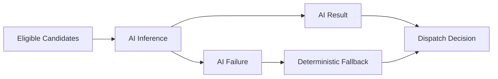

---

## 24. ETA Provider Failure

```text
ETA Request
    ↓
Provider
    ↓
Failure
    ↓
Alternative / Fallback
    ↓
Dispatch
```

ETA should remain a replaceable capability.

---

## 25. Event Processing Failure


This follows the event-driven architecture documented separately.

---

## 26. Database Failure

A database failure can affect:

```text
Transactional Operations
Queries
Outbox Processing
Background Jobs
```

The system should avoid pretending that unavailable authoritative state is current.

Recovery should follow:

```text
Detect
 ↓
Protect
 ↓
Recover
 ↓
Reconcile
```

---

## 27. Redis Failure

Redis supports real-time state and caching.

A Redis failure should be treated according to the capability using it.

Possible outcomes:

```text
Fallback
Retry
Reduced Capability
Temporary Unavailability
```

The system must not silently treat missing real-time state as valid current state.

---

## 28. Kafka / Redpanda Failure

Streaming failure may temporarily affect:

```text
Event Propagation
Asynchronous Consumers
Notifications
Analytics
AI Data Pipelines
```

The Outbox should preserve events that have not yet been published.

---

## 29. Outbox Recovery

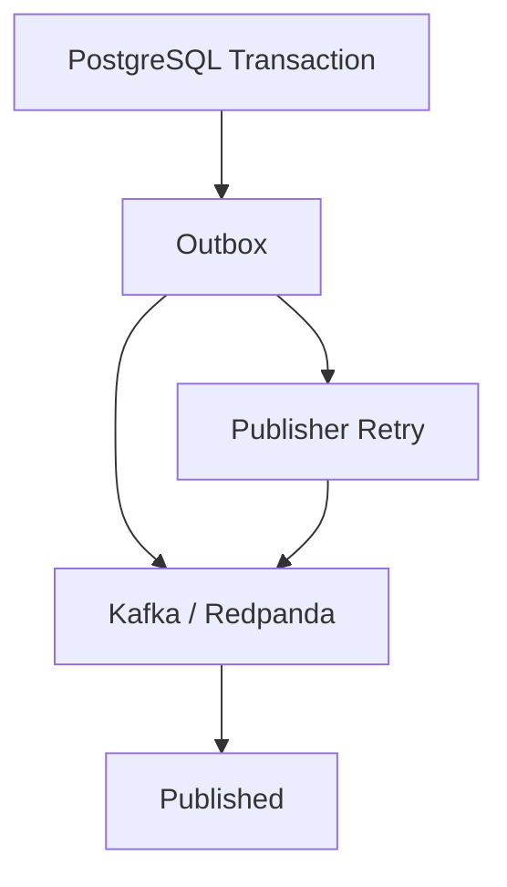

This protects against the failure occurring between:

```text
Database Commit
```

and:

```text
Event Publication
```

---

## 30. Failure Isolation

A failure should remain within its smallest practical boundary.

```text
Component Failure
      ↓
Service Boundary
      ↓
Fallback / Retry
      ↓
Core System Continues
```

Avoid unnecessary cascading failures.

---

## 31. Cascading Failure

A dangerous pattern is:

```text
Service A Slow
   ↓
Service B Waits
   ↓
Service C Waits
   ↓
Resource Exhaustion
   ↓
Platform-Wide Failure
```

Prevent this using appropriate:

```text
Timeouts
Circuit Breaking
Bulkheads
Bounded Queues
Backpressure
Load Shedding
Fallbacks
```

---

# Observability

## 32. Observability Principle

Observability should answer:

```text
What happened?
Why did it happen?
Where did it happen?
How long did it take?
What was affected?
Is it recovering?
```

The primary signals are:

```text
Logs
Metrics
Traces
```

---

## 33. Observability Architecture

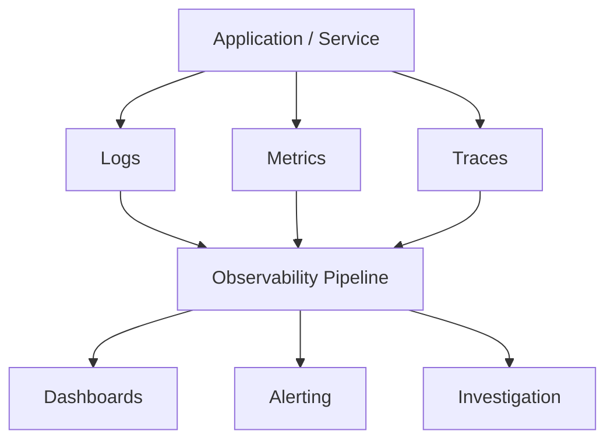

---

## 34. Logs

Logs should capture useful operational context.

Examples:

```text
Request ID
Correlation ID
Ride ID
Driver ID
Service
Operation
Outcome
Error Category
Latency
```

Avoid unnecessary sensitive payloads.

---

## 35. Metrics

Metrics should measure system behaviour.

Useful categories include:

```text
Request Rate
Error Rate
Latency
Database Health
Cache Health
Broker Health
Dispatch Metrics
Event Processing
AI Metrics
Infrastructure Metrics
```

---

## 36. Tracing

Distributed traces connect work across service boundaries.

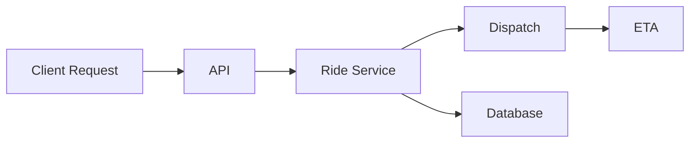

A trace should make the relationship between these operations visible.

---

## 37. Correlation

Important identifiers should connect:

```text
Request
Ride
Dispatch Attempt
Assignment
Event
Consumer Operation
Trace
```

Conceptually:

```text
Correlation ID
      ↓
Logs + Events + Traces
```

This dramatically reduces debugging time in distributed workflows.

---

## 38. Business Metrics

Technical metrics alone are insufficient.

Important business/operational metrics may include:

```text
Ride Creation Rate
Assignment Success Rate
Assignment Latency
Driver Acceptance Rate
Re-dispatch Rate
Cancellation Rate
Ride Completion Rate
ETA Accuracy
```

---

## 39. Dispatch Observability

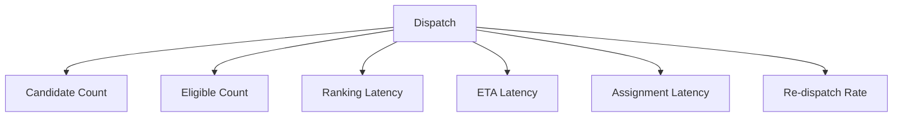

---

## 40. Event Observability

Important event metrics include:

```text
Publish Rate
Consumer Throughput
Consumer Lag
Processing Latency
Retry Rate
DLQ Rate
Duplicate Rate
```

These help detect event-platform degradation before it becomes a user-visible failure.

---

## 41. Location Observability

Useful location metrics include:

```text
Location Update Rate
Ingestion Latency
Stale Location Rate
Invalid Location Rate
Out-of-Order Rate
Geospatial Query Latency
Candidate Count
```

---

## 42. AI Observability

AI-specific metrics may include:

```text
Inference Latency
Inference Error Rate
Fallback Rate
Prediction Quality
Ranking Quality
Feature Missing Rate
Feature Drift
Model Drift
ETA Error
```

AI monitoring remains separate from general service health while contributing to overall observability.

---

## 43. Alerting

Alerts should be tied to meaningful operational conditions.

Examples:

```text
High Error Rate
High Latency
Consumer Lag
DLQ Growth
Database Saturation
Redis Failure
AI Fallback Spike
Dispatch Failure Spike
Stale Location Spike
```

Avoid alerting on every minor fluctuation.

---

## 44. Alert Severity

Conceptually:

```text
Informational
      ↓
Warning
      ↓
Critical
```

Severity should reflect:

```text
User Impact
Business Impact
Recovery Urgency
Scope
```

---

## 45. Health Checks

Services should expose appropriate health information.

Distinguish:

```text
Process Alive
```

from:

```text
Ready to Serve Traffic
```

A process can be running while a required dependency is unavailable.

---

## 46. Readiness

Conceptually:

```text
Application Started
      ↓
Dependency Validation
      ↓
Ready?
 ├── Yes → Receive Traffic
 └── No  → Remain Unready
```

The exact readiness policy depends on service criticality.

---

## 47. Operational Dashboard

A useful operational dashboard should expose:

```text
Traffic
Errors
Latency
Ride Flow
Dispatch
Driver Availability
Event Streaming
Database
Redis
AI
External Providers
```

Dashboards should prioritize actionable signals over excessive detail.

---

## 48. Failure Detection to Recovery

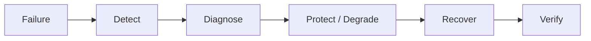

This represents the operational lifecycle of a failure.

---

## 49. Observability During Recovery

Recovery itself must be observable.

Monitor:

```text
Retry Count
Recovery Progress
Remaining Failures
Queue Depth
Backlog
Dependency Health
User Impact
```

A system should not declare recovery simply because the original error disappeared temporarily.

---

## 50. Security and Observability Balance

Observability should not weaken security.

```text
More Logs
    ≠
More Visibility
```

Useful observability requires:

```text
Redaction
Access Control
Retention
Secure Storage
```

Sensitive information should be minimized.

---

## 51. Failure and Observability Relationship

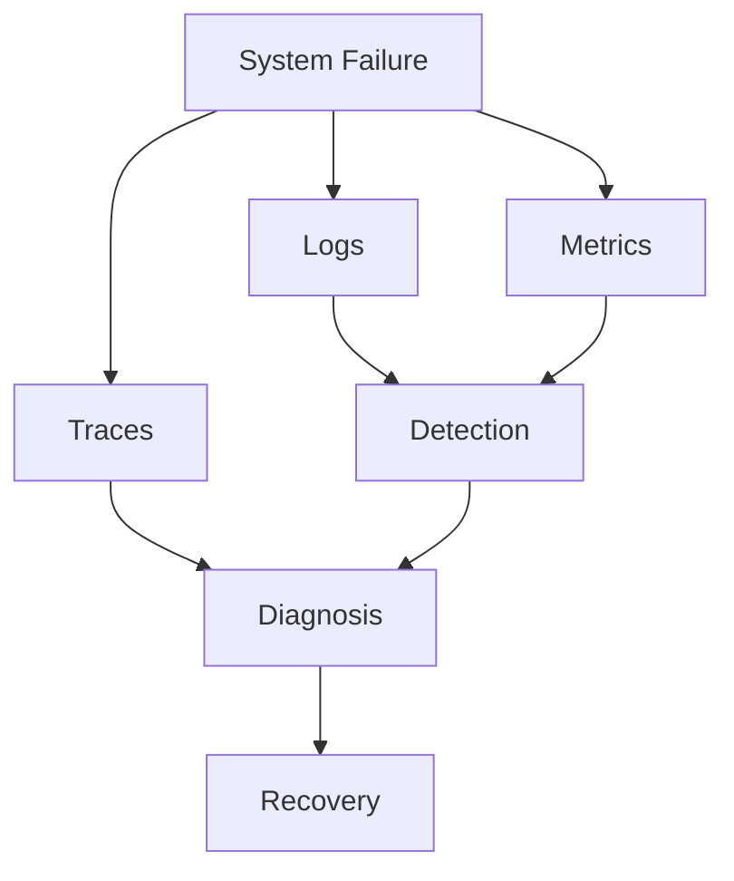

Observability is therefore part of reliability, not merely a debugging feature.

---

## 52. Operational Golden Signals

For major services, monitor:

```text
Latency
Traffic
Errors
Saturation
```

Additional domain signals should be added where they provide meaningful operational insight.

---

## 53. Dependency Observability

External and internal dependencies should be observable independently.

```text
Dependency
 ├── Availability
 ├── Latency
 ├── Error Rate
 └── Saturation / Limits
```

This helps distinguish:

```text
RideForge Failure
```

from:

```text
Dependency Failure
```

---

## 54. Security Incident Visibility

Security-relevant events should be observable, including:

```text
Authentication Failures
Authorization Failures
Suspicious Access Patterns
Credential Errors
Secret Access Problems
Unexpected Administrative Operations
```

Sensitive details should remain protected.

---

## 55. Operational Data Flow

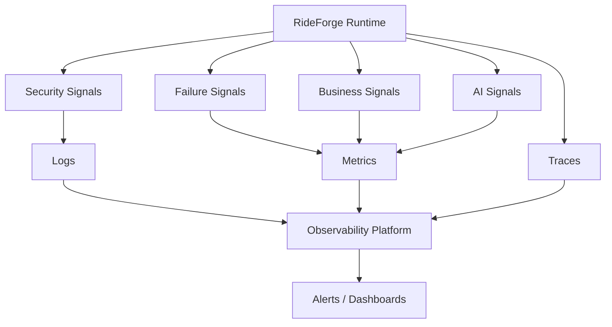

---

## 56. Core Operational Rules

```text
1. Authentication and authorization are separate concerns.

2. Internal services should not automatically be trusted.

3. Services should follow least privilege.

4. Secrets must not be embedded in source code or exposed through logs.

5. Sensitive data should be minimized and protected.

6. Remote dependencies require appropriate timeouts.

7. Retries must be bounded and designed for idempotency.

8. Transient failures may be retried.

9. Permanent failures should not be retried indefinitely.

10. Critical dependencies and non-critical dependencies should have different degradation behaviour.

11. AI failure must not unnecessarily become platform failure.

12. ETA provider failure must have an explicit fallback strategy.

13. Event failures should use retry and DLQ mechanisms where appropriate.

14. Outbox protects events between transactional commit and publication.

15. Failures should be isolated to the smallest practical boundary.

16. Observability must cover logs, metrics, and traces.

17. Business and technical metrics should both be monitored.

18. Correlation IDs should connect distributed operations.

19. Alerts should represent actionable conditions.

20. Recovery must itself be observable.

21. Observability must not expose sensitive data.

22. Security, reliability, and observability should evolve together.
```

---

## 57. AI Agent Usage

For security, failure, reliability, or observability work, load:

```text
01-SYSTEM_CONTEXT_AND_HIGH_LEVEL_ARCHITECTURE.md
02-SERVICE_AND_DOMAIN_ARCHITECTURE.md
03-RIDE_AND_DRIVER_LIFECYCLE.md
04-DISPATCH_ARCHITECTURE.md
05-DRIVER_LOCATION_AND_GEOSPATIAL_FLOW.md
06-EVENT_DRIVEN_AND_DATA_FLOW.md
07-AI_AND_ML_ARCHITECTURE.md
08-SECURITY_FAILURE_AND_OBSERVABILITY.md
```

Relevant ADRs:

```text
ADR-0011 — PgBouncer for Database Connection Pooling
ADR-0012 — Outbox Pattern
ADR-0013 — Dead Letter Queue Strategy
ADR-0014 — API and Service Communication
ADR-0018 — Regional and Legal Ride Validation
ADR-0019 — Data Consistency and Transaction Boundaries
ADR-0020 — Idempotency Strategy
ADR-0021 — Failure and Degradation Strategy
ADR-0022 — Observability Strategy
ADR-0023 — Security and Secret Management
ADR-0024 — Configuration and Environment Strategy
ADR-0026 — Model and AI Governance
ADR-0028 — Cost Optimization Strategy
```

---

## 58. Related Documents

```text
01-SYSTEM_CONTEXT_AND_HIGH_LEVEL_ARCHITECTURE.md
02-SERVICE_AND_DOMAIN_ARCHITECTURE.md
03-RIDE_AND_DRIVER_LIFECYCLE.md
04-DISPATCH_ARCHITECTURE.md
05-DRIVER_LOCATION_AND_GEOSPATIAL_FLOW.md
06-EVENT_DRIVEN_AND_DATA_FLOW.md
07-AI_AND_ML_ARCHITECTURE.md
09-CLOUD_DEPLOYMENT_AND_INFRASTRUCTURE.md
10-DIAGRAM_INDEX.md
```

---

## 59. Related ADRs

```text
ADR-0011 — PgBouncer for Database Connection Pooling
ADR-0012 — Outbox Pattern
ADR-0013 — Dead Letter Queue Strategy
ADR-0014 — API and Service Communication
ADR-0018 — Regional and Legal Ride Validation
ADR-0019 — Data Consistency and Transaction Boundaries
ADR-0020 — Idempotency Strategy
ADR-0021 — Failure and Degradation Strategy
ADR-0022 — Observability Strategy
ADR-0023 — Security and Secret Management
ADR-0024 — Configuration and Environment Strategy
ADR-0026 — Model and AI Governance
ADR-0027 — Cloud and Deployment Strategy
ADR-0028 — Cost Optimization Strategy
```

---

## 60. Maintenance Rules

Update this document when:

```text
Security architecture changes materially
Authentication / authorization boundaries change
Secret-management strategy changes
Failure / degradation strategy changes
Major recovery mechanisms change
Observability architecture changes
Major monitoring boundaries change
```

Do not update it for:

```text
Individual log-message changes
Minor dashboard changes
Small alert-threshold changes
Routine implementation refactoring
```

---

## 61. Completion Criteria

```text
□ Authentication Represented
□ Authorization Represented
□ Service Security Represented
□ Least Privilege Represented
□ Secret Management Represented
□ Sensitive Data Protection Considered
□ Failure Classification Represented
□ Retry Represented
□ Timeout Represented
□ Circuit / Degradation Concept Represented
□ Dispatch Failure Represented
□ AI Failure Represented
□ Event Failure Represented
□ Outbox Recovery Represented
□ Failure Isolation Represented
□ Logs Represented
□ Metrics Represented
□ Traces Represented
□ Correlation Represented
□ Alerting Represented
□ Health / Readiness Represented
□ Business Metrics Represented
□ Security Observability Represented
□ Related ADRs Referenced
□ Related Diagrams Referenced
```

---

## 62. Status

```text
Status: Complete

Document:
08-SECURITY_FAILURE_AND_OBSERVABILITY.md

Diagram Type:
Security + Failure / Degradation + Observability

Primary Audience:
AI Agents
Architects
Backend Engineers
Platform Engineers
SRE / DevOps Engineers

Primary Purpose:
Fast understanding of RideForge security boundaries, failure handling, graceful degradation, and operational visibility.

Previous Diagram:
07-AI_AND_ML_ARCHITECTURE.md

Next Diagram:
09-CLOUD_DEPLOYMENT_AND_INFRASTRUCTURE.md
```
