# 09 — Cloud Deployment and Infrastructure

> **Format:** Markdown + Mermaid  
> **Scope:** Production deployment topology, application runtime, PostgreSQL, Redis, Kafka / Redpanda, AI services, external providers, networking, scaling, and operational infrastructure  
> **Purpose:** Provide a compact visual model of the RideForge production runtime without duplicating detailed deployment or cloud-provider configuration documentation.

---

## 1. Purpose

RideForge is designed to run as a distributed production system.

The high-level runtime contains:

```text
Clients
    ↓
API / Edge
    ↓
Application Services
    ↓
Data + Messaging + AI
    ↓
External Providers
```

The infrastructure must support:

```text
Availability
Scalability
Security
Observability
Failure Isolation
Cost Efficiency
```

---

## 2. High-Level Production Topology

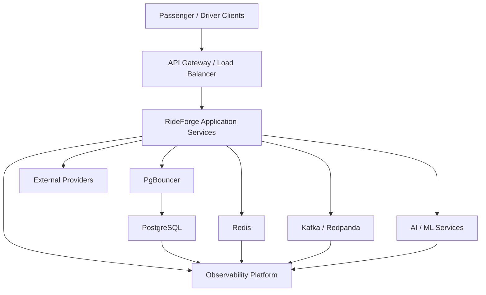

---

## 3. Runtime Layers

The production system can be viewed as:

```text
Layer 1 — Clients
Layer 2 — Edge / Networking
Layer 3 — Application Services
Layer 4 — Data / State
Layer 5 — Messaging
Layer 6 — AI / ML
Layer 7 — External Integrations
Layer 8 — Observability
```

---

## 4. Client Layer

Clients may include:

```text
Passenger Application
Driver Application
Admin / Operations Interface
```

Clients should communicate through controlled public service boundaries.

They should not directly access:

```text
PostgreSQL
Redis
Kafka / Redpanda
Internal Service Ports
Internal AI Infrastructure
```

---

## 5. Edge Layer

The edge layer provides the public entry point for application traffic.

Conceptually:

```text
Internet
   ↓
DNS / Edge
   ↓
Load Balancer / API Gateway
   ↓
Application Services
```

Responsibilities may include:

```text
TLS Termination
Routing
Rate Limiting
Authentication Integration
Traffic Distribution
Request Protection
```

The exact implementation depends on the deployment environment.

---

## 6. Application Layer

Application services contain the core RideForge capabilities.

Conceptually:

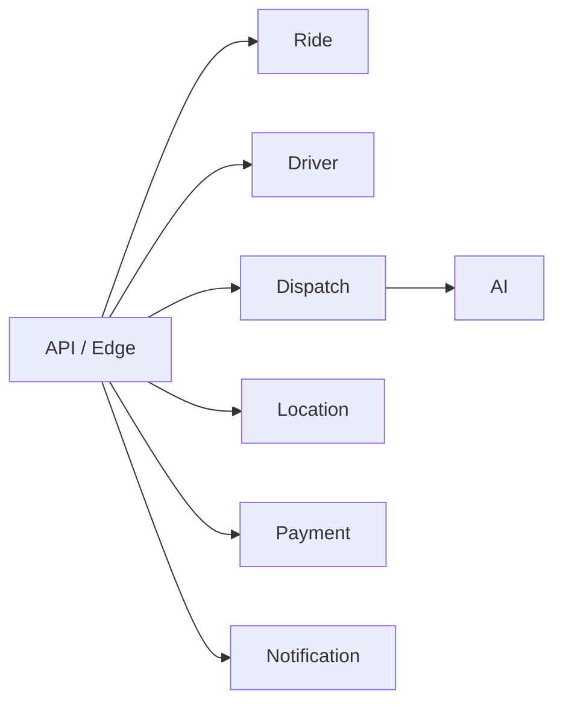

The actual service boundaries are governed by the service/domain architecture.

---

## 7. Stateless Application Services

Where practical, application service instances should remain stateless.

```text
Load Balancer
      ↓
 ┌────┼────┐
 ↓    ↓    ↓
App1 App2 App3
```

Shared state belongs in appropriate infrastructure such as:

```text
PostgreSQL
Redis
Kafka / Redpanda
Object Storage
```

This enables horizontal scaling.

---

## 8. Horizontal Scaling

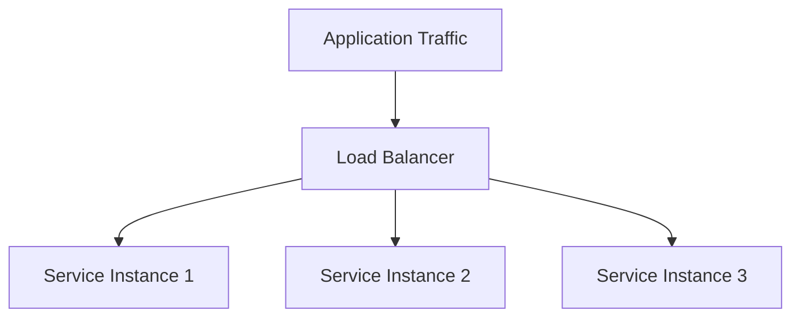

Scaling should be driven by:

```text
Traffic
Latency
CPU / Memory
Concurrency
Queue Depth
Domain Workload
```

not by arbitrary instance counts.

---

## 9. Service-to-Data Architecture

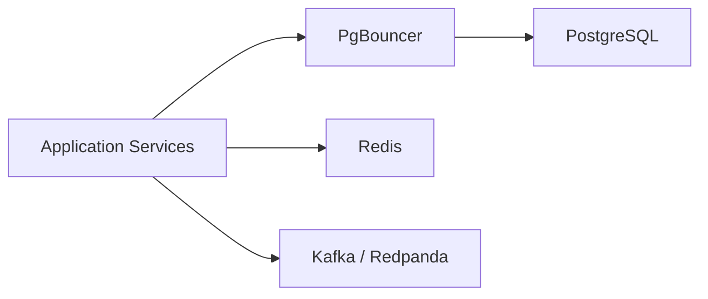

The application layer should access infrastructure through appropriate interfaces rather than spreading infrastructure-specific assumptions throughout domain logic.

---

## 10. PostgreSQL

PostgreSQL is the primary transactional database.

It supports:

```text
Transactional State
Domain Data
Outbox
Relational Data
PostGIS
```

Conceptually:

```text
Application
    ↓
PgBouncer
    ↓
PostgreSQL
    ├── Domain Data
    ├── Outbox
    └── PostGIS
```

---

## 11. PgBouncer

PgBouncer protects PostgreSQL from excessive application connection pressure.

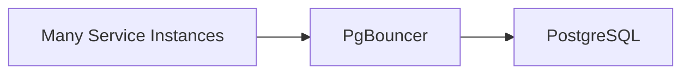

This is especially important as application instances and concurrent requests increase.

---

## 12. Redis

Redis supports low-latency state and caching.

Typical responsibilities include:

```text
Real-Time Driver State
Location-Related State
Caching
Short-Lived Operational State
```

Redis should not automatically become the authoritative store for transactional domain state.

---

## 13. Kafka / Redpanda

Kafka / Redpanda provides asynchronous event streaming.

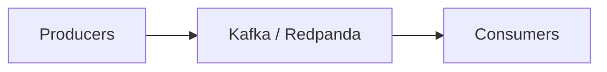

Consumers may include:

```text
Dispatch
Notifications
Analytics
AI Pipelines
Operational Workers
Other Domain Services
```

---

## 14. AI Runtime

AI services may be deployed independently from core application services.

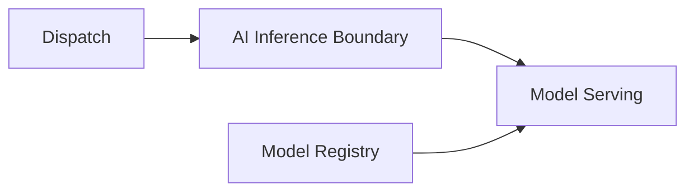

This allows AI infrastructure to scale and evolve independently.

---

## 15. External Providers

RideForge may integrate with external systems such as:

```text
Maps / Routing
Payment
Messaging
Other Platform Services
```

Conceptually:

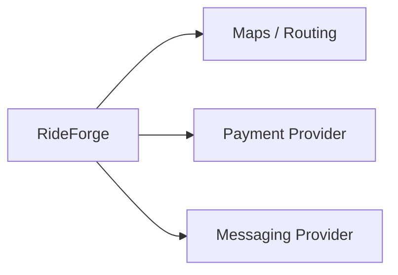

External dependencies must have:

```text
Timeouts
Failure Handling
Observability
Credential Management
Fallback / Degradation
```

where applicable.

---

## 16. Network Boundaries

A production deployment should separate:

```text
Public Network
Private Application Network
Private Data Network
```

Conceptually:

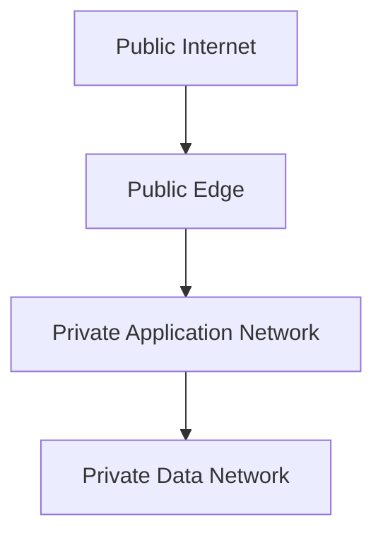

Databases and internal infrastructure should not be unnecessarily exposed to the public internet.

---

## 17. Public vs Private Components

### Public-facing

```text
API / Edge
```

### Private

```text
Application Services
PostgreSQL
PgBouncer
Redis
Kafka / Redpanda
AI Infrastructure
Internal Workers
```

External providers are reached through controlled outbound connectivity.

---

## 18. Deployment Unit

A deployable application component should have:

```text
Application Artifact
Configuration
Secrets / Secret References
Health Checks
Observability
Resource Limits
Deployment Policy
```

The exact container and orchestration configuration belongs to the deployment implementation.

---

## 19. Containerized Runtime

Conceptually:

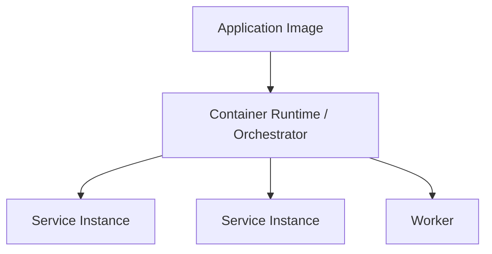

Containerization provides a consistent deployment artifact across environments.

---

## 20. Configuration

Configuration should be separated from application code.

```text
Application
   ↓
Environment Configuration
   ↓
Runtime Behaviour
```

Configuration may include:

```text
Database Endpoint
Redis Endpoint
Broker Endpoint
Provider Configuration
Feature Flags
Dispatch Mode
AI Model Configuration
Operational Limits
```

Secrets should remain under secret management rather than ordinary configuration files.

---

## 21. Environment Separation

RideForge should distinguish at least:

```text
Development
Testing
Staging
Production
```

Conceptually:

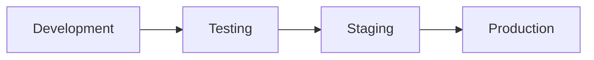

Production credentials and infrastructure must not be casually reused in lower environments.

---

## 22. Deployment Pipeline

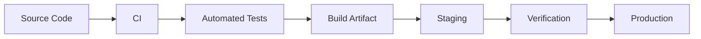

Deployment should be automated where practical and protected by validation gates.

---

## 23. Health and Readiness

Each production service should expose appropriate operational health signals.

```text
Liveness
    ↓
Is the process alive?

Readiness
    ↓
Can the service safely receive traffic?
```

A service may be alive while not being ready.

---

## 24. Graceful Shutdown

A service should handle shutdown without unnecessarily losing work.

Conceptually:

```text
Shutdown Signal
      ↓
Stop New Work
      ↓
Finish / Persist Active Work
      ↓
Close Connections
      ↓
Exit
```

The exact behaviour depends on the service.

---

## 25. Rolling Deployment

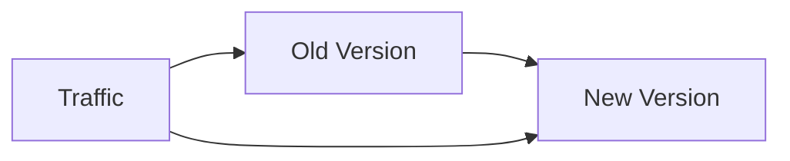

New instances should become ready before old instances are removed.

---

## 26. Deployment Safety

Production deployment should consider:

```text
Backward Compatibility
Database Migration Safety
Event Schema Compatibility
API Compatibility
Rollback
Health Checks
Traffic Shifting
```

Deploying application code and changing persistent state should not create avoidable incompatibilities.

---

## 27. Database Migration

```text
Migration
   ↓
Backward-Compatible Schema
   ↓
Application Deployment
   ↓
Data Migration / Cleanup
```

Avoid migrations that require all application instances to change simultaneously unless the deployment architecture explicitly guarantees that behaviour.

---

## 28. Event Schema Deployment

Event consumers may be deployed independently.

Therefore:

```text
Producer Version A
       ↓
Compatible Event
       ↓
Consumer Version A / B
```

Schema evolution should preserve compatibility during rolling deployments.

---

## 29. Scaling the Event Layer

Kafka / Redpanda scaling may involve:

```text
Partitions
Consumers
Consumer Groups
Broker Resources
Retention
```

The event architecture should scale independently from synchronous application instances where required.

---

## 30. Scaling Redis

Redis workload may grow with:

```text
Driver Count
Location Update Rate
Active Users
Cache Volume
Real-Time State
```

Scaling should be based on:

```text
Memory
Command Rate
Latency
Connection Count
Data Distribution
```

The exact topology depends on production requirements.

---

## 31. Scaling PostgreSQL

PostgreSQL scaling considerations include:

```text
Connection Count
CPU
Memory
IO
Query Latency
Storage
Read Load
Write Load
Geospatial Workload
```

PgBouncer helps control connection pressure but does not eliminate inefficient queries.

---

## 32. Scaling Location Infrastructure

Driver location is high-frequency.

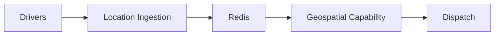

The location path should be optimized independently from lower-frequency transactional operations.

---

## 33. Scaling Dispatch

Dispatch workload can grow with:

```text
Ride Requests
Candidate Count
Driver Population
ETA Calls
AI Inference
Geospatial Queries
```

Scaling should avoid multiplying expensive downstream calls unnecessarily.

---

## 34. Scaling AI

AI workloads may scale independently:

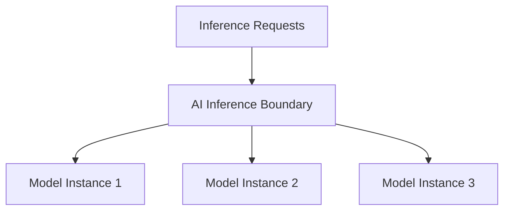

Model serving capacity should be matched to:

```text
Inference Rate
Latency Target
Model Size
CPU / GPU Requirement
Cost
```

---

## 35. Availability Zones / Regions

Production deployment may use multiple failure domains where justified.

Conceptually:

```text
Region
 ├── Zone A
 ├── Zone B
 └── Zone C
```

The exact topology depends on:

```text
Traffic
Budget
Availability Requirements
Data Residency
Provider Capabilities
Operational Complexity
```

Do not introduce multi-region complexity without a concrete requirement.

---

## 36. Multi-Region Considerations

RideForge has regional operating and legal constraints.

Therefore infrastructure region selection must consider:

```text
Operating Geography
Latency
Data Residency
Legal Requirements
Provider Availability
Cross-Region Traffic
Disaster Recovery
```

A multi-region architecture should not be introduced solely for theoretical scalability.

---

## 37. Regional Ride Context

The infrastructure layer does not replace regional business validation.

```text
Infrastructure Region
        ≠
Ride Operating Region
```

A ride must still pass:

```text
Regional / Legal Validation
```

before dispatch.

---

## 38. Disaster Recovery

A production system should define recovery objectives:

```text
RTO — Recovery Time Objective
RPO — Recovery Point Objective
```

The appropriate targets depend on business requirements.

Recovery planning should cover:

```text
PostgreSQL
Redis
Kafka / Redpanda
Application Services
Configuration
Secrets
AI Artifacts
```

---

## 39. Backup and Restore

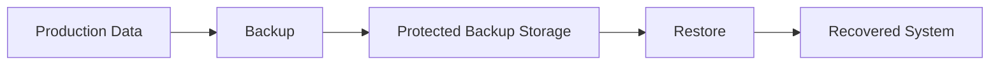

A backup is not sufficient until restoration has been tested.

---

## 40. Infrastructure Failure

Possible failures include:

```text
Instance Failure
Zone Failure
Database Failure
Redis Failure
Broker Failure
Network Failure
Provider Failure
Deployment Failure
```

The platform should have an explicit recovery strategy for failures that matter to its availability targets.

---

## 41. Infrastructure Observability

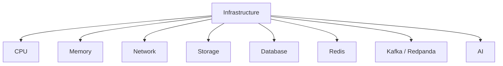

These signals feed the platform observability system.

---

## 42. Infrastructure Security

Infrastructure security should include:

```text
Private Networking
Firewall / Security Rules
TLS
Identity and Access Management
Secret Management
Least Privilege
Audit Logging
Network Segmentation
```

Infrastructure access should be restricted to authorized operators and services.

---

## 43. Infrastructure as Code

Production infrastructure should be reproducible where practical.

Conceptually:

```text
Infrastructure Definition
        ↓
Review
        ↓
Provision / Update
        ↓
Environment
```

This reduces configuration drift and makes infrastructure changes auditable.

---

## 44. Deployment and Secrets

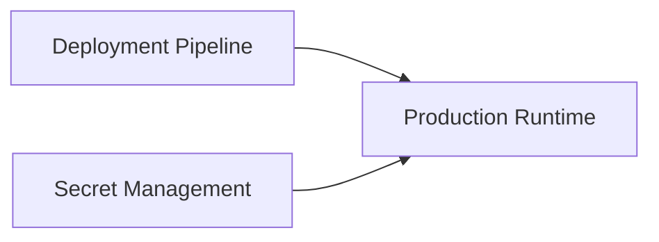

Secrets should be injected securely at runtime rather than stored in deployment artifacts.

---

## 45. Cost-Aware Infrastructure

RideForge should optimize for practical production economics.

Major cost drivers include:

```text
Compute
Database
Redis
Kafka / Redpanda
AI Inference
External APIs
Storage
Network Traffic
Observability
```

Infrastructure complexity should be justified by actual reliability, performance, or scale requirements.

---

## 46. Avoiding Over-Engineering

The architecture should support growth without prematurely deploying every possible infrastructure component.

Prefer:

```text
Simple
+
Observable
+
Replaceable
+
Scalable
```

over:

```text
Complex
+
Expensive
+
Hard to Operate
+
Not Yet Required
```

---

## 47. Infrastructure and Architecture Evolution

Infrastructure may evolve through stages:

```text
Development
   ↓
Small Production
   ↓
Growing Production
   ↓
Regional Scale
   ↓
Larger Multi-Region Requirements
```

Each stage should introduce infrastructure complexity only when justified.

---

## 48. Production Topology Summary

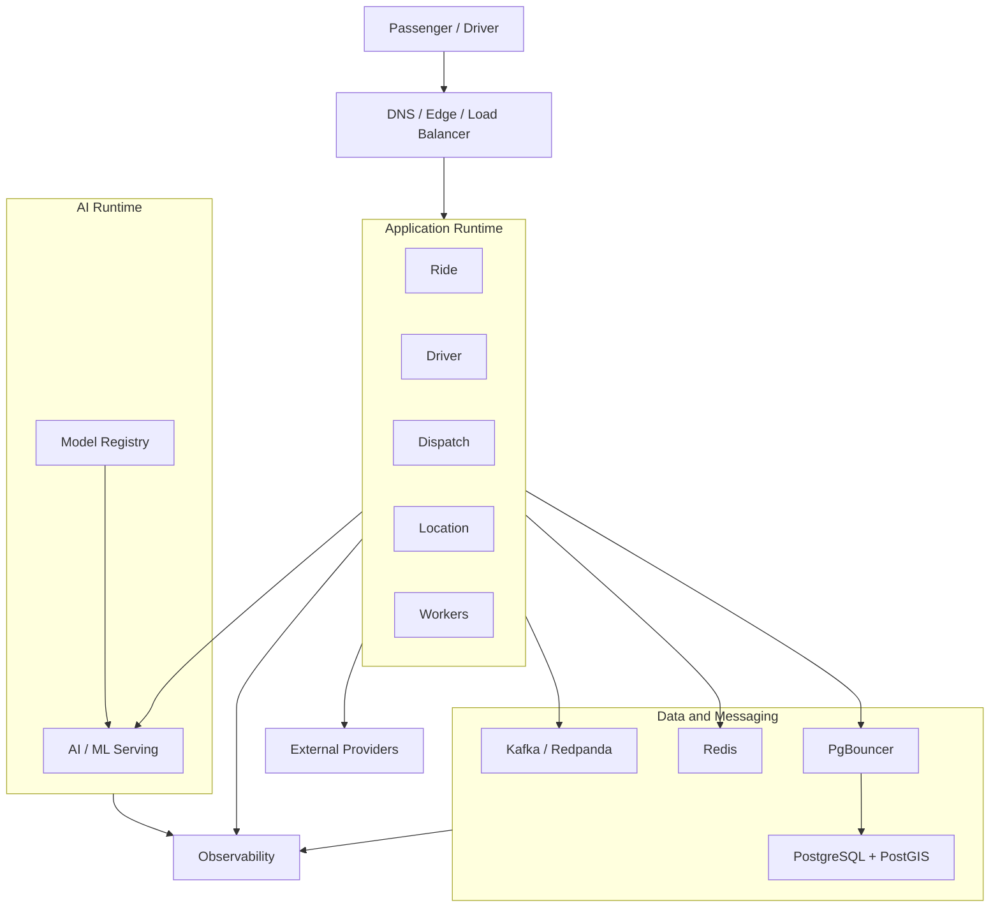

---

## 49. End-to-End Production Flow

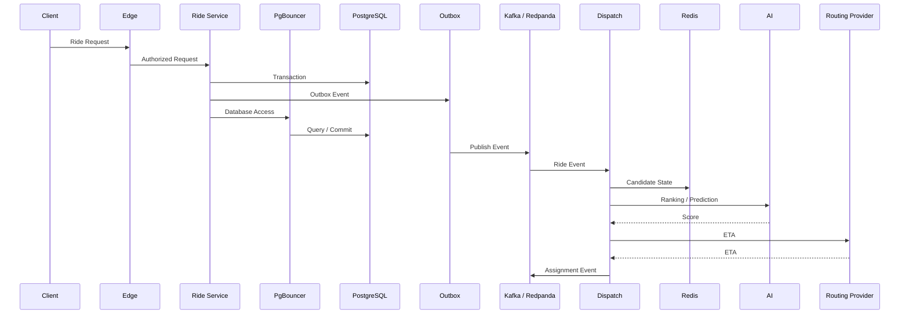

---

## 50. Deployment Principles

```text
1. Public traffic enters through controlled edge boundaries.

2. Internal infrastructure should remain private where practical.

3. Application services should be horizontally scalable where appropriate.

4. PostgreSQL remains the primary transactional database.

5. PgBouncer protects PostgreSQL from connection pressure.

6. Redis supports real-time state and caching.

7. Kafka / Redpanda provides asynchronous event streaming.

8. AI infrastructure remains independently deployable where useful.

9. External providers remain isolated behind service boundaries.

10. Health and readiness must be observable.

11. Deployments should support safe rolling changes.

12. Database and event schema changes must consider backward compatibility.

13. Secrets must be managed outside source code.

14. Production environments must remain isolated from development environments.

15. Infrastructure failures require explicit recovery strategies.

16. Backups must have tested restoration procedures.

17. Infrastructure complexity should grow with actual requirements.

18. Multi-region deployment should be introduced only when justified.

19. Infrastructure region does not replace regional/legal ride validation.

20. Infrastructure should remain observable and cost-aware.

21. Infrastructure should be reproducible where practical.

22. Core ride operations should remain resilient to non-critical dependency failures.
```

---

## 51. AI Agent Usage

For deployment or infrastructure work, load:

```text
01-SYSTEM_CONTEXT_AND_HIGH_LEVEL_ARCHITECTURE.md
02-SERVICE_AND_DOMAIN_ARCHITECTURE.md
03-RIDE_AND_DRIVER_LIFECYCLE.md
04-DISPATCH_ARCHITECTURE.md
05-DRIVER_LOCATION_AND_GEOSPATIAL_FLOW.md
06-EVENT_DRIVEN_AND_DATA_FLOW.md
07-AI_AND_ML_ARCHITECTURE.md
08-SECURITY_FAILURE_AND_OBSERVABILITY.md
09-CLOUD_DEPLOYMENT_AND_INFRASTRUCTURE.md
```

Relevant ADRs:

```text
ADR-0007 — PostgreSQL as Primary Database
ADR-0008 — PostGIS for Geospatial Operations
ADR-0009 — Redis for Real-Time State and Caching
ADR-0011 — PgBouncer for Database Connection Pooling
ADR-0006 — Kafka / Redpanda for Event Streaming
ADR-0021 — Failure and Degradation Strategy
ADR-0022 — Observability Strategy
ADR-0023 — Security and Secret Management
ADR-0024 — Configuration and Environment Strategy
ADR-0027 — Cloud and Deployment Strategy
ADR-0028 — Cost Optimization Strategy
ADR-0029 — Architecture Evolution and Migration
```

---

## 52. Related Documents

```text
01-SYSTEM_CONTEXT_AND_HIGH_LEVEL_ARCHITECTURE.md
02-SERVICE_AND_DOMAIN_ARCHITECTURE.md
03-RIDE_AND_DRIVER_LIFECYCLE.md
04-DISPATCH_ARCHITECTURE.md
05-DRIVER_LOCATION_AND_GEOSPATIAL_FLOW.md
06-EVENT_DRIVEN_AND_DATA_FLOW.md
07-AI_AND_ML_ARCHITECTURE.md
08-SECURITY_FAILURE_AND_OBSERVABILITY.md
10-DIAGRAM_INDEX.md
```

---

## 53. Related ADRs

```text
ADR-0006 — Kafka / Redpanda for Event Streaming
ADR-0007 — PostgreSQL as Primary Database
ADR-0008 — PostGIS for Geospatial Operations
ADR-0009 — Redis for Real-Time State and Caching
ADR-0011 — PgBouncer for Database Connection Pooling
ADR-0021 — Failure and Degradation Strategy
ADR-0022 — Observability Strategy
ADR-0023 — Security and Secret Management
ADR-0024 — Configuration and Environment Strategy
ADR-0027 — Cloud and Deployment Strategy
ADR-0028 — Cost Optimization Strategy
ADR-0029 — Architecture Evolution and Migration
```

---

## 54. Maintenance Rules

Update this document when:

```text
Production topology changes materially
Major infrastructure components are added or removed
Deployment strategy changes
Cloud architecture changes
Network boundaries change
Scaling architecture changes
Disaster recovery architecture changes
Infrastructure security boundaries change
```

Do not update it for:

```text
Minor deployment configuration changes
Individual instance-size changes
Routine CI/CD changes
Small infrastructure refactors
```

---

## 55. Completion Criteria

```text
□ Production Topology Represented
□ Client / Edge Boundary Represented
□ Application Runtime Represented
□ PostgreSQL Represented
□ PgBouncer Represented
□ Redis Represented
□ Kafka / Redpanda Represented
□ AI Runtime Represented
□ External Providers Represented
□ Network Boundaries Represented
□ Horizontal Scaling Represented
□ Deployment Flow Represented
□ Configuration Boundary Represented
□ Environment Separation Represented
□ Rolling Deployment Represented
□ Migration Safety Considered
□ Disaster Recovery Considered
□ Backup / Restore Considered
□ Infrastructure Security Considered
□ Infrastructure Observability Represented
□ Cost Considerations Represented
□ Architecture Evolution Considered
□ Related ADRs Referenced
□ Related Diagrams Referenced
```

---

## 56. Status

```text
Status: Complete

Document:
09-CLOUD_DEPLOYMENT_AND_INFRASTRUCTURE.md

Diagram Type:
Cloud Deployment + Production Infrastructure

Primary Audience:
AI Agents
Architects
Backend Engineers
Platform Engineers
DevOps / SRE Engineers

Primary Purpose:
Fast understanding of the RideForge production runtime topology, infrastructure boundaries, deployment flow, scaling, and recovery considerations.

Previous Diagram:
08-SECURITY_FAILURE_AND_OBSERVABILITY.md

Next Diagram:
10-DIAGRAM_INDEX.md
```
