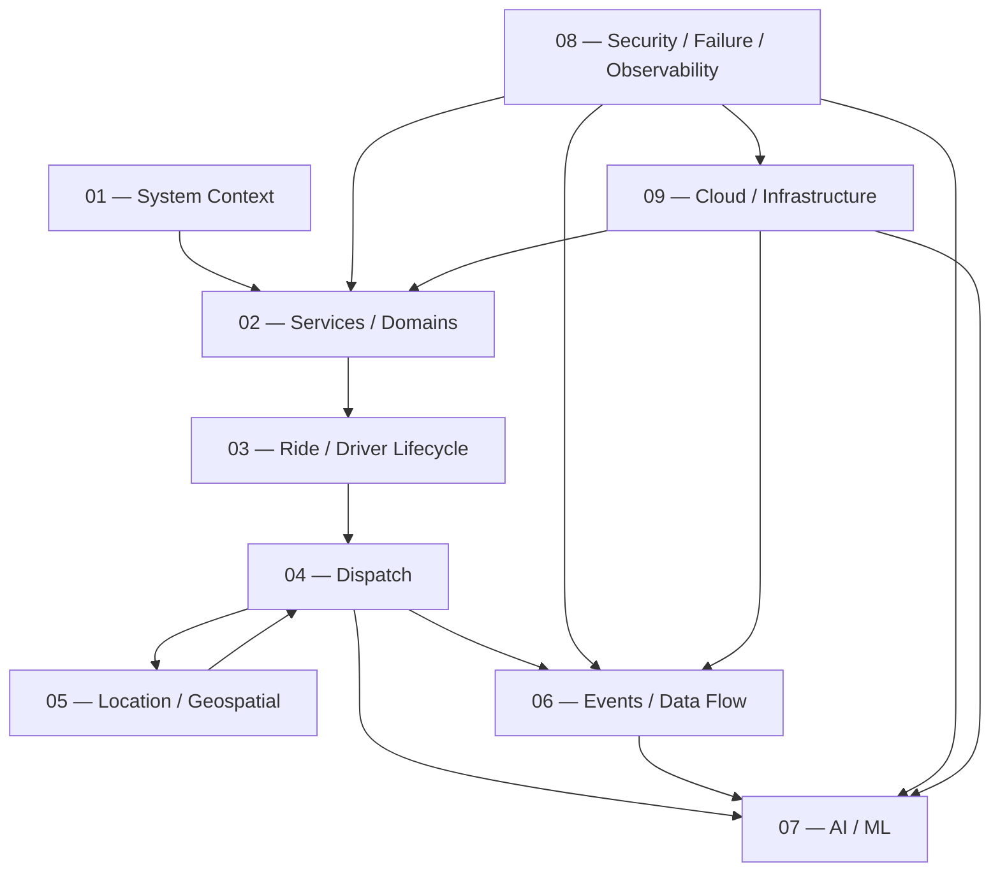

# 10 — Diagram Index

> **Format:** Markdown  
> **Purpose:** Navigation and context-loading guide for the RideForge architecture diagrams  
> **Audience:** AI agents, architects, backend engineers, platform engineers, DevOps/SRE engineers  
> **Principle:** Load only the diagrams relevant to the task to minimize unnecessary context and input-token usage.

---

## 1. Purpose

The `diagrams/` documentation folder provides a compact visual representation of the RideForge architecture.

The diagrams are intentionally organized so an AI agent does **not** need to load every document for every task.

Use this file as the navigation layer:

```text
Task
 ↓
Identify Concern
 ↓
Load Relevant Diagram(s)
 ↓
Load Relevant ADR(s)
 ↓
Load Relevant Development / AI Documentation
 ↓
Implement / Review
```

---

## 2. Diagram Set

```text
diagrams/
│
├── 01-SYSTEM_CONTEXT_AND_HIGH_LEVEL_ARCHITECTURE.md
├── 02-SERVICE_AND_DOMAIN_ARCHITECTURE.md
├── 03-RIDE_AND_DRIVER_LIFECYCLE.md
├── 04-DISPATCH_ARCHITECTURE.md
├── 05-DRIVER_LOCATION_AND_GEOSPATIAL_FLOW.md
├── 06-EVENT_DRIVEN_AND_DATA_FLOW.md
├── 07-AI_AND_ML_ARCHITECTURE.md
├── 08-SECURITY_FAILURE_AND_OBSERVABILITY.md
├── 09-CLOUD_DEPLOYMENT_AND_INFRASTRUCTURE.md
└── 10-DIAGRAM_INDEX.md
```

---

## 3. Recommended Reading Order

For broad architectural context:

```text
01
 ↓
02
 ↓
03
 ↓
04
 ↓
05
 ↓
06
 ↓
07
 ↓
08
 ↓
09
```

`10-DIAGRAM_INDEX.md` is the navigation document and normally does not need to be loaded as architectural content after the required diagram has been identified.

---

## 4. Diagram Responsibilities

| File | Primary Concern |
|---|---|
| `01-SYSTEM_CONTEXT_AND_HIGH_LEVEL_ARCHITECTURE.md` | Overall system context and major boundaries |
| `02-SERVICE_AND_DOMAIN_ARCHITECTURE.md` | Services, domains, and service relationships |
| `03-RIDE_AND_DRIVER_LIFECYCLE.md` | Ride and driver lifecycle/state flows |
| `04-DISPATCH_ARCHITECTURE.md` | Stand Dispatch, Smart Dispatch, matching, assignment |
| `05-DRIVER_LOCATION_AND_GEOSPATIAL_FLOW.md` | Driver location, Redis, PostGIS, geospatial discovery |
| `06-EVENT_DRIVEN_AND_DATA_FLOW.md` | Events, Outbox, Kafka/Redpanda, consumers, DLQ |
| `07-AI_AND_ML_ARCHITECTURE.md` | AI/ML, features, inference, training, feedback |
| `08-SECURITY_FAILURE_AND_OBSERVABILITY.md` | Security, failures, degradation, observability |
| `09-CLOUD_DEPLOYMENT_AND_INFRASTRUCTURE.md` | Production topology and infrastructure |
| `10-DIAGRAM_INDEX.md` | Navigation and context-selection rules |

---

## 5. Task-to-Diagram Mapping

### General Architecture

Load:

```text
01-SYSTEM_CONTEXT_AND_HIGH_LEVEL_ARCHITECTURE.md
02-SERVICE_AND_DOMAIN_ARCHITECTURE.md
```

Use when working on:

```text
System structure
Service boundaries
Architecture overview
Domain boundaries
Cross-service relationships
```

---

### Ride Lifecycle

Load:

```text
03-RIDE_AND_DRIVER_LIFECYCLE.md
```

Additionally load:

```text
04-DISPATCH_ARCHITECTURE.md
```

when the task involves dispatch or assignment.

Use for:

```text
Ride creation
Ride state transitions
Driver lifecycle
Trip lifecycle
Cancellation
Completion
Assignment state
```

---

### Dispatch

Load:

```text
04-DISPATCH_ARCHITECTURE.md
```

Then, when relevant:

```text
05-DRIVER_LOCATION_AND_GEOSPATIAL_FLOW.md
06-EVENT_DRIVEN_AND_DATA_FLOW.md
07-AI_AND_ML_ARCHITECTURE.md
```

Use for:

```text
Stand Dispatch
Smart Dispatch
Candidate discovery
Matching
Ranking
Assignment
Re-dispatch
Dispatch fallback
```

---

### Driver Location / Geospatial

Load:

```text
05-DRIVER_LOCATION_AND_GEOSPATIAL_FLOW.md
```

Additionally load:

```text
04-DISPATCH_ARCHITECTURE.md
```

when location is used for dispatch.

Use for:

```text
Driver location
Redis
PostGIS
Geospatial search
Location freshness
Nearby drivers
Candidate discovery
Location ingestion
```

---

### Events / Messaging

Load:

```text
06-EVENT_DRIVEN_AND_DATA_FLOW.md
```

Additionally load:

```text
02-SERVICE_AND_DOMAIN_ARCHITECTURE.md
```

when service boundaries are involved.

Use for:

```text
Kafka
Redpanda
Events
Outbox
Consumers
DLQ
Retries
Replay
Eventual consistency
Event contracts
```

---

### AI / ML

Load:

```text
07-AI_AND_ML_ARCHITECTURE.md
```

Then load the relevant documents from:

```text
05-ai/
```

Use for:

```text
Smart Dispatch AI
ETA prediction
Demand prediction
Supply prediction
Matching / ranking
Feature engineering
Model training
Model serving
Model registry
AI feedback
AI monitoring
AI governance
```

---

### Security / Reliability / Observability

Load:

```text
08-SECURITY_FAILURE_AND_OBSERVABILITY.md
```

Additionally load:

```text
06-EVENT_DRIVEN_AND_DATA_FLOW.md
```

when event failures are involved.

Use for:

```text
Authentication
Authorization
Secrets
Security boundaries
Retries
Timeouts
Fallbacks
Failure handling
Degradation
Logs
Metrics
Traces
Alerts
```

---

### Cloud / Infrastructure

Load:

```text
09-CLOUD_DEPLOYMENT_AND_INFRASTRUCTURE.md
```

Additionally load:

```text
08-SECURITY_FAILURE_AND_OBSERVABILITY.md
```

when the task involves operational reliability or infrastructure security.

Use for:

```text
Deployment
Cloud topology
Networking
Containers
Scaling
PostgreSQL infrastructure
Redis infrastructure
Kafka/Redpanda infrastructure
AI infrastructure
Backups
Disaster recovery
Production environments
```

---

## 6. Cross-Cutting Task Loading

For tasks crossing multiple architectural concerns, use the smallest relevant combination.

### Dispatch + Location

```text
04-DISPATCH_ARCHITECTURE.md
05-DRIVER_LOCATION_AND_GEOSPATIAL_FLOW.md
```

### Dispatch + AI

```text
04-DISPATCH_ARCHITECTURE.md
07-AI_AND_ML_ARCHITECTURE.md
```

### Dispatch + Events

```text
04-DISPATCH_ARCHITECTURE.md
06-EVENT_DRIVEN_AND_DATA_FLOW.md
```

### Location + Events

```text
05-DRIVER_LOCATION_AND_GEOSPATIAL_FLOW.md
06-EVENT_DRIVEN_AND_DATA_FLOW.md
```

### AI + Events

```text
06-EVENT_DRIVEN_AND_DATA_FLOW.md
07-AI_AND_ML_ARCHITECTURE.md
```

### AI + Dispatch + Location

```text
04-DISPATCH_ARCHITECTURE.md
05-DRIVER_LOCATION_AND_GEOSPATIAL_FLOW.md
07-AI_AND_ML_ARCHITECTURE.md
```

### Security + Infrastructure

```text
08-SECURITY_FAILURE_AND_OBSERVABILITY.md
09-CLOUD_DEPLOYMENT_AND_INFRASTRUCTURE.md
```

### Full Runtime Investigation

Only when the task genuinely requires broad architectural context:

```text
01
02
03
04
05
06
07
08
09
```

Do **not** load all diagrams for a narrowly scoped implementation task.

---

## 7. Diagram + ADR Loading

Diagrams explain:

```text
What the architecture looks like
```

ADRs explain:

```text
Why the architecture was chosen
```

Therefore an AI agent should normally use:

```text
Diagram
    +
Relevant ADR
```

for architecture-changing work.

---

## 8. Core Diagram-to-ADR Mapping

### System / Services

```text
01
→ ADR-0002
→ ADR-0003
→ ADR-0004
```

### Dispatch

```text
04
→ ADR-0015
→ ADR-0016
→ ADR-0017
→ ADR-0018
```

### Location / Geospatial

```text
05
→ ADR-0007
→ ADR-0008
→ ADR-0009
→ ADR-0010
```

### Events

```text
06
→ ADR-0005
→ ADR-0006
→ ADR-0012
→ ADR-0013
→ ADR-0014
→ ADR-0019
→ ADR-0020
```

### AI

```text
07
→ ADR-0015
→ ADR-0016
→ ADR-0017
→ ADR-0026
```

### Security / Reliability

```text
08
→ ADR-0021
→ ADR-0022
→ ADR-0023
→ ADR-0024
```

### Infrastructure

```text
09
→ ADR-0027
→ ADR-0028
→ ADR-0029
```

---

## 9. Context Loading Rules for AI Agents

Before changing architecture:

```text
1. Identify the affected capability.
2. Load its primary diagram.
3. Load directly related diagrams only if necessary.
4. Load the relevant ADR(s).
5. Load the corresponding development documentation.
6. For AI work, load only the relevant 05-ai documents.
7. Inspect existing implementation before changing architecture.
```

---

## 10. Avoid Unnecessary Context

Do not automatically load:

```text
All diagrams
All ADRs
All development documentation
All AI documentation
```

unless the task is explicitly architectural or cross-system.

Prefer:

```text
1–3 diagrams
+
Relevant ADRs
+
Relevant implementation documentation
```

This keeps the agent's context focused and reduces input-token consumption.

---

## 11. Diagram Authority

These diagrams are:

```text
Architecture Context Documents
```

They are not substitutes for:

```text
Source Code
Database Schema
API Contracts
Service Contracts
Migration Files
Production Configuration
Tests
```

When implementing a change:

```text
Architecture Documentation
        ↓
Existing Implementation
        ↓
Tests / Contracts
        ↓
Change
```

The actual repository state must be inspected before assuming that documentation and implementation are identical.

---

## 12. Conflict Handling

If a diagram conflicts with an ADR:

```text
Check ADR
    ↓
Check Development Documentation
    ↓
Check Current Implementation
    ↓
Determine Whether Architecture Has Evolved
```

Do not silently rewrite architectural assumptions.

A confirmed architecture change should update the relevant:

```text
ADR
Diagram
Development Documentation
Implementation
```

as appropriate.

---

## 13. Diagram Maintenance

Update a diagram when:

```text
A major architecture boundary changes
A major service relationship changes
A major data flow changes
A major infrastructure component changes
A major AI integration changes
A major reliability/security boundary changes
```

Do not update diagrams for:

```text
Variable changes
Small refactors
Minor query optimizations
Individual bug fixes
Routine configuration changes
```

---

## 14. Diagram Folder Principle

The diagram folder intentionally contains a small number of consolidated documents.

The goal is:

```text
High Architectural Coverage
+
Low Document Count
+
Low Context Cost
+
Fast AI Navigation
```

Do not create a new diagram document merely because a new implementation detail exists.

First determine whether the detail belongs inside an existing diagram.

---

## 15. Quick Navigation

```text
Need overall architecture?
→ 01

Need services/domains?
→ 02

Need ride/driver lifecycle?
→ 03

Need dispatch?
→ 04

Need location/geospatial?
→ 05

Need events/Kafka/Outbox/DLQ?
→ 06

Need AI/ML?
→ 07

Need security/failure/observability?
→ 08

Need cloud/deployment/infrastructure?
→ 09
```

---

## 16. AI Agent Minimal Context Strategy

For most implementation tasks:

```text
Start with:
    Relevant Diagram

Then:
    Relevant ADR

Then:
    Relevant Development Document

Then:
    Relevant Source Code
```

For AI tasks:

```text
Relevant Diagram
+
Relevant ADR
+
Relevant 05-ai Document
+
Relevant Source Code
```

For infrastructure tasks:

```text
09-CLOUD_DEPLOYMENT_AND_INFRASTRUCTURE.md
+
Relevant Infrastructure ADR
+
Relevant Deployment Documentation
+
Actual Infrastructure Configuration
```

---

## 17. Complete Architecture Context

When an agent explicitly needs the complete architecture:

```text
01-SYSTEM_CONTEXT_AND_HIGH_LEVEL_ARCHITECTURE.md
02-SERVICE_AND_DOMAIN_ARCHITECTURE.md
03-RIDE_AND_DRIVER_LIFECYCLE.md
04-DISPATCH_ARCHITECTURE.md
05-DRIVER_LOCATION_AND_GEOSPATIAL_FLOW.md
06-EVENT_DRIVEN_AND_DATA_FLOW.md
07-AI_AND_ML_ARCHITECTURE.md
08-SECURITY_FAILURE_AND_OBSERVABILITY.md
09-CLOUD_DEPLOYMENT_AND_INFRASTRUCTURE.md
```

Then use:

```text
ADR/
05-ai/
04-development/
```

selectively rather than loading every document.

---

## 18. Final Architecture Map



---

## 19. Documentation Relationship

```text
                    RideForge Documentation
                            │
          ┌─────────────────┼─────────────────┐
          ↓                 ↓                 ↓
     Development           ADR               AI
     Documentation    Architecture       Documentation
          │                 │                 │
          └─────────────────┼─────────────────┘
                            ↓
                         Diagrams
                            │
                            ↓
                     Fast Architecture
                        Understanding
```

The diagram folder is therefore a **visual/context layer**, not a replacement for the detailed architecture decisions or implementation documentation.

---

## 20. Status

```text
Status: Complete

Document:
10-DIAGRAM_INDEX.md

Purpose:
Diagram navigation and AI context-loading guide

Previous Diagram:
09-CLOUD_DEPLOYMENT_AND_INFRASTRUCTURE.md

Diagram Folder:
Complete
```

---

## 21. Diagram Folder Completion

The planned diagram documentation is now:

```text
diagrams/
│
├── 01-SYSTEM_CONTEXT_AND_HIGH_LEVEL_ARCHITECTURE.md
├── 02-SERVICE_AND_DOMAIN_ARCHITECTURE.md
├── 03-RIDE_AND_DRIVER_LIFECYCLE.md
├── 04-DISPATCH_ARCHITECTURE.md
├── 05-DRIVER_LOCATION_AND_GEOSPATIAL_FLOW.md
├── 06-EVENT_DRIVEN_AND_DATA_FLOW.md
├── 07-AI_AND_ML_ARCHITECTURE.md
├── 08-SECURITY_FAILURE_AND_OBSERVABILITY.md
├── 09-CLOUD_DEPLOYMENT_AND_INFRASTRUCTURE.md
└── 10-DIAGRAM_INDEX.md
```

**The `diagrams/` documentation folder is complete.**

---

## 11. Dispatch Strategy Documentation Alignment

The diagram set must consistently represent the canonical RideForge dispatch model.

### 11.1 Two Primary Dispatch Strategies

The architecture contains two primary dispatch strategies:

```text
Smart Stand Dispatch
Smart Dispatch
```

AI-assisted dispatch is **not a third primary dispatch strategy**.

AI/ML is an optimization capability that may operate within either primary strategy.

---

### 11.2 Hierarchical Dispatch Configuration

Dispatch strategy is resolved through hierarchical configuration.

Possible configuration levels include:

```text
State
District
City / Town
Rural Area
Auto Stand
Specific Ride Level
Other Intermediate Levels
```

The system does not require configuration at every level.

The effective strategy is resolved from the most specific applicable explicit configuration:

```text
Most Specific Applicable Configuration
        ↓
Explicit Strategy?
   ├── YES → Effective Strategy
   └── NO
        ↓
Parent Configuration
        ↓
Continue Upward
        ↓
System Default
```

Canonical rule:

> **Specific configuration overrides inherited configuration.**

Diagram documentation must not imply that every hierarchy level requires a configuration.

---

### 11.3 Smart Stand Dispatch

Smart Stand Dispatch is **stand-preferred, not stand-exclusive**.

When the rider is within a configured auto-stand radius:

```text
Pickup
  ↓
Applicable Stand
  ↓
Prefer Eligible Stand Drivers
  ↓
Stand Queue / Ordering
```

If suitable stand supply is unavailable, candidate discovery may expand to:

```text
Non-Stand Drivers
Nearby Stand Drivers
Drivers from Nearby Locations
```

If the rider is outside all configured stand radii, the system must not restrict candidate discovery to stand drivers.

The diagram set must therefore avoid representing:

```text
Smart Stand Dispatch = Stand-Only Dispatch
```

---

### 11.4 Smart Dispatch

Smart Dispatch is stand-agnostic.

The diagram should represent normal eligible nearby-driver discovery without making stand membership an inherent preference.

```text
Smart Dispatch
      ↓
Eligible Nearby Drivers
      ↓
Distance / ETA / Other Dispatch Factors
      ↓
Ranking
```

Drivers may be:

```text
At a Stand
Outside a Stand
From a Nearby Location
```

subject to hard eligibility and operational constraints.

---

### 11.5 Cross-Location Dispatch

A location's dispatch strategy must not be represented as a hard geographic boundary.

Example:

```text
Location A → Smart Dispatch
Location B → Smart Stand Dispatch
```

If local supply in A is insufficient:

```text
Location A
    ↓
Local Candidate Search
    ↓
Insufficient Suitable Supply
    ↓
Nearby Location B
    ↓
Eligible Candidate Discovery
```

Candidates from B may be considered even though B uses Smart Stand Dispatch.

The diagrams should preserve or indicate:

```text
Candidate Location
Candidate Location Strategy
Stand Membership
Relevant Stand
Queue Position
Discovery Source
Expansion Level
```

A different source-location strategy does not automatically make a candidate ineligible.

---

### 11.6 Strategy and Candidate Scope

The diagram set must maintain the distinction:

```text
Dispatch Strategy
        ≠
Candidate Discovery Scope
```

and:

```text
Not Preferred
        ≠
Ineligible
```

Smart Stand Dispatch defines a preference for applicable stand supply; it does not create an absolute candidate boundary.

---

### 11.7 Candidate Expansion Is Not Strategy Switching

Diagrams must not imply that broader geographic candidate discovery changes the primary dispatch strategy.

Correct:

```text
Smart Stand Dispatch
        ↓
Preferred Stand Unavailable
        ↓
Broader Candidate Discovery
        ↓
Still Smart Stand Dispatch
```

Therefore:

```text
Candidate Expansion ≠ Strategy Switching
```

A strategy change requires an explicit business/configuration rule.

---

### 11.8 AI/ML Relationship

AI/ML should be shown as an optional optimization capability after the primary strategy and candidate/hard-constraint processing.

Conceptually:

```text
Effective Dispatch Strategy
        ↓
Candidate Discovery
        ↓
Hard Eligibility / Legal Validation
        ↓
Strategy-Specific Processing
        ↓
AI-Assisted Optimization
        ↓
Ranking / Selection
```

AI must not be shown as:

```text
Strategy 3: AI-Assisted Dispatch
```

AI may operate with either:

```text
Smart Stand Dispatch + AI
Smart Dispatch + AI
```

---

### 11.9 Legal and Regional Constraints

Cross-location candidate discovery must continue to pass through hard regional/legal validation.

The diagrams should preserve:

```text
Geographic Discovery
        ↓
Regional / Legal Validation
        ↓
Strategy-Specific Prioritization
        ↓
Assignment
```

The following distinctions must remain clear:

```text
Geographic Proximity ≠ Legal Permission
Candidate Discovery ≠ Legal Authorization
Dispatch Strategy ≠ Legal Boundary
```

---

### 11.10 Diagram Consistency Requirements

All diagrams under `docs/diagrams/` should use terminology consistently.

Use:

```text
Smart Stand Dispatch
Smart Dispatch
AI-Assisted Optimization / AI Assistance
Effective Dispatch Strategy
Hierarchical Dispatch Configuration
Candidate Discovery
Candidate Pipeline
Strategy-Specific Prioritization
Hard Eligibility / Regional / Legal Validation
```

Avoid ambiguous terminology such as:

```text
AI Dispatch Strategy
AI Strategy 3
Stand-Only Dispatch
Stand-Restricted Dispatch
Strategy = Candidate Boundary
Location Strategy = Geographic Boundary
```

unless explicitly discussing an invalid implementation that must be avoided.

---

## 12. Diagram Update Checklist

When any dispatch-related diagram is created or modified, verify:

```text
□ Two primary dispatch strategies are shown correctly.
□ AI is shown as optimization, not a third strategy.
□ Hierarchical configuration inheritance is represented correctly.
□ Most-specific explicit configuration takes precedence.
□ Smart Stand Dispatch is shown as stand-preferred, not stand-only.
□ Stand radius is not shown as a universal driver-search boundary.
□ Smart Dispatch is shown as stand-agnostic.
□ Cross-location candidate discovery is possible.
□ Different source-location strategies do not automatically reject candidates.
□ Candidate expansion is not represented as strategy switching.
□ Candidate preference is not confused with eligibility.
□ Regional/legal validation remains authoritative.
□ AI cannot override hard constraints.
□ AI failure does not silently change the primary strategy.
□ Source location / stand / strategy context is preserved where required.
```

The diagram index should remain a navigation and consistency document. Detailed dispatch behavior belongs in the dedicated dispatch architecture, component, business-rule, AI, and ADR documents referenced by the index.

